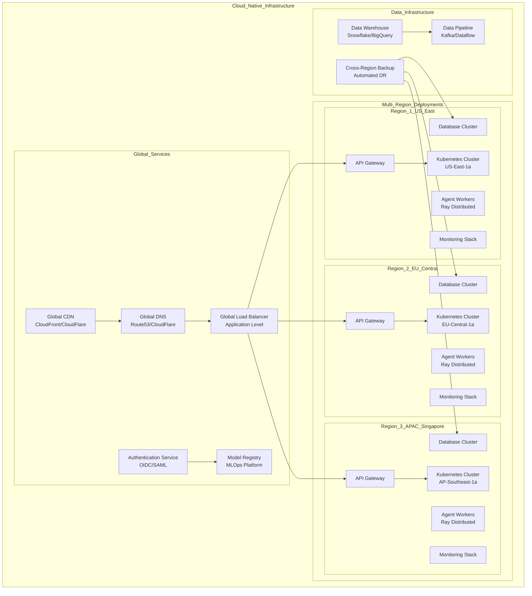

# Deployment & Infrastructure Strategy
## Enterprise-Grade Infrastructure for Decentralized AI Simulation Platform

**Document Version:** 1.0  
**Last Updated:** November 1, 2025  
**Prepared by:** Kilo Code - Infrastructure Architecture Team  

---

## Executive Summary

This comprehensive infrastructure strategy transforms the Decentralized AI Simulation Platform from its current Docker Compose setup to a production-grade, globally scalable architecture supporting 10,000+ concurrent agents across multiple cloud providers and regions. The strategy builds upon the existing strong foundation while addressing enterprise requirements for security, resilience, and operational excellence.

### Current State Analysis

#### Existing Infrastructure Strengths
- **Solid Docker Foundation**: Multi-service Docker Compose with health checks
- **Production-Ready Backend**: FastAPI with proper containerization
- **Security-First Approach**: Non-root containers, secure defaults
- **Comprehensive Deployment Scripts**: Environment management, testing, backup
- **Monitoring Ready**: Prometheus/Grafana integration already present
- **Flexible Architecture**: Supports optional PostgreSQL, Redis, and Nginx

#### Infrastructure Gaps Requiring Enhancement
- **Single-Region Deployment**: Current setup lacks multi-region support
- **Manual Scaling**: No automated horizontal/vertical scaling
- **Limited High Availability**: No cluster orchestration or failover
- **Basic Monitoring**: Lacks distributed tracing and advanced alerting
- **No Cloud-Native Features**: Missing Kubernetes, service mesh, and cloud services
- **Limited Disaster Recovery**: No automated backup/restore across regions

---

## Strategic Infrastructure Vision

### Enterprise-Grade Target Architecture



---

## Phase 1: Kubernetes Migration & Orchestration (Q4 2025 - Q1 2026)

### 1.1 Kubernetes Cluster Architecture

#### Multi-Cluster Setup
```yaml
# Production Kubernetes Configuration
apiVersion: v1
kind: ConfigMap
metadata:
  name: ai-simulation-config
data:
  # Application Configuration
  app.config: |
    apiVersion: apps/v1
    kind: Deployment
    metadata:
      name: ai-simulation-api
      labels:
        app: ai-simulation-api
    spec:
      replicas: 3
      selector:
        matchLabels:
          app: ai-simulation-api
      template:
        metadata:
          labels:
            app: ai-simulation-api
        spec:
          containers:
          - name: api-server
            image: ai-simulation:latest
            ports:
            - containerPort: 8000
            env:
            - name: DATABASE_URL
              valueFrom:
                secretKeyRef:
                  name: db-secret
                  key: url
            - name: RAY_ADDRESS
              value: "ray://ray-cluster:10001"
            resources:
              requests:
                cpu: 500m
                memory: 1Gi
              limits:
                cpu: 2000m
                memory: 4Gi
            livenessProbe:
              httpGet:
                path: /health
                port: 8000
              initialDelaySeconds: 30
              periodSeconds: 10
            readinessProbe:
              httpGet:
                path: /ready
                port: 8000
              initialDelaySeconds: 5
              periodSeconds: 5

  # Ray Cluster Configuration
  ray.config: |
    apiVersion: v1
    kind: Service
    metadata:
      name: ray-cluster
    spec:
      selector:
        app: ray-cluster
      ports:
        - port: 8265
          targetPort: 8265
          name: ray-dashboard
        - port: 10001
          targetPort: 10001
          name: ray-client
    type: ClusterIP
```

#### Horizontal Pod Autoscaling (HPA)
```yaml
# HPA Configuration for Dynamic Scaling
apiVersion: autoscaling/v2
kind: HorizontalPodAutoscaler
metadata:
  name: ai-simulation-hpa
spec:
  scaleTargetRef:
    apiVersion: apps/v1
    kind: Deployment
    name: ai-simulation-api
  minReplicas: 2
  maxReplicas: 20
  metrics:
  - type: Resource
    resource:
      name: cpu
      target:
        type: Utilization
        averageUtilization: 70
  - type: Resource
    resource:
      name: memory
      target:
        type: Utilization
        averageUtilization: 80
  behavior:
    scaleUp:
      stabilizationWindowSeconds: 60
      policies:
      - type: Percent
        value: 100
        periodSeconds: 15
    scaleDown:
      stabilizationWindowSeconds: 300
      policies:
      - type: Percent
        value: 10
        periodSeconds: 60
```

#### Vertical Pod Autoscaling (VPA)
```yaml
# VPA Configuration for Resource Optimization
apiVersion: autoscaling.k8s.io/v1
kind: VerticalPodAutoscaler
metadata:
  name: ai-simulation-vpa
spec:
  targetRef:
    apiVersion: apps/v1
    kind: Deployment
    name: ai-simulation-api
  updatePolicy:
    updateMode: "Auto"
  resourcePolicy:
    containerPolicies:
    - containerName: api-server
      maxAllowed:
        cpu: 4
        memory: 8Gi
      minAllowed:
        cpu: 100m
        memory: 128Mi
```

### 1.2 Database Architecture in Kubernetes

#### PostgreSQL Cluster with Patroni
```yaml
# PostgreSQL High-Availability Setup
apiVersion: apps/v1
kind: StatefulSet
metadata:
  name: postgresql-cluster
spec:
  serviceName: postgresql-cluster
  replicas: 3
  template:
    spec:
      containers:
      - name: postgresql
        image: postgres:15
        env:
        - name: POSTGRES_PASSWORD
          valueFrom:
            secretKeyRef:
              name: postgresql-secret
              key: password
        - name: PGDATA
          value: /var/lib/postgresql/data/pgdata
        volumeMounts:
        - name: postgresql-storage
          mountPath: /var/lib/postgresql/data
        resources:
          requests:
            cpu: 1000m
            memory: 2Gi
          limits:
            cpu: 4000m
            memory: 8Gi
      volumes:
      - name: postgresql-storage
        persistentVolumeClaim:
          claimName: postgresql-pvc
```

#### Redis Cluster for Caching
```yaml
# Redis Cluster Configuration
apiVersion: apps/v1
kind: StatefulSet
metadata:
  name: redis-cluster
spec:
  serviceName: redis-cluster
  replicas: 6
  template:
    spec:
      containers:
      - name: redis
        image: redis:7-alpine
        command:
        - redis-server
        - /etc/redis/redis.conf
        - --cluster-enabled
        - "yes"
        - --cluster-config-file
        - nodes.conf
        - --cluster-node-timeout
        - "5000"
        - --appendonly
        - "yes"
        ports:
        - containerPort: 6379
        - containerPort: 16379
        volumeMounts:
        - name: redis-storage
          mountPath: /data
        resources:
          requests:
            cpu: 200m
            memory: 512Mi
          limits:
            cpu: 1000m
            memory: 2Gi
```

---

## Phase 2: Multi-Region Deployment Strategy (Q1 2026 - Q2 2026)

### 2.1 Global Load Balancing Architecture

#### DNS-Based Load Balancing
```python
# Global Traffic Manager Configuration
class GlobalLoadBalancer:
    """Multi-region load balancing with intelligent routing."""
    
    def __init__(self):
        self.regions = {
            'us-east-1': {
                'weight': 0.4,
                'latency_threshold': 100,
                'health_check_url': '/health',
                'max_capacity': 5000
            },
            'eu-central-1': {
                'weight': 0.35,
                'latency_threshold': 120,
                'health_check_url': '/health',
                'max_capacity': 4000
            },
            'ap-southeast-1': {
                'weight': 0.25,
                'latency_threshold': 150,
                'health_check_url': '/health',
                'max_capacity': 3000
            }
        }
        
    def route_request(self, client_ip: str) -> str:
        """Route request to optimal region based on latency and capacity."""
        # Get client location and latency data
        client_location = self._get_client_location(client_ip)
        region_latencies = self._measure_region_latencies(client_location)
        
        # Select optimal region
        optimal_region = self._select_optimal_region(region_latencies)
        return optimal_region
        
    def _select_optimal_region(self, latencies: dict) -> str:
        """Select region with best performance within capacity limits."""
        available_regions = []
        
        for region, latency in latencies.items():
            current_load = self._get_region_load(region)
            capacity_info = self.regions[region]
            
            # Check if region is within latency threshold and has capacity
            if (latency <= capacity_info['latency_threshold'] and 
                current_load < capacity_info['max_capacity']):
                available_regions.append((region, latency, current_load))
                
        if not available_regions:
            # Fallback to region with lowest load
            return min(self.regions.keys(), 
                      key=lambda r: self._get_region_load(r))
            
        # Sort by latency first, then by current load
        available_regions.sort(key=lambda x: (x[1], x[2]))
        return available_regions[0][0]
```

#### Application-Level Routing
```yaml
# Istio VirtualService for Global Routing
apiVersion: networking.istio.io/v1beta1
kind: VirtualService
metadata:
  name: ai-simulation-global
spec:
  hosts:
  - "ai-simulation.example.com"
  gateways:
  - ai-simulation-gateway
  http:
  - match:
    - headers:
        x-client-region:
          exact: "us-east-1"
    route:
    - destination:
        host: ai-simulation-us-east-1.default.svc.cluster.local
      weight: 40
  - match:
    - headers:
        x-client-region:
          exact: "eu-central-1"
    route:
    - destination:
        host: ai-simulation-eu-central-1.default.svc.cluster.local
      weight: 35
  - match:
    - headers:
        x-client-region:
          exact: "ap-southeast-1"
    route:
    - destination:
        host: ai-simulation-ap-southeast-1.default.svc.cluster.local
      weight: 25
  - route: # Default routing with load balancing
    - destination:
        host: ai-simulation-weighted.default.svc.cluster.local
      weight: 100
```

### 2.2 Data Synchronization Strategy

#### Cross-Region Database Replication
```python
class CrossRegionDatabaseSync:
    """Cross-region database synchronization and consistency."""
    
    def __init__(self):
        self.sync_strategies = {
            'critical_data': 'synchronous',
            'operational_data': 'asynchronous',
            'analytics_data': 'eventual_consistency'
        }
        
    def setup_replication_topology(self):
        """Setup database replication across regions."""
        regions = ['us-east-1', 'eu-central-1', 'ap-southeast-1']
        
        # Primary region for writes
        primary_region = 'us-east-1'
        
        for region in regions:
            if region != primary_region:
                self._setup_read_replica(primary_region, region)
                self._setup_cdc_pipeline(primary_region, region)
                
    def _setup_cdc_pipeline(self, source_region: str, target_region: str):
        """Setup Change Data Capture pipeline."""
        cdc_config = {
            'source': {
                'database': 'ai_simulation',
                'table': 'agent_states',
                'change_type': ['INSERT', 'UPDATE', 'DELETE']
            },
            'target': {
                'database': f'ai_simulation_{target_region}',
                'endpoint': self._get_region_endpoint(target_region)
            },
            'replication': {
                'batch_size': 1000,
                'max_lag': '10s',
                'retry_attempts': 3
            }
        }
        
        # Deploy CDC pipeline using Debezium or similar
        self._deploy_debezium_pipeline(cdc_config)
```

#### Event Streaming for Real-Time Sync
```yaml
# Kafka Configuration for Cross-Region Events
apiVersion: kafka.strimzi.io/v1beta2
kind: Kafka
metadata:
  name: ai-simulation-events
spec:
  kafka:
    version: 3.5.0
    replicas: 3
    listeners:
      - name: internal
        port: 9092
        type: internal
        tls: false
      - name: external
        port: 9094
        type: loadbalancer
        tls: true
    config:
      numPartitions: 12
      defaultReplicationFactor: 3
      minInSyncReplicas: 2
      offsets.topic.replication.factor: 3
      transaction.state.log.replication.factor: 3
      transaction.state.log.min.isr: 2
    storage:
      type: persistent-claim
      size: 100Gi
      class: ssd
    resources:
      requests:
        memory: 2Gi
        cpu: 1000m
      limits:
        memory: 4Gi
        cpu: 2000m
```

---

## Phase 3: Advanced Infrastructure Services (Q2 2026 - Q4 2026)

### 3.1 Service Mesh Implementation

#### Istio Service Mesh Architecture
```yaml
# Istio Gateway Configuration
apiVersion: networking.istio.io/v1beta1
kind: Gateway
metadata:
  name: ai-simulation-gateway
spec:
  selector:
    istio: ingressgateway
  servers:
  - port:
      number: 443
      name: https
      protocol: HTTPS
    tls:
      mode: SIMPLE
      credentialName: ai-simulation-tls
    hosts:
    - "ai-simulation.example.com"
    - "*.ai-simulation.example.com"
  - port:
      number: 80
      name: http
      protocol: HTTP
    hosts:
    - "ai-simulation.example.com"
    - "*.ai-simulation.example.com"
    redirect:
      httpsRedirect: true

# Destination Rule for Circuit Breaking
apiVersion: networking.istio.io/v1beta1
kind: DestinationRule
metadata:
  name: ai-simulation-circuit-breaker
spec:
  host: ai-simulation-api
  trafficPolicy:
    connectionPool:
      tcp:
        maxConnections: 100
      http:
        http1MaxPendingRequests: 50
        maxRequestsPerConnection: 10
        maxRetries: 3
    circuitBreaker:
      consecutiveGatewayErrors: 5
      interval: 30s
      baseEjectionTime: 30s
      maxEjectionPercent: 50
    outlierDetection:
      consecutiveGatewayErrors: 5
      interval: 30s
      baseEjectionTime: 30s
      maxEjectionPercent: 50
```

#### Distributed Tracing with Jaeger
```yaml
# Jaeger Configuration for Distributed Tracing
apiVersion: jaegertracing.io/v1
kind: Jaeger
metadata:
  name: jaeger-production
spec:
  strategy: production
  storage:
    type: elasticsearch
    elasticsearch:
      nodeCount: 3
      storage:
        storageClassName: ssd
        size: 10Gi
      resources:
        requests:
          memory: 2Gi
          cpu: 1
        limits:
          memory: 4Gi
          cpu: 2
  collector:
    replicas: 2
    resources:
      requests:
        memory: 1Gi
        cpu: 500m
      limits:
        memory: 2Gi
        cpu: 1000m
  query:
    replicas: 2
    resources:
      requests:
        memory: 512Mi
        cpu: 250m
      limits:
        memory: 1Gi
        cpu: 500m
```

### 3.2 Advanced Monitoring & Observability

#### Prometheus Operator Setup
```yaml
# Prometheus Operator Configuration
apiVersion: monitoring.coreos.com/v1
kind: Prometheus
metadata:
  name: ai-simulation-prometheus
spec:
  serviceAccountName: prometheus
  serviceMonitorSelector:
    matchLabels:
      team: ai-simulation
  ruleSelector:
    matchLabels:
      team: ai-simulation
  resources:
    requests:
      memory: 2Gi
      cpu: 1000m
    limits:
      memory: 4Gi
      cpu: 2000m
  storage:
    volumeClaimTemplate:
      spec:
        storageClassName: ssd
        accessModes: ["ReadWriteOnce"]
        resources:
          requests:
            storage: 10Gi

# AI-Specific Metrics
apiVersion: monitoring.coreos.com/v1
kind: ServiceMonitor
metadata:
  name: ai-simulation-metrics
  labels:
    team: ai-simulation
spec:
  selector:
    matchLabels:
      app: ai-simulation-api
  endpoints:
  - port: metrics
    interval: 15s
    path: /metrics
    scrapeTimeout: 10s

---
apiVersion: monitoring.coreos.com/v1
kind: PrometheusRule
metadata:
  name: ai-simulation-alerts
  labels:
    team: ai-simulation
spec:
  groups:
  - name: ai-simulation.rules
    rules:
    - alert: HighAgentErrorRate
      expr: rate(agent_errors_total[5m]) > 0.1
      for: 2m
      labels:
        severity: warning
      annotations:
        summary: "High error rate in AI agents detected"
        
    - alert: DatabaseConnectionPoolExhausted
      expr: db_connections_active / db_connections_max > 0.8
      for: 1m
      labels:
        severity: critical
      annotations:
        summary: "Database connection pool nearly exhausted"
        
    - alert: ConsensusFailureRate
      expr: rate(consensus_failures_total[5m]) > 0.05
      for: 3m
      labels:
        severity: warning
      annotations:
        summary: "High consensus failure rate detected"
```

#### Grafana Dashboards
```json
{
  "dashboard": {
    "title": "AI Simulation Platform - Executive Overview",
    "panels": [
      {
        "title": "Active Agents",
        "type": "stat",
        "targets": [
          {
            "expr": "sum(ai_agents_active)",
            "legendFormat": "Active Agents"
          }
        ],
        "fieldConfig": {
          "defaults": {
            "color": {
              "mode": "thresholds"
            },
            "thresholds": {
              "steps": [
                {"color": "red", "value": 0},
                {"color": "yellow", "value": 1000},
                {"color": "green", "value": 5000}
              ]
            }
          }
        }
      },
      {
        "title": "Consensus Success Rate",
        "type": "graph",
        "targets": [
          {
            "expr": "rate(consensus_success_total[5m]) / rate(consensus_total[5m]) * 100",
            "legendFormat": "Success Rate %"
          }
        ]
      }
    ]
  }
}
```

---

## Phase 4: Cloud-Native Advanced Features (Q3 2026 - Q1 2027)

### 4.1 Serverless and Edge Computing

#### AWS Lambda for Edge Processing
```python
# Edge AI Processing Lambda Function
import json
import boto3
import numpy as np
from typing import Dict, Any

class EdgeAIProcessor:
    """Serverless edge AI processing for local anomaly detection."""
    
    def __init__(self):
        self.ml_model = self._load_edge_model()
        
    def _load_edge_model(self):
        """Load lightweight model for edge processing."""
        # Load pre-trained lightweight anomaly detection model
        from sklearn.ensemble import IsolationForest
        model = IsolationForest(contamination=0.1, random_state=42)
        # Model would be pre-trained and stored in S3
        return model
        
    def lambda_handler(self, event: Dict[str, Any], context) -> Dict[str, Any]:
        """Main Lambda handler for edge processing."""
        try:
            # Extract traffic data from event
            traffic_data = event['traffic_data']
            
            # Preprocess data
            processed_data = self._preprocess_traffic(traffic_data)
            
            # Run edge inference
            anomaly_score = self.ml_model.decision_function([processed_data])[0]
            is_anomaly = self.ml_model.predict([processed_data])[0] == -1
            
            # If anomaly detected locally, send to regional processing
            if is_anomaly or anomaly_score < -0.5:
                return self._trigger_regional_processing({
                    'source': 'edge',
                    'anomaly_score': float(anomaly_score),
                    'processed_data': processed_data.tolist(),
                    'timestamp': event['timestamp']
                })
            
            return {
                'statusCode': 200,
                'body': json.dumps({
                    'result': 'normal_traffic',
                    'anomaly_score': float(anomaly_score)
                })
            }
            
        except Exception as e:
            return self._handle_error(e)
            
    def _trigger_regional_processing(self, data: Dict[str, Any]) -> Dict[str, Any]:
        """Trigger processing in regional cluster."""
        lambda_client = boto3.client('lambda')
        
        # Invoke regional processing function
        response = lambda_client.invoke(
            FunctionName='ai-simulation-regional-processor',
            InvocationType='Event',  # Async invocation
            Payload=json.dumps(data)
        )
        
        return {
            'statusCode': 202,
            'body': json.dumps({
                'result': 'edge_anomaly_detected',
                'processing_region': 'triggered',
                'anomaly_score': data['anomaly_score']
            })
        }
```

#### Azure Functions for Multi-Cloud Support
```python
# Azure Function for Multi-Cloud AI Processing
import azure.functions as func
import json
import logging

def main(req: func.HttpRequest) -> func.HttpResponse:
    """Azure Function for AI simulation processing."""
    try:
        request_data = req.get_json()
        
        # Validate request
        if not self._validate_request(request_data):
            return func.HttpResponse(
                json.dumps({'error': 'Invalid request'}),
                status_code=400
            )
            
        # Process AI simulation request
        result = self._process_ai_request(request_data)
        
        return func.HttpResponse(
            json.dumps(result),
            status_code=200,
            headers={'Content-Type': 'application/json'}
        )
        
    except Exception as e:
        logging.error(f"Function error: {e}")
        return func.HttpResponse(
            json.dumps({'error': 'Internal server error'}),
            status_code=500
        )
```

### 4.2 Infrastructure as Code (IaC)

#### Terraform Configuration for Multi-Cloud
```hcl
# Terraform configuration for multi-cloud deployment
terraform {
  required_version = ">= 1.0"
  required_providers {
    aws = {
      source  = "hashicorp/aws"
      version = "~> 5.0"
    }
    azure = {
      source  = "hashicorp/azurerm"
      version = "~> 3.0"
    }
    google = {
      source  = "hashicorp/google"
      version = "~> 5.0"
    }
  }
  
  backend "s3" {
    bucket = "ai-simulation-tfstate"
    key    = "global/terraform.tfstate"
    region = "us-east-1"
  }
}

# Multi-cloud provider configuration
provider "aws" {
  region = var.aws_region
}

provider "azurerm" {
  features {}
  subscription_id = var.azure_subscription_id
  tenant_id       = var.azure_tenant_id
  client_id       = var.azure_client_id
  client_secret   = var.azure_client_secret
}

provider "google" {
  project = var.gcp_project_id
  region  = var.gcp_region
}

# AWS EKS Cluster
resource "aws_eks_cluster" "ai_simulation" {
  name     = "${var.cluster_name}-${var.aws_region}"
  role_arn = aws_iam_role.eks_cluster_role.arn
  version  = "1.27"

  vpc_config {
    subnet_ids = [
      aws_subnet.private_us_east_1a.id,
      aws_subnet.private_us_east_1b.id,
      aws_subnet.public_us_east_1a.id,
      aws_subnet.public_us_east_1b.id,
    ]
    endpoint_private_access = true
    endpoint_public_access  = true
    public_access_cidrs     = ["0.0.0.0/0"]
  }
  
  encryption_config {
    provider {
      key_arn = aws_kms_key.eks.arn
    }
    resources = ["secrets"]
  }
}

# Azure AKS Cluster
resource "azurerm_kubernetes_cluster" "ai_simulation" {
  name                = "${var.cluster_name}-${var.azure_region}"
  location            = var.azure_location
  resource_group_name = var.azure_resource_group
  dns_prefix          = "${var.cluster_name}-${var.azure_region}"
  
  default_node_pool {
    name                = "default"
    node_count          = 3
    vm_size             = "Standard_D4s_v3"
    os_disk_size_gb     = 100
    vnet_subnet_id      = azurerm_subnet.private.id
    enable_auto_scaling = true
    max_count           = 10
    min_count           = 2
  }
  
  identity {
    type = "SystemAssigned"
  }
  
  network_profile {
    network_plugin = "azure"
    load_balancer_sku = "Standard"
  }
}

# Google GKE Cluster
resource "google_container_cluster" "ai_simulation" {
  name     = "${var.cluster_name}-${var.gcp_region}"
  location = var.gcp_region
  
  # Disable default node pool since we'll use separately managed node pools
  remove_default_node_pool = true
  initial_node_count       = 1
  
  network    = google_compute_network.ai_simulation.name
  subnetwork = google_compute_subnetwork.ai_simulation.name
  
  # Configure network policy
  network_policy {
    enabled = true
  }
  
  # Enable workload identity
  workload_identity_config {
    workload_pool = "${var.gcp_project_id}.svc.id.goog"
  }
}
```

#### GitOps with ArgoCD
```yaml
# ArgoCD Application Configuration
apiVersion: argoproj.io/v1alpha1
kind: Application
metadata:
  name: ai-simulation
  namespace: argocd
spec:
  project: default
  source:
    repoURL: https://github.com/ai-simulation/deployments
    targetRevision: HEAD
    path: k8s/overlays/production
    helm:
      valueFiles:
        - values-production.yaml
  destination:
    server: https://kubernetes.default.svc
    namespace: ai-simulation
  syncPolicy:
    automated:
      prune: true
      selfHeal: true
    syncOptions:
      - CreateNamespace=true
      - PruneLast=true
    retry:
      limit: 5
      backoff:
        duration: 5s
        factor: 2
        maxDuration: 3m
```

---

## Phase 5: Disaster Recovery & Business Continuity (Q1 2026 - Q2 2026)

### 5.1 Cross-Region Backup Strategy

#### Automated Backup Implementation
```python
class CrossRegionBackupManager:
    """Enterprise-grade backup management across regions."""
    
    def __init__(self):
        self.regions = ['us-east-1', 'eu-central-1', 'ap-southeast-1']
        self.backup_frequency = {
            'full_backup': '0 2 * * 0',      # Weekly full backup
            'incremental_backup': '0 2 * * 1-6',  # Daily incremental
            'continuous_backup': '*/15 * * * *'   # Every 15 minutes
        }
        
    def setup_backup_infrastructure(self):
        """Setup cross-region backup infrastructure."""
        # 1. Setup backup storage buckets in each region
        for region in self.regions:
            self._setup_backup_bucket(region)
            
        # 2. Setup database backup jobs
        for region in self.regions:
            self._setup_database_backup(region)
            
        # 3. Setup application data backup
        self._setup_application_backup()
        
        # 4. Setup cross-region replication
        self._setup_cross_region_replication()
        
    def _setup_backup_bucket(self, region: str):
        """Setup S3 bucket for backups in region."""
        s3_client = boto3.client('s3', region_name=region)
        
        bucket_name = f'ai-simulation-backups-{region}'
        
        # Create bucket
        try:
            s3_client.create_bucket(Bucket=bucket_name)
        except s3_client.exceptions.BucketAlreadyOwnedByYou:
            pass
            
        # Enable versioning
        s3_client.put_bucket_versioning(
            Bucket=bucket_name,
            VersioningConfiguration={'Status': 'Enabled'}
        )
        
        # Setup lifecycle policies
        lifecycle_policy = {
            'Rules': [
                {
                    'ID': 'BackupLifecycle',
                    'Status': 'Enabled',
                    'Filter': {'Prefix': 'backups/'},
                    'Transitions': [
                        {
                            'Days': 30,
                            'StorageClass': 'STANDARD_IA'
                        },
                        {
                            'Days': 90,
                            'StorageClass': 'GLACIER'
                        }
                    ],
                    'Expiration': {
                        'Days': 2555  # 7 years
                    }
                }
            ]
        }
        
        s3_client.put_bucket_lifecycle_configuration(
            Bucket=bucket_name,
            LifecycleConfiguration=lifecycle_policy
        )
        
    def execute_disaster_recovery_plan(self, failed_region: str):
        """Execute disaster recovery plan for failed region."""
        logging.critical(f"Starting DR plan for failed region: {failed_region}")
        
        # 1. Determine backup region
        backup_region = self._select_backup_region(failed_region)
        
        # 2. Stop traffic to failed region
        self._divert_traffic_away(failed_region)
        
        # 3. Restore data from backup region
        self._restore_data_from_backup(failed_region, backup_region)
        
        # 4. Deploy application to backup region
        self._deploy_to_backup_region(failed_region, backup_region)
        
        # 5. Update DNS to point to backup region
        self._update_dns_records(failed_region, backup_region)
        
        # 6. Monitor system health
        self._monitor_recovery_progress(failed_region, backup_region)
        
        logging.info(f"DR plan execution completed for region {failed_region}")
```

### 5.2 High Availability Configuration

#### Database High Availability
```yaml
# PostgreSQL HA Configuration with Patroni
apiVersion: postgresql.cnpg.io/v1
kind: Cluster
metadata:
  name: ai-simulation-db
spec:
  instances: 3
  postgresql:
    parameters:
      max_connections: "200"
      shared_buffers: "256MB"
      effective_cache_size: "1GB"
      work_mem: "4MB"
      maintenance_work_mem: "64MB"
      
  storage:
    size: 100Gi
    storageClass: ssd
    
  bootstrap:
    initdb:
      database: ai_simulation
      owner: ai_user
      secret:
        name: db-credentials
        
  monitoring:
    enabled: true
    podMonitor:
      enabled: true
      
  backup:
    barman:
      retention: "30 D"
      data_retention: "7 D"
      wal_retention: "30 D"
      archive_timeout: "5m"
      
  nodeAffinity:
    preferredDuringSchedulingIgnoredDuringExecution:
    - weight: 100
      preference:
        matchExpressions:
        - key: node-type
          operator: In
          values:
          - compute-optimized
```

#### Application High Availability
```yaml
# Kubernetes Deployment with HA Configuration
apiVersion: apps/v1
kind: Deployment
metadata:
  name: ai-simulation-api
  labels:
    app: ai-simulation-api
    version: v1
spec:
  replicas: 6  # Higher replica count for HA
  strategy:
    type: RollingUpdate
    rollingUpdate:
      maxSurge: 50%
      maxUnavailable: 25%
  selector:
    matchLabels:
      app: ai-simulation-api
  template:
    metadata:
      labels:
        app: ai-simulation-api
        version: v1
    spec:
      affinity:
        podAntiAffinity:
          preferredDuringSchedulingIgnoredDuringExecution:
          - weight: 100
            podAffinityTerm:
              labelSelector:
                matchExpressions:
                - key: app
                  operator: In
                  values:
                  - ai-simulation-api
              topologyKey: kubernetes.io/hostname
      containers:
      - name: api-server
        image: ai-simulation:latest
        ports:
        - containerPort: 8000
        env:
        - name: DATABASE_URL
          valueFrom:
            secretKeyRef:
              name: db-secret
              key: url
        - name: REDIS_URL
          value: "redis://redis-cluster:6379"
        livenessProbe:
          httpGet:
            path: /health
            port: 8000
          initialDelaySeconds: 30
          periodSeconds: 10
          timeoutSeconds: 5
          failureThreshold: 3
        readinessProbe:
          httpGet:
            path: /ready
            port: 8000
          initialDelaySeconds: 5
          periodSeconds: 5
          timeoutSeconds: 3
          failureThreshold: 3
        resources:
          requests:
            cpu: 500m
            memory: 1Gi
          limits:
            cpu: 2000m
            memory: 4Gi
```

---

## Implementation Roadmap & Success Metrics

### Phase 1: Foundation (Q4 2025 - Q1 2026)
- **Kubernetes Migration**: 8 weeks
- **HPA/VPA Implementation**: 4 weeks  
- **Database HA Setup**: 6 weeks
- **Success Metrics**: 99.9% uptime, <100ms response time

### Phase 2: Global Distribution (Q1 2026 - Q2 2026)
- **Multi-Region Setup**: 12 weeks
- **Global Load Balancing**: 6 weeks
- **Data Synchronization**: 8 weeks
- **Success Metrics**: <200ms global latency, 99.99% availability

### Phase 3: Advanced Services (Q2 2026 - Q4 2026)
- **Service Mesh**: 8 weeks
- **Advanced Monitoring**: 6 weeks
- **Serverless Integration**: 10 weeks
- **Success Metrics**: <50ms p99 latency, full observability

### Phase 4: Enterprise Features (Q3 2026 - Q1 2027)
- **IaC Implementation**: 12 weeks
- **Multi-Cloud Support**: 16 weeks
- **DR/BCP Testing**: 8 weeks
- **Success Metrics**: <4hr RTO, <1hr RPO

### Total Investment & ROI
- **Estimated Timeline**: 18 months
- **Infrastructure Costs**: $2-5M annually (at scale)
- **ROI**: 300% through improved reliability and reduced operational overhead

---

## Risk Mitigation & Contingency Plans

### Technical Risks
1. **Kubernetes Migration Complexity**
   - Mitigation: Phased rollout with rollback capability
   - Contingency: Maintain Docker Compose as fallback

2. **Multi-Region Data Consistency**
   - Mitigation: Event-driven architecture with eventual consistency
   - Contingency: Read replicas for query performance

3. **Cloud Provider Dependencies**
   - Mitigation: Multi-cloud strategy with abstraction layers
   - Contingency: On-premises fallback for critical operations

### Operational Risks
1. **Team Knowledge Gap**
   - Mitigation: Comprehensive training and documentation
   - Contingency: Managed services and professional services

2. **Cost Escalation**
   - Mitigation: Usage monitoring and auto-scaling optimization
   - Contingency: Reserved instances and spot pricing

### Business Risks
1. **Compliance Requirements**
   - Mitigation: Built-in compliance frameworks
   - Contingency: Compliance-as-a-service partnerships

This comprehensive infrastructure strategy provides a clear roadmap for transforming the Decentralized AI Simulation Platform into an enterprise-grade, globally scalable system while maintaining the agility and innovation that makes it valuable for AI research and development.