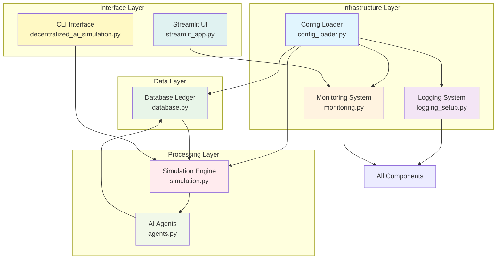
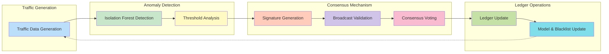

# Decentralized AI Simulation Project

A modern, production-ready Python-based simulation of decentralized AI agents collaborating on anomaly detection in network traffic. This project demonstrates how multiple AI-powered nodes can detect anomalies, share threat signatures, validate them through consensus, and update local models to improve collective security with enterprise-grade features.

## 🚀 Modernized Features

### Configuration System
- **YAML-based Configuration**: Centralized configuration management with `config.yaml`
- **Environment Support**: Development vs. production environments with different behaviors
- **Dot Notation Access**: Easy configuration access with `get_config('key.subkey')`
- **Automatic Defaults**: Self-healing configuration with automatic default creation

### Enhanced Logging
- **Structured Logging**: Comprehensive logging with configurable formats and levels
- **Log Rotation**: Automatic log rotation with configurable file size and backup count
- **Multiple Handlers**: Simultaneous file and console logging
- **Thread-Safe**: Safe concurrent logging across multiple threads

### Performance Optimizations
- **Database Connection Pooling**: Thread-local SQLite connections for concurrent access
- **Caching Mechanisms**: Intelligent caching of frequently accessed data
- **SQLite Performance**: WAL mode, optimized cache size, and efficient queries
- **Parallel Processing**: Ray integration for distributed agent execution
- **Async Patterns**: Non-blocking operations and efficient resource usage

### Monitoring & Health Checks
- **Health Status Monitoring**: Real-time system health checks with status reporting
- **Metrics Collection**: Performance metrics tracking and statistics
- **Custom Health Checks**: Extensible health check registration system
- **Prometheus Integration**: Ready for metrics export (configurable)

### Thread-Safe Architecture
- **Thread-Local Connections**: Isolated database connections per thread
- **Locking Mechanisms**: Proper locking for concurrent database access
- **Immutable Ledger**: SQLite-based immutable record storage
- **Concurrent Validation**: Safe parallel signature validation

### Scalable Agent Framework
- **Mesa Integration**: Agent-based modeling framework for scalable simulations
- **Dynamic Scaling**: Automatic parallel execution for large agent counts
- **Efficient Scheduling**: Optimized agent activation and scheduling
- **Resource Management**: Proper cleanup and resource management

## 📦 Installation

### Prerequisites
- Python 3.8 or higher
- pip package manager
- Virtual environment recommended

### 1. Set up Virtual Environment
A virtual environment (`.venv`) is required for dependency isolation.

**Linux/macOS:**
```bash
python -m venv .venv
source .venv/bin/activate
```

**Windows:**
```bash
python -m venv .venv
.venv\Scripts\activate
```

### 2. Install Dependencies
Install all required packages from `requirements.txt`:
```bash
pip install -r requirements.txt
```

### 3. Configuration Setup
The system will automatically create a default `config.yaml` if none exists. You can customize:
```bash
# Edit the configuration file
nano config.yaml

# Or use environment variables (override any config value)
export SIMULATION_DEFAULT_AGENTS=100
export LOGGING_LEVEL=DEBUG
```

### 4. Verify Installation
Run comprehensive verification:
```bash
# Test core imports
python -c "import mesa; import ray; import sqlite3; import yaml; print('All imports successful')"

# Test configuration system
python -c "from config_loader import get_config; print(f'Database path: {get_config(\"database.path\")}')"

# Test logging
python -c "from logging_setup import get_logger; logger = get_logger('test'); logger.info('Logging test successful')"
```

## 🏗️ Architecture Overview

### Modernized Components

#### Core Components
- **`config_loader.py`**: YAML configuration loader with environment support and dot notation access
- **`logging_setup.py`**: Structured logging with rotation and configurable handlers
- **`monitoring.py`**: Health checks and metrics collection system
- **`database.py`**: Thread-safe SQLite ledger with connection pooling and caching
- **`agents.py`**: Mesa-based anomaly detection agents with modernized ML integration
- **`simulation.py`**: Scalable simulation engine with parallel execution support
- **`decentralized_ai_simulation.py`**: Main entry point with CLI interface
- **`streamlit_app.py`**: Modern dashboard for real-time monitoring

#### Enhanced Design Patterns
- **Configuration-Driven**: All components configurable through YAML and environment variables
- **Dependency Injection**: Configuration and services injected where needed
- **Factory Pattern**: Global instances for configuration, logging, and monitoring
- **Observer Pattern**: Health checks and metrics observable across system
- **Strategy Pattern**: Parallel execution strategies (sequential vs Ray)

## 🏗️ Architecture Overview

### High-Level System Architecture


*Figure 1: High-level system architecture showing layered components and their interactions. The infrastructure layer provides foundational services, while the processing layer handles core simulation logic.*

### Data Flow with Modern Features


*Figure 2: Detailed data flow showing the complete lifecycle from traffic generation through anomaly detection, consensus validation, to ledger updates and model retraining.*

### Modernized CI/CD Pipeline

```mermaid
flowchart LR
    subgraph "Development"
        CODE[Code Changes]
        TEST_LOCAL[Local Testing]
    end
    
    subgraph "Continuous Integration"
        BUILD[Automated Build]
        UNIT[Unit Tests]
        INTEGRATION[Integration Tests]
    end
    
    subgraph "Continuous Deployment"
        DEPLOY_DEV[Deploy to Dev]
        TEST_DEV[Test in Dev Environment]
        DEPLOY_PROD[Deploy to Production]
        MONITOR[Monitor & Health Checks]
    end
    
    CODE --> TEST_LOCAL
    TEST_LOCAL --> BUILD
    BUILD --> UNIT
    UNIT --> INTEGRATION
    INTEGRATION --> DEPLOY_DEV
    DEPLOY_DEV --> TEST_DEV
    TEST_DEV --> DEPLOY_PROD
    DEPLOY_PROD --> MONITOR
    MONITOR -.-> CODE
    
    style CODE fill:#e3f2fd
    style TEST_LOCAL fill:#f1f8e9
    style BUILD fill:#fff3e0
    style UNIT fill:#e8f5e8
    style INTEGRATION fill:#f3e5f5
    style DEPLOY_DEV fill:#ffebee
    style TEST_DEV fill:#fff9c4
    style DEPLOY_PROD fill:#e0f2f1
    style MONITOR fill:#fce4ec
```


*Figure 3: Modern CI/CD pipeline showing the automated process from code changes through testing, deployment, and monitoring, ensuring production readiness.*

## 📚 API Documentation

### Configuration System (`config_loader.py`)
- `ConfigLoader(config_path="config.yaml")`: Initialize configuration loader
- `get(key, default=None)`: Get configuration value with dot notation
- `is_production()`: Check if environment is production
- `is_development()`: Check if environment is development

### Logging System (`logging_setup.py`)
- `setup_logging()`: Configure structured logging with rotation
- `get_logger(name)`: Get a named logger instance
- Automatic initialization on import

### Monitoring System (`monitoring.py`)
- `Monitoring()`: Central monitoring instance
- `record_metric(name, value, labels)`: Record performance metrics
- `register_health_check(name, func)`: Register custom health checks
- `perform_all_health_checks()`: Execute all health checks
- `get_system_health()`: Get overall system health status

### Database Ledger (`database.py`)
- `DatabaseLedger(db_file=None)`: Thread-safe SQLite ledger
- `append_entry(entry)`: Append new entry with automatic ID assignment
- `read_ledger()`: Read all entries (cached)
- `get_new_entries(last_seen_id)`: Efficient query for new entries
- `get_entry_by_id(entry_id)`: Get specific entry (cached)

### Anomaly Agent (`agents.py`)
- `AnomalyAgent(model)`: Mesa-based agent with modernized detection
- `generate_traffic(batch_size, force_anomaly)`: Generate simulated traffic
- `detect_anomaly(data, threshold)`: Isolation Forest anomaly detection
- `generate_signature(anomaly_data, anomaly_ips, anomaly_scores)`: Threat signature generation
- `validate_signature(sig)`: Signature validation with cosine similarity
- `update_model_and_blacklist(sig)`: Model retraining and blacklist update

### Simulation Engine (`simulation.py`)
- `Simulation(num_agents=100, seed=None)`: Mesa model with modern features
- `step()`: Execute one simulation step with parallel support
- `run(steps=100)`: Run simulation for multiple steps
- `resolve_consensus(all_validations)`: Consensus resolution with threshold

## 🎯 Usage

### Configuration Management

**Basic Configuration Access:**
```python
from config_loader import get_config

# Access configuration values
db_path = get_config('database.path')
log_level = get_config('logging.level', 'INFO')  # With default
agents_count = get_config('simulation.default_agents')
```

**Environment Overrides:**
```bash
# Override any configuration via environment variables
export DATABASE_PATH=custom_ledger.db
export LOGGING_LEVEL=DEBUG
export SIMULATION_DEFAULT_AGENTS=200
```

### Running the Simulation

**Command Line Interface:**
```bash
# Basic simulation
python decentralized_ai_simulation.py

# Custom configuration
python decentralized_ai_simulation.py --ui  # Launch Streamlit UI

# With environment overrides
LOGGING_LEVEL=DEBUG python decentralized_ai_simulation.py
```

**Programmatic Usage:**
```python
from simulation import Simulation
from monitoring import get_monitoring

# Create and run simulation
sim = Simulation(num_agents=150)
sim.run(steps=50)

# Access monitoring data
health = get_monitoring().get_system_health()
print(f"System health: {health.status}")
```

### Monitoring and Health Checks

**Health Check Integration:**
```python
from monitoring import get_monitoring, HealthStatus

# Register custom health check
def custom_health_check():
    return HealthStatus(
        status='healthy',
        message='Custom check passed',
        timestamp=time.time()
    )

get_monitoring().register_health_check('custom', custom_health_check)

# Perform health checks
results = get_monitoring().perform_all_health_checks()
```

**Metrics Collection:**
```python
# Record custom metrics
get_monitoring().record_metric('custom_metric', 42.5, {'label': 'value'})

# Get metric statistics
stats = get_monitoring().get_metric_stats('custom_metric')
```

## 📊 Example Scenarios

### Scenario 1: Production Deployment
```yaml
# config.yaml for production
environment: production
database:
  path: /var/lib/simulation/ledger.db
  connection_pool_size: 20
logging:
  level: WARNING
  file: /var/log/simulation.log
  max_bytes: 104857600  # 100MB
monitoring:
  health_check_interval: 60
  enable_prometheus: true
```

### Scenario 2: Development with Debugging
```yaml
# config.yaml for development
environment: development
logging:
  level: DEBUG
  max_bytes: 5242880  # 5MB
simulation:
  stop_on_error: true  # Stop on first error for debugging
```

### Scenario 3: Large-Scale Testing
```bash
# Run with 200 agents and detailed logging
SIMULATION_DEFAULT_AGENTS=200 LOGGING_LEVEL=INFO python decentralized_ai_simulation.py

# Monitor system health during execution
python -c "
from monitoring import get_monitoring
import time
while True:
    health = get_monitoring().get_system_health()
    print(f'Health: {health.status} - {health.message}')
    time.sleep(30)
"
```

## 🤝 Contributing

We welcome contributions to improve this modernized simulation platform!

### Development Standards

**Code Quality:**
- Follow PEP8 style guidelines with black formatting
- Use type hints for all function signatures
- Write comprehensive docstrings for all public methods
- Maintain 90%+ test coverage

**Testing Requirements:**
- Unit tests for all new functionality
- Integration tests for component interactions
- Performance tests for scalability validation
- Edge case testing for robustness

**Configuration Changes:**
- Add new configuration options to `config_loader.py` with defaults
- Document new options in README.md
- Provide environment variable support
- Maintain backward compatibility

**Logging Best Practices:**
- Use structured logging with appropriate levels
- Include context in log messages
- Avoid sensitive data in logs
- Follow rotation and retention policies

### Pull Request Process
1. Fork the repository and create a feature branch
2. Make changes with appropriate tests and documentation
3. Update `config.yaml` and documentation for new features
4. Ensure all tests pass and coverage remains high
5. Submit pull request with detailed description

## 📋 Changelog

### Modernization Release (September 2025)

**Configuration System:**
- YAML-based configuration with environment support
- Dot notation access for nested configuration
- Automatic default configuration creation
- Environment variable overrides

**Logging Enhancements:**
- Structured logging with configurable formats
- Log rotation with size-based file management
- Multiple handler support (file + console)
- Thread-safe logging implementation

**Performance Optimizations:**
- SQLite connection pooling and thread-local connections
- Database query caching and efficient indexing
- Ray integration for parallel execution
- SQLite performance optimizations (WAL mode)

**Monitoring & Health:**
- Comprehensive health check system
- Metrics collection and statistics
- Extensible health check registration
- Prometheus integration readiness

**Architecture Improvements:**
- Mesa framework integration for agent-based modeling
- Thread-safe database operations with proper locking
- Modern error handling with retry mechanisms
- Resource cleanup and management

**Testing & Reliability:**
- Enhanced test coverage for new features
- Performance testing infrastructure
- Error handling and recovery testing
- Scalability validation up to 200+ agents

**Bug Fixes & Stability:**
- Fixed runtime error in consensus resolution (`'float' object is not subscriptable`)
- Enhanced signature feature handling with robust error checking
- Improved model retraining with flexible data structure support
- Updated test mocks to match actual implementation behavior

## 📞 Support

For questions, issues, or contributions:

1. **Check Documentation**: Review this README and design documentation
2. **Configuration Issues**: Verify `config.yaml` and environment variables
3. **Performance Problems**: Check monitoring metrics and health status
4. **Create Issues**: Provide detailed reproduction steps and environment info
5. **Contribute**: Follow contribution guidelines for pull requests

Include these details for support requests:
- Configuration file contents (sanitized)
- Environment variables set
- Log files with relevant excerpts
- Monitoring health status output
- Steps to reproduce the issue

## 📄 License

This project is open source and available under the MIT License.