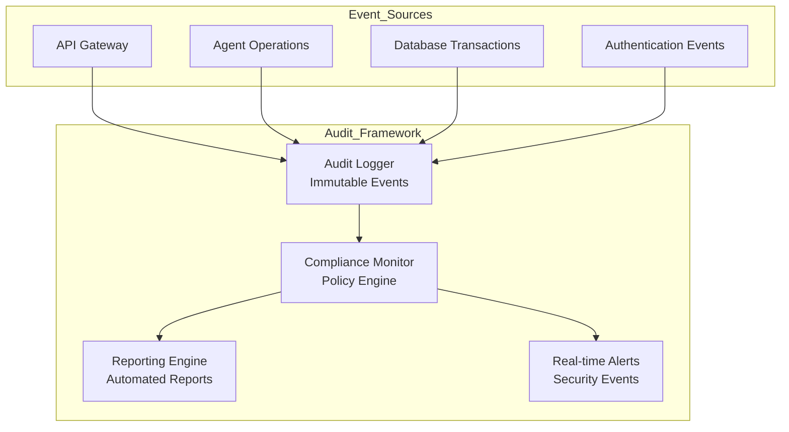
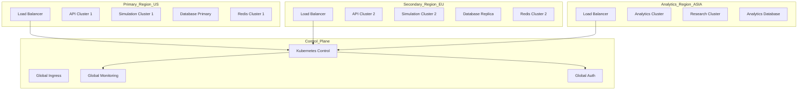
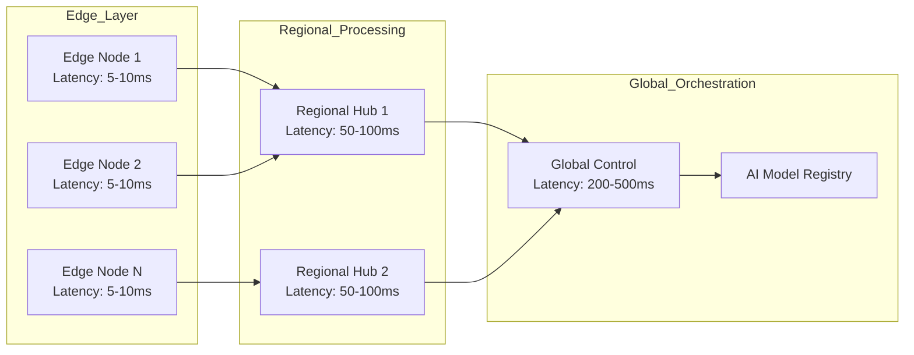
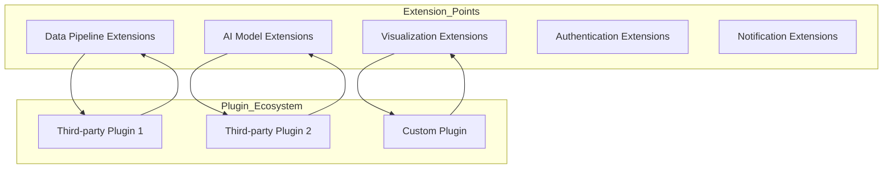

# Strategic Architecture Framework
## Decentralized AI Simulation Platform - 2025-2027 Roadmap

**Document Version:** 1.0  
**Last Updated:** November 1, 2025  
**Prepared by:** Kilo Code - Technical Architecture Team  

---

## Executive Summary

This strategic framework provides a comprehensive roadmap for evolving the Decentralized AI Simulation Platform from its current production-ready state to an enterprise-grade, globally scalable distributed AI system. Based on comprehensive architectural analysis, the platform demonstrates exceptional technical foundation with Mesa 3.3.0, Ray 2.45.0, and modern React/TypeScript frontend.

### Key Strategic Objectives
- **Scale to 10,000+ concurrent agents** across multiple data centers
- **Achieve 99.99% availability** with global distribution
- **Implement enterprise security** with zero-trust architecture
- **Enable real-time collaboration** across global research networks
- **Establish open ecosystem** for third-party integrations

---

## Phase 1: Foundation Enhancement (Q4 2025 - Q1 2026)

### 1.1 Advanced Security Architecture

#### Identity and Access Management (IAM)
```yaml
security_roadmap:
  phase_1:
    - OpenID Connect (OIDC) integration
    - Role-Based Access Control (RBAC)
    - Multi-factor authentication (MFA)
    - API key management system
  
  phase_2:
    - OAuth 2.0 with PKCE
    - Hardware security key support (FIDO2)
    - Identity federation with enterprise systems
    - Just-in-time (JIT) access provisioning
```

#### Data Protection Framework
```python
# Enhanced security configuration
class EnterpriseSecurityConfig:
    encryption:
      at_rest: "AES-256-GCM"
      in_transit: "TLS 1.3"
      key_management: "HashiCorp Vault"
    data_classification:
      - "Public"
      - "Internal" 
      - "Confidential"
      - "Restricted"
    compliance:
      - "SOC 2 Type II"
      - "ISO 27001"
      - "GDPR"
      - "HIPAA"
```

#### Audit and Compliance System


### 1.2 Observability and Monitoring Enhancement

#### Next-Generation Observability Stack
```yaml
observability_architecture:
  metrics:
    - Prometheus + Thanos for metrics
    - Custom AI-specific metrics
    - Business KPIs tracking
  
  logging:
    - Centralized ELK stack
    - Structured JSON logging
    - PII filtering and masking
  
  tracing:
    - Jaeger for distributed tracing
    - AI workflow visualization
    - Performance bottleneck detection
  
  alerting:
    - Grafana Alertmanager
    - Custom AI detection alerts
    - Escalation policies
```

#### AI-Specific Monitoring Framework
```python
class AIMonitoringFramework:
    """Comprehensive monitoring for AI operations."""
    
    def __init__(self):
        self.detection_metrics = {
            'anomaly_detection_accuracy': Histogram('anomaly_accuracy'),
            'consensus_convergence_time': Histogram('consensus_time'),
            'model_drift_indicators': Gauge('model_drift'),
            'collaboration_efficiency': Histogram('collab_efficiency')
        }
        
    def track_agent_performance(self, agent_id: str, metrics: dict):
        """Track individual agent performance."""
        self.detection_metrics['agent_accuracy'].labels(
            agent_id=agent_id
        ).observe(metrics['accuracy'])
        
    def detect_model_drift(self, baseline_data: np.ndarray, 
                          current_data: np.ndarray) -> bool:
        """Detect statistical model drift."""
        drift_score = self._calculate_kl_divergence(baseline_data, current_data)
        return drift_score > 0.05  # 5% threshold
```

### 1.3 Enhanced Development Practices

#### Architectural Decision Records (ADRs)
```markdown
# ADR-001: Distributed Consensus Algorithm Selection

## Status
Accepted

## Context
We need to choose a consensus algorithm for our distributed AI agent network that balances:
- Fault tolerance
- Performance
- Network partition resilience
- Byzantine fault tolerance

## Decision
We will implement a hybrid approach:
1. Raft for leader election and log replication
2. Custom Byzantine Fault Tolerant (BFT) layer for critical security decisions
3. Eventually consistent approach for non-critical operations

## Consequences
- Improved fault tolerance
- Higher complexity in implementation
- Better performance than pure BFT
```

#### Code Quality Gates
```yaml
quality_gates:
  automated_checks:
    - pytest coverage >= 90%
    - mypy type checking
    - pylint score >= 8.5/10
    - bandit security scanning
  
  architectural_checks:
    - cyclomatic complexity <= 10
    - method length <= 50 lines
    - class responsibilities <= 7
    - dependency injection patterns
  
  ai_specific_checks:
    - model training reproducibility
    - algorithm bias detection
    - performance benchmarking
```

---

## Phase 2: Scalability Architecture (Q1 2026 - Q3 2026)

### 2.1 Global Distribution Framework

#### Multi-Region Deployment Architecture


#### Horizontal Scaling Strategy
```python
class GlobalScalingManager:
    """Manages scaling across global regions."""
    
    def __init__(self):
        self.scaling_policies = {
            'agent_count': ScalingPolicy(
                min_agents=100,
                max_agents=50000,
                target_utilization=0.70,
                scale_out_cooldown=300,
                scale_in_cooldown=900
            ),
            'compute_resources': ScalingPolicy(
                cpu_threshold=0.75,
                memory_threshold=0.80,
                gpu_threshold=0.90
            )
        }
        
    def calculate_regional_capacity(self, region: str) -> dict:
        """Calculate optimal agent distribution across regions."""
        current_load = self.get_regional_load(region)
        historical_patterns = self.analyze_usage_patterns(region)
        predicted_load = self.predict_future_load(region, hours=24)
        
        return {
            'current_agents': current_load['agents'],
            'recommended_agents': predicted_load['agents'],
            'resource_requirements': self.calculate_resource_needs(predicted_load)
        }
```

### 2.2 Database Scaling and Data Management

#### Polyglot Persistence Strategy
```yaml
data_architecture:
  operational_data:
    - PostgreSQL (user accounts, configuration)
    - Redis (session data, cache)
    - Elasticsearch (search, analytics)
  
  analytical_data:
    - ClickHouse (time-series metrics)
    - Apache Kafka (event streaming)
    - Apache Spark (batch analytics)
  
  blockchain_data:
    - IPFS (immutable audit logs)
    - Hyperledger Fabric ( consortium chains)
    - Ethereum (public references)
```

#### Data Partitioning and Sharding
```python
class AdvancedDataManager:
    """Enterprise-grade data management."""
    
    def __init__(self):
        self.shard_key_generator = ShardKeyGenerator()
        self.rebalancing_engine = RebalancingEngine()
        
    def shard_agent_data(self, agent_id: str) -> str:
        """Generate shard key for agent data."""
        # Use consistent hashing for even distribution
        return hashlib.md5(agent_id.encode()).hexdigest()[:8]
        
    def setup_realtime_replication(self, shard_id: str):
        """Setup real-time replication for critical data."""
        primary_db = self.get_primary_shard(shard_id)
        replica_dbs = self.get_replica_shards(shard_id)
        
        for replica in replica_dbs:
            self.setup_logical_replication(primary_db, replica)
```

### 2.3 Network and Communication Optimization

#### Edge Computing Integration


#### Optimized Communication Protocols
```python
class ProtocolOptimization:
    """Optimized communication protocols for global scale."""
    
    # gRPC for low-latency, high-throughput internal communication
    GRPC_PROTOCOLS = {
        'agent_coordination': 'tcp://optimized',
        'consensus_operations': 'tcp://reliable',
        'data_sync': 'tcp://high_throughput'
    }
    
    # WebSockets for real-time client communication
    WEBSOCKET_CONFIG = {
        'compression': 'permessage-deflate',
        'heartbeat_interval': 30,
        'max_message_size': 1024 * 1024,  # 1MB
        'connection_pool_size': 1000
    }
    
    # QUIC for modern, secure, fast network transport
    def setup_quic_communication(self):
        """Setup QUIC protocol for global communication."""
        return quic.Connection(
            host="0.0.0.0",
            port=443,
            certificate_chain="fullchain.pem",
            private_key="privkey.pem"
        )
```

---

## Phase 3: Advanced AI Capabilities (Q2 2026 - Q4 2026)

### 3.1 Federated Learning Framework

#### Distributed Model Training
```python
class FederatedLearningFramework:
    """Advanced federated learning for privacy-preserving AI."""
    
    def __init__(self):
        self.aggregation_algorithms = {
            'fedavg': FedAvgAggregation(),
            'fedprox': FedProxAggregation(0.1),
            'scaffold': ScaffoldAggregation(),
            'personalized': PersonalizedAggregation()
        }
        
    async def start_federated_training(self, model_config: dict):
        """Initiate federated training across distributed nodes."""
        training_rounds = model_config['rounds']
        
        for round_num in range(training_rounds):
            # 1. Select subset of agents for training
            selected_agents = self.select_participants(
                model_config['participation_rate']
            )
            
            # 2. Distribute current model to participants
            await self.distribute_model(selected_agents, round_num)
            
            # 3. Collect local model updates
            updates = await self.collect_updates(selected_agents)
            
            # 4. Aggregate updates using chosen algorithm
            aggregated_model = self.aggregate_updates(
                updates, 
                model_config['aggregation_method']
            )
            
            # 5. Update global model
            self.update_global_model(aggregated_model)
            
            # 6. Evaluate model performance
            performance = await self.evaluate_model(aggregated_model)
            self.log_training_round(round_num, performance)
```

#### Privacy-Preserving Technologies
```yaml
privacy_technologies:
  differential_privacy:
    epsilon: 1.0
    delta: 1e-5
    noise_mechanism: "gaussian"
  
  secure_multiparty_computation:
    threshold: 2/3
    secret_sharing: "shamir"
    verification: "robust"
  
  homomorphic_encryption:
    scheme: "CKKS"
    precision: "double"
    batch_size: 4096
  
  trusted_execution_environments:
    - Intel SGX
    - AMD SEV
    - ARM TrustZone
```

### 3.2 Advanced Consensus Mechanisms

#### Byzantine Fault Tolerant Consensus
```python
class BFTConsensusEngine:
    """Advanced Byzantine Fault Tolerant consensus for critical decisions."""
    
    def __init__(self, fault_tolerance: float = 0.33):
        self.fault_tolerance = fault_tolerance
        self.byzantine_threshold = int(fault_tolerance * 100) + 1
        
    async def reach_consensus(self, proposal: dict) -> bool:
        """Reach Byzantine consensus on proposal."""
        # Phase 1: Pre-prepare
        pre_prepare_msg = await self.broadcast_pre_prepare(proposal)
        
        # Phase 2: Prepare
        prepare_votes = await self.collect_prepare_votes(pre_prepare_msg)
        
        if len(prepare_votes) < self.byzantine_threshold:
            return False
            
        # Phase 3: Commit
        commit_votes = await self.collect_commit_votes(prepare_votes)
        
        return len(commit_votes) >= self.byzantine_threshold
        
    async def validate_signature(self, message: dict, sender: str) -> bool:
        """Validate message signature and authenticity."""
        # Implement threshold signature validation
        threshold = self.byzantine_threshold
        valid_signatures = 0
        
        for validator in self.get_active_validators():
            if await validator.verify_signature(message, sender):
                valid_signatures += 1
                
        return valid_signatures >= threshold
```

### 3.3 AI Model Registry and Governance

#### Model Lifecycle Management
```mermaid
graph TD
    SUBGRAPH "Model_Lifecycle"
        DEV[Model Development]
        VAL[Validation]
        REG[Registry]
        DEPLOY[Deployment]
        MON[Monitoring]
        RET[Retirement]
    end
    
    DEV --> VAL
    VAL --> REG
    REG --> DEPLOY
    DEPLOY --> MON
    MON --> RET
    
    MON --> DEV
```

#### Automated Model Governance
```python
class ModelGovernanceEngine:
    """Comprehensive model governance and compliance."""
    
    def __init__(self):
        self.compliance_checks = {
            'bias_detection': BiasDetectionEngine(),
            'explainability': XAIMetricsEngine(),
            'performance_degradation': PerformanceMonitor(),
            'security_vulnerabilities': SecurityScanner()
        }
        
    async def validate_model(self, model: ModelArtifact) -> ValidationResult:
        """Comprehensive model validation."""
        validation_results = {}
        
        for check_name, checker in self.compliance_checks.items():
            try:
                result = await checker.validate(model)
                validation_results[check_name] = result
            except Exception as e:
                validation_results[check_name] = ValidationResult(
                    passed=False,
                    error=str(e)
                )
                
        return ValidationResult(
            overall_pass=all(r.passed for r in validation_results.values()),
            details=validation_results
        )
```

---

## Phase 4: Ecosystem Integration (Q3 2026 - Q1 2027)

### 4.1 API Gateway and Service Mesh

#### Microservices Architecture
```yaml
microservices_design:
  core_services:
    - agent_management: "Agent lifecycle and coordination"
    - consensus_engine: "Distributed consensus operations"
    - model_registry: "AI model versioning and governance"
    - data_ingestion: "Real-time data processing"
    - analytics_service: "Performance analytics and insights"
  
  supporting_services:
    - authentication_service: "Identity and access management"
    - notification_service: "Alert and notification delivery"
    - reporting_service: "Automated reporting and compliance"
    - audit_service: "Comprehensive audit logging"
  
  infrastructure_services:
    - api_gateway: "Central API management"
    - service_mesh: "Inter-service communication"
    - config_service: "Distributed configuration"
    - monitoring_service: "Observability and metrics"
```

#### Service Mesh Implementation
```python
class ServiceMeshManager:
    """Istio-based service mesh for microservices communication."""
    
    def __init__(self):
        self.istio_client = IstioClient()
        self.circuit_breaker = CircuitBreakerConfig()
        self.load_balancer = LoadBalancerConfig()
        
    def setup_service_mesh(self):
        """Configure service mesh for all microservices."""
        services = [
            'agent-management',
            'consensus-engine', 
            'model-registry',
            'data-ingestion',
            'analytics-service'
        ]
        
        for service in services:
            self.create_virtual_service(service)
            self.configure_circuit_breaker(service)
            self.setup_mutual_tls(service)
            
    def create_virtual_service(self, service_name: str):
        """Create Istio VirtualService for traffic routing."""
        return self.istio_client.virtual_service.create(
            api_version="networking.istio.io/v1beta1",
            kind="VirtualService",
            spec={
                'hosts': [service_name],
                'http': [{
                    'route': [{
                        'destination': {
                            'host': service_name,
                            'subset': 'v1'
                        }
                    }],
                    'timeout': '30s',
                    'retries': {
                        'attempts': 3,
                        'per_try_timeout': '10s'
                    }
                }]
            }
        )
```

### 4.2 Plugin and Extension Architecture

#### Plugin System Design
```python
class PluginArchitecture:
    """Extensible plugin system for third-party integrations."""
    
    def __init__(self):
        self.plugin_registry = PluginRegistry()
        self.security_validator = PluginSecurityValidator()
        self.compatibility_checker = CompatibilityChecker()
        
    def load_plugin(self, plugin_package: bytes, signature: str) -> Plugin:
        """Securely load and validate plugin."""
        # 1. Verify digital signature
        if not self.verify_plugin_signature(plugin_package, signature):
            raise SecurityError("Invalid plugin signature")
            
        # 2. Security scanning
        scan_results = self.security_validator.scan(plugin_package)
        if scan_results.has_malicious_code():
            raise SecurityError("Plugin failed security scan")
            
        # 3. Compatibility check
        compatibility = self.compatibility_checker.check(plugin_package)
        if not compatibility.is_compatible():
            raise CompatibilityError(f"Plugin incompatible: {compatibility.issues}")
            
        # 4. Load and initialize plugin
        plugin = self.initialize_plugin(plugin_package)
        self.plugin_registry.register(plugin)
        
        return plugin
        
    def create_plugin_api(self) -> PluginAPI:
        """Provide standardized API for plugin development."""
        return PluginAPI(
            data_access=DataAccessInterface(),
            event_system=EventSystemInterface(),
            security=SecurityInterface(),
            metrics=MetricsInterface()
        )
```

#### Extension Points Architecture


### 4.3 External Integration Framework

#### Enterprise System Connectors
```python
class EnterpriseIntegrations:
    """Connectors for major enterprise systems."""
    
    def __init__(self):
        self.connectors = {
            'salesforce': SalesforceConnector(),
            'splunk': SplunkConnector(),
            'kafka': KafkaConnector(),
            'snowflake': SnowflakeConnector(),
            'servicenow': ServiceNowConnector()
        }
        
    async def sync_with_salesforce(self, config: dict) -> SyncResult:
        """Sync threat intelligence with Salesforce Security Cloud."""
        connector = self.connectors['salesforce']
        
        try:
            # Connect to Salesforce
            await connector.authenticate(config)
            
            # Export AI detections
            detections = await self.get_recent_detections()
            exported_count = await connector.export_detections(detections)
            
            # Import threat intelligence
            threats = await connector.import_threat_intelligence()
            updated_models = await self.update_models_with_threats(threats)
            
            return SyncResult(
                exported_detections=exported_count,
                imported_threats=