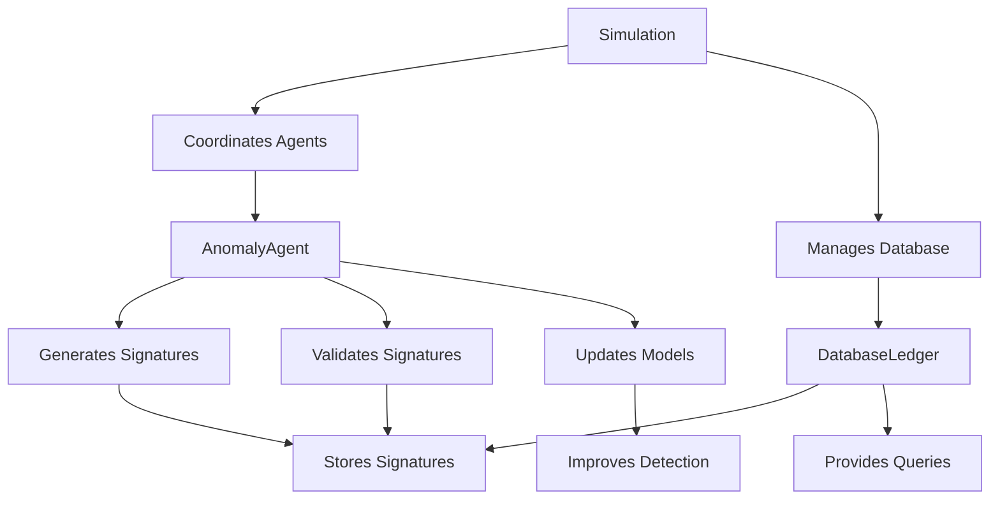

# API Documentation Index

## Overview

This index provides a centralized reference for all API documentation related to the core modules of the decentralized AI simulation system. It ensures consistency, provides cross-references, and serves as the main entry point for API documentation.

## Core Module Documentation

### 📊 Simulation Module
**File:** [API_SIMULATION.md](API_SIMULATION.md)

**Description:**
Comprehensive API documentation for the `Simulation` class, covering initialization, step execution, parallel processing, consensus resolution, and resource management.

**Key Sections:**
- Class constructor and initialization patterns
- Step execution and parallel processing strategies
- Consensus resolution algorithms
- Resource management and cleanup procedures
- Performance monitoring and statistics
- Configuration integration and best practices

**Related Documentation:**
- [Workflow Diagrams](API_WORKFLOW_DIAGRAMS.md#simulation-lifecycle-workflow) - Visual representation of simulation lifecycle
- [Usage Examples](API_USAGE_EXAMPLES.md#simulation-module-examples) - Practical simulation patterns
- [Database Integration](#database-module) - How simulation interacts with database layer
- [Performance Optimization](PERFORMANCE_OPTIMIZATION.md#simulation-performance) - Performance tuning for simulation module

### 🤖 Agents Module
**File:** [API_AGENTS.md](API_AGENTS.md)

**Description:**
Detailed API documentation for the `AnomalyAgent` class and related data structures, covering anomaly detection, signature generation, validation, and model management.

**Key Sections:**
- Data classes: `AnomalySignature`, `ValidationResult`, `TrafficData`
- Agent lifecycle and Mesa framework integration
- Traffic generation and anomaly detection algorithms
- Signature creation and broadcasting mechanisms
- Validation system with caching optimizations
- Model retraining and blacklist management

**Related Documentation:**
- [Workflow Diagrams](API_WORKFLOW_DIAGRAMS.md#agent-step-workflow) - Agent operation flow
- [Usage Examples](API_USAGE_EXAMPLES.md#agent-module-examples) - Agent operation patterns
- [Integration Patterns](#integration-patterns) - How agents integrate with other modules
- [Best Practices](BEST_PRACTICES.md#agent-development-patterns) - Agent development best practices

### 🗄️ Database Module
**File:** [API_DATABASE.md](API_DATABASE.md)

**Description:**
Comprehensive API documentation for the `DatabaseLedger` class and connection management, covering SQLite operations, connection pooling, caching, and performance optimizations.

**Key Sections:**
- Data classes: `DatabaseConfig`, `ConnectionPool`
- Database schema and initialization procedures
- Entry management: append, read, query operations
- Connection pooling and thread safety mechanisms
- Caching strategies and performance optimizations
- Maintenance operations and cleanup procedures

**Related Documentation:**
- [Workflow Diagrams](API_WORKFLOW_DIAGRAMS.md#database-operations-workflow) - Database operation flows
- [Usage Examples](API_USAGE_EXAMPLES.md#database-module-examples) - Database operation patterns
- [Error Handling](#error-handling-patterns) - Database-specific error handling
- [Troubleshooting](TROUBLESHOOTING_GUIDE.md#database-connectivity-problems) - Database troubleshooting guide

## Visual Documentation

### 🔄 Workflow Diagrams
**File:** [API_WORKFLOW_DIAGRAMS.md](API_WORKFLOW_DIAGRAMS.md)

**Description:**
Comprehensive collection of Mermaid diagrams illustrating API interactions, data flows, error handling patterns, and integration strategies across all modules.

**Diagram Categories:**
- **API Interaction Workflows**: Step-by-step process flows for each module
- **Data Flow Diagrams**: Inter-module and intra-module data movement
- **Error Handling Flows**: Exception handling and recovery patterns
- **Integration Patterns**: Framework and system integration diagrams

**Key Diagrams:**
- [Simulation Lifecycle Workflow](API_WORKFLOW_DIAGRAMS.md#simulation-lifecycle-workflow) - Complete simulation process
- [Agent Step Workflow](API_WORKFLOW_DIAGRAMS.md#agent-step-workflow) - Agent operation cycle
- [Database Operations Workflow](API_WORKFLOW_DIAGRAMS.md#database-operations-workflow) - Database interaction patterns
- [Inter-Module Data Flow](API_WORKFLOW_DIAGRAMS.md#inter-module-data-flow) - Cross-module data movement

## Practical Guides

### 💡 Usage Examples and Troubleshooting
**File:** [API_USAGE_EXAMPLES.md](API_USAGE_EXAMPLES.md)

**Description:**
Practical examples, real-world patterns, and comprehensive troubleshooting guide for all API modules with copy-paste ready code snippets.

**Content Sections:**
- **Simulation Examples**: Basic setup, large-scale operations, custom monitoring
- **Agent Examples**: Lifecycle management, batch processing, model retraining
- **Database Examples**: Operations, connection management, performance monitoring
- **Integration Examples**: Complete workflows and multi-agent coordination
- **Troubleshooting Guide**: Common issues, solutions, and best practices

**Usage Patterns:**
- [Basic Simulation Setup](API_USAGE_EXAMPLES.md#basic-simulation-setup) - Getting started patterns
- [Agent Lifecycle Management](API_USAGE_EXAMPLES.md#agent-lifecycle-management) - Agent operation examples
- [Database Operations](API_USAGE_EXAMPLES.md#database-operations-and-queries) - Database interaction patterns
- [Performance Optimization](API_USAGE_EXAMPLES.md#performance-optimization-patterns) - Optimization strategies

## Quick Reference

### Module Relationships



### API Entry Points

| Module | Main Classes | Key Methods | Purpose |
|--------|-------------|-------------|---------|
| **Simulation** | `Simulation` | `step()`, `run()`, `resolve_consensus()` | Orchestrates the entire simulation |
| **Agents** | `AnomalyAgent` | `step()`, `detect_anomaly()`, `validate_signature()` | Handles individual node behavior |
| **Database** | `DatabaseLedger` | `append_entry()`, `read_ledger()`, `get_new_entries()` | Manages persistent signature storage |

### Configuration Dependencies

Each module integrates with the configuration system:

```python
# Configuration keys by module
simulation:
  use_parallel_threshold: 50
  stop_on_error: false

database:
  path: "ledger.db"
  timeout: 30
  max_connections: 10

# Agent configuration is primarily set at initialization
```

## Documentation Standards

### Consistency Guidelines

1. **Type Annotations**: All API documentation includes comprehensive type hints
2. **Error Documentation**: Every method documents raised exceptions and error conditions
3. **Performance Notes**: Performance characteristics and optimization guidance provided
4. **Cross-References**: Related sections and modules are linked throughout
5. **Code Examples**: Practical, copy-paste ready examples in each section

### Documentation Structure

```
API_[MODULE].md           # Core API documentation
├── Overview              # Module purpose and scope
├── Class Documentation   # Detailed class and method docs
├── Configuration         # Configuration integration
├── Error Handling        # Exception and recovery patterns
├── Best Practices        # Recommended usage patterns
└── Troubleshooting       # Common issues and solutions
```

## Navigation Guide

### For New Users

1. **Start Here**: [Simulation Module](API_SIMULATION.md) - Understand the main simulation framework
2. **Core Concepts**: [Agents Module](API_AGENTS.md) - Learn about anomaly detection agents
3. **Data Persistence**: [Database Module](API_DATABASE.md) - Understand data storage patterns
4. **Visual Learning**: [Workflow Diagrams](API_WORKFLOW_DIAGRAMS.md) - See how components interact
5. **Hands-On Practice**: [Usage Examples](API_USAGE_EXAMPLES.md) - Try practical examples

### For Developers

1. **API Reference**: Use individual module documentation for detailed API information
2. **Integration Patterns**: [Workflow Diagrams](API_WORKFLOW_DIAGRAMS.md) for system integration
3. **Performance Tuning**: [Usage Examples](API_USAGE_EXAMPLES.md#performance-optimization-patterns) for optimization
4. **Troubleshooting**: [Usage Examples](API_USAGE_EXAMPLES.md#troubleshooting-guide) for issue resolution

### For System Architects

1. **System Overview**: [Workflow Diagrams](API_WORKFLOW_DIAGRAMS.md) for architectural understanding
2. **Integration Patterns**: [API_WORKFLOW_DIAGRAMS.md](API_WORKFLOW_DIAGRAMS.md#integration-pattern-diagrams) for system design
3. **Performance Characteristics**: Module documentation for capacity planning
4. **Best Practices**: [Usage Examples](API_USAGE_EXAMPLES.md#best-practices-summary) for design guidance

## Version Information

### API Version: v1.5

**Current Features:**
- ✅ Modern type annotations throughout
- ✅ Comprehensive error handling and recovery
- ✅ Performance optimizations and caching
- ✅ Thread-safe operations
- ✅ Configuration system integration
- ✅ Extensive monitoring and metrics
- ✅ Parallel execution support
- ✅ Comprehensive documentation and examples

**Recent Updates:**
- Enhanced parallel processing capabilities
- Improved caching strategies
- Better error handling and recovery
- Modern Python patterns and type safety
- Comprehensive monitoring integration

## Getting Help

### Documentation Issues
If you find inconsistencies, broken links, or missing information in the documentation, please check:

1. **Cross-References**: Ensure all referenced sections exist and are accessible
2. **Code Examples**: Verify examples are syntactically correct and functional
3. **Link Integrity**: Check that all internal links point to valid sections
4. **Consistency**: Ensure similar concepts are documented consistently across modules

### API Issues
For API-related questions or issues:

1. **Check Examples**: Review [Usage Examples](API_USAGE_EXAMPLES.md) for similar use cases
2. **Review Diagrams**: Use [Workflow Diagrams](API_WORKFLOW_DIAGRAMS.md) for visual understanding
3. **Error Handling**: Refer to error handling sections in each module's documentation
4. **Performance**: Check performance optimization patterns if experiencing issues

## Contributing to Documentation

When contributing to or updating the API documentation:

1. **Maintain Consistency**: Follow the established documentation structure and style
2. **Update Cross-References**: Ensure all related sections are updated when making changes
3. **Add Examples**: Include practical examples for new features or modifications
4. **Update Diagrams**: Modify or add workflow diagrams for significant changes
5. **Test Code**: Verify all code examples are functional and error-free

---

*This API documentation index provides a comprehensive guide to understanding and using the decentralized AI simulation system. For the most up-to-date information, always refer to the individual module documentation files.*