# API Workflow Diagrams

## Overview

This document contains comprehensive Mermaid diagrams illustrating the API interactions, data flows, and error handling patterns across the core modules of the decentralized AI simulation system.

## API Interaction Workflows

### Simulation Lifecycle Workflow

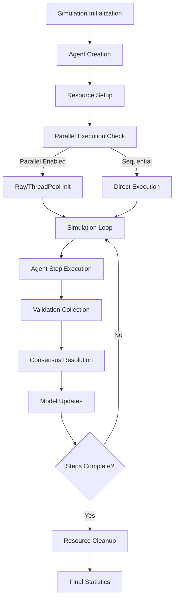

### Agent Step Workflow

```mermaid
graph TD
    A[Agent.step()] --> B[Generate Traffic]
    B --> C[Detect Anomalies]

    C --> D{Anomalies Found?}
    D -->|No| E[Poll & Validate]
    D -->|Yes| F[Extract Anomaly Data]

    F --> G[Generate Signature]
    G --> H[Broadcast to Ledger]
    H --> I[Update Local Model]
    I --> E

    E --> J[Return Results]
```

### Database Operations Workflow

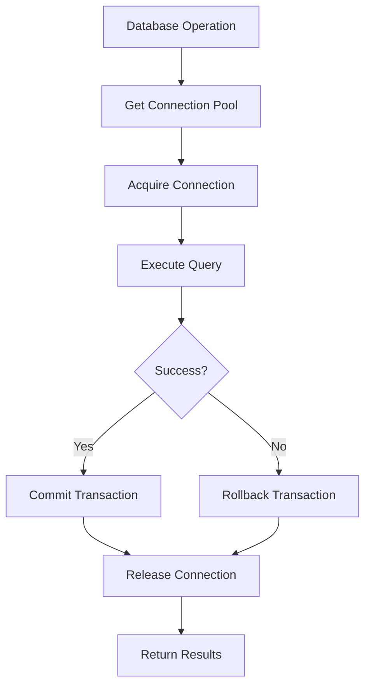

## Data Flow Diagrams

### Inter-Module Data Flow

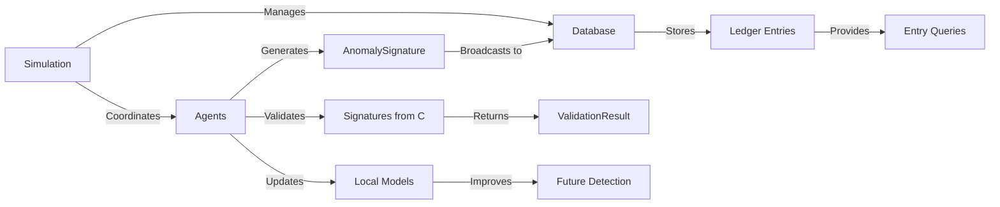

### Agent Internal Data Flow

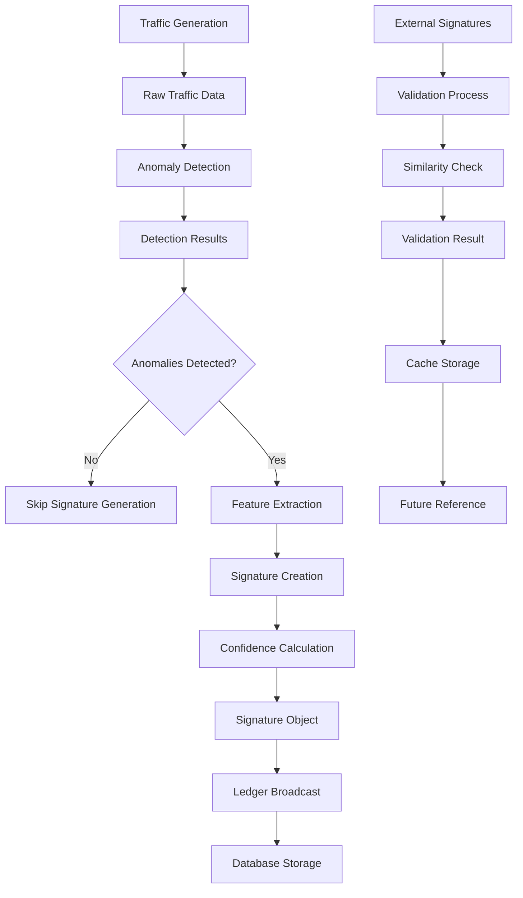

### Database Connection Flow

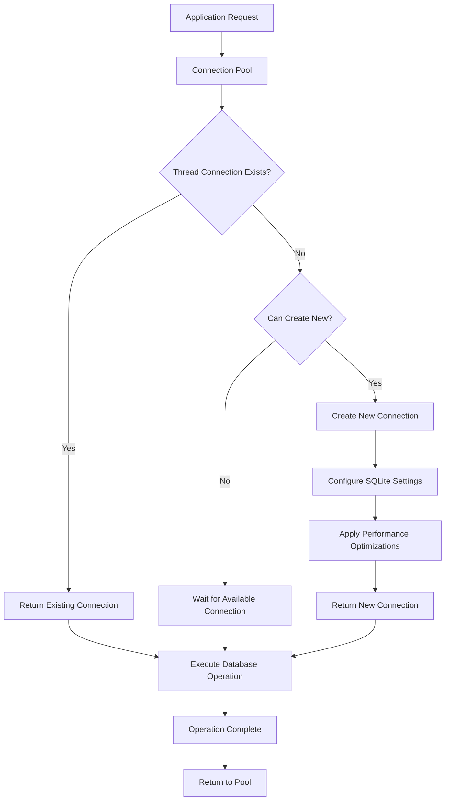

## Error Handling Flows

### Agent Error Handling

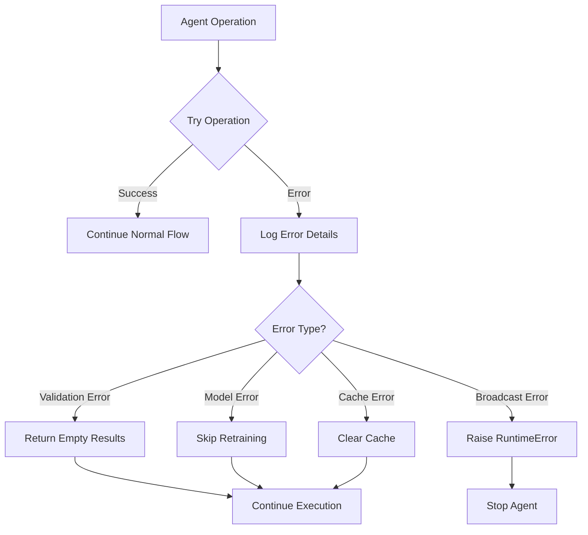

### Database Error Handling

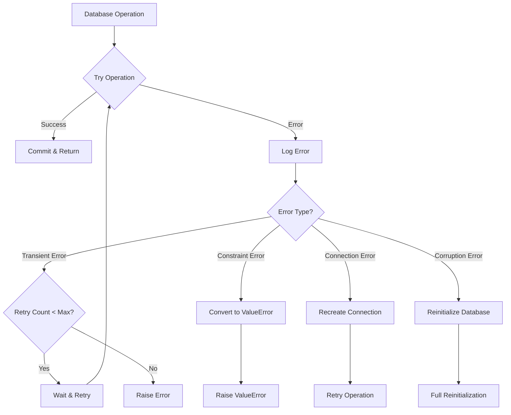

### Simulation Error Handling

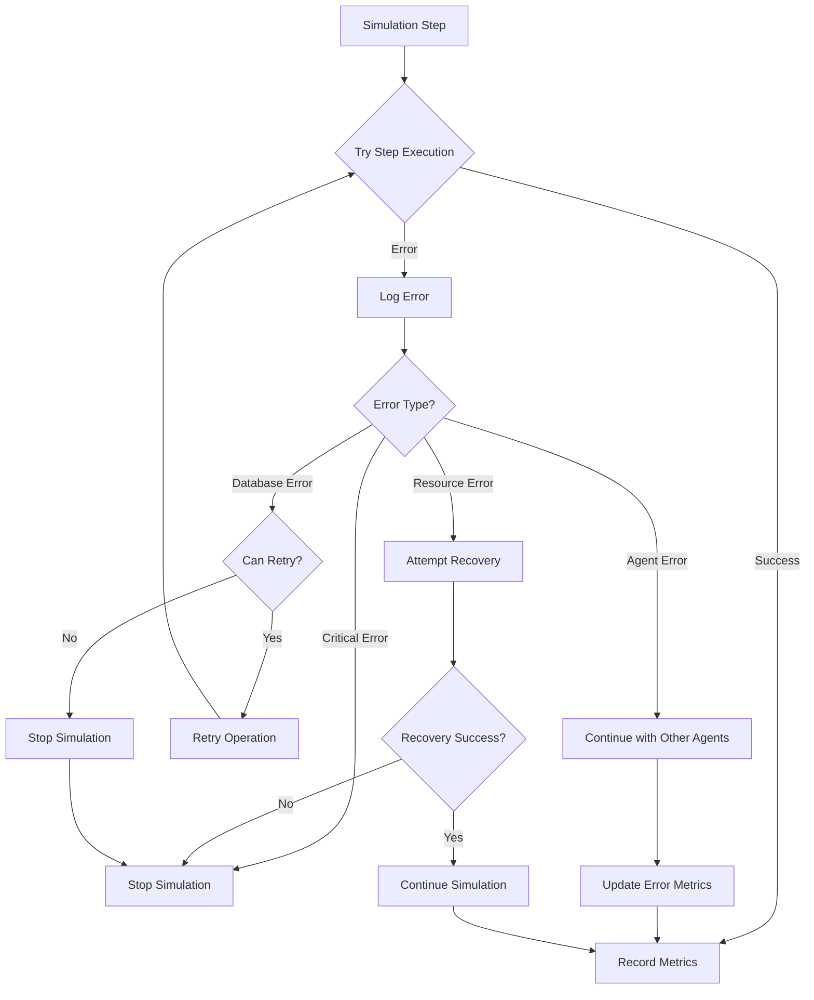

## Integration Pattern Diagrams

### Mesa Framework Integration

```mermaid
graph TD
    A[Mesa Model] --> B[Simulation Class]
    B --> C[Mesa Agent] --> D[AnomalyAgent Class]

    E[Mesa Scheduler] --> F[Step Execution]
    F --> G[Agent Activation]
    G --> H[Agent.step() Method]

    I[Mesa Data Collector] --> J[Simulation Stats]
    J --> K[Performance Metrics]
    K --> L[Monitoring Integration]
```

### Configuration Integration

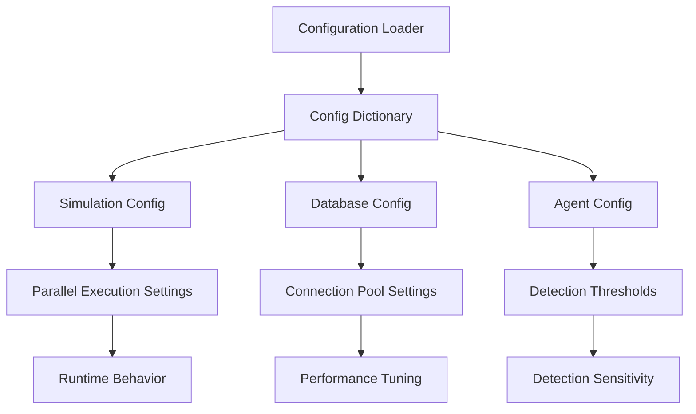

### Monitoring Integration

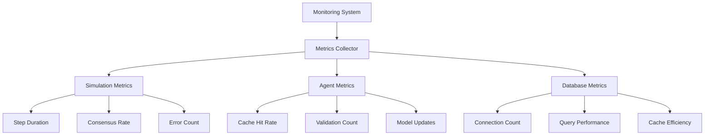

## Advanced Workflow Patterns

### Parallel Execution Patterns

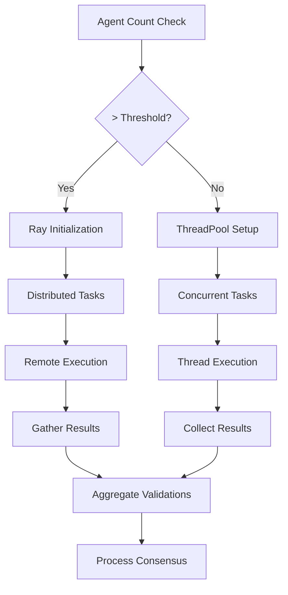

### Caching Strategy Workflow

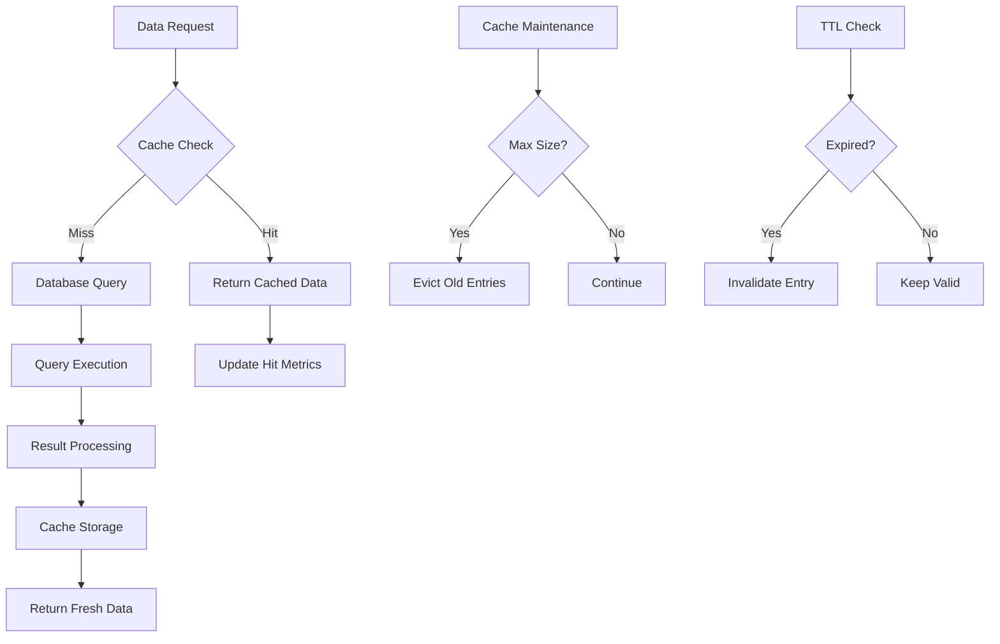

### Consensus Resolution Workflow

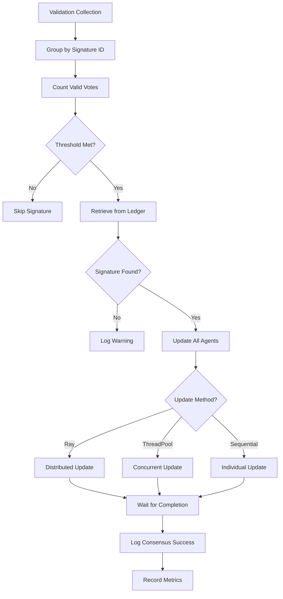

## Best Practices Illustrated

### Resource Management Pattern

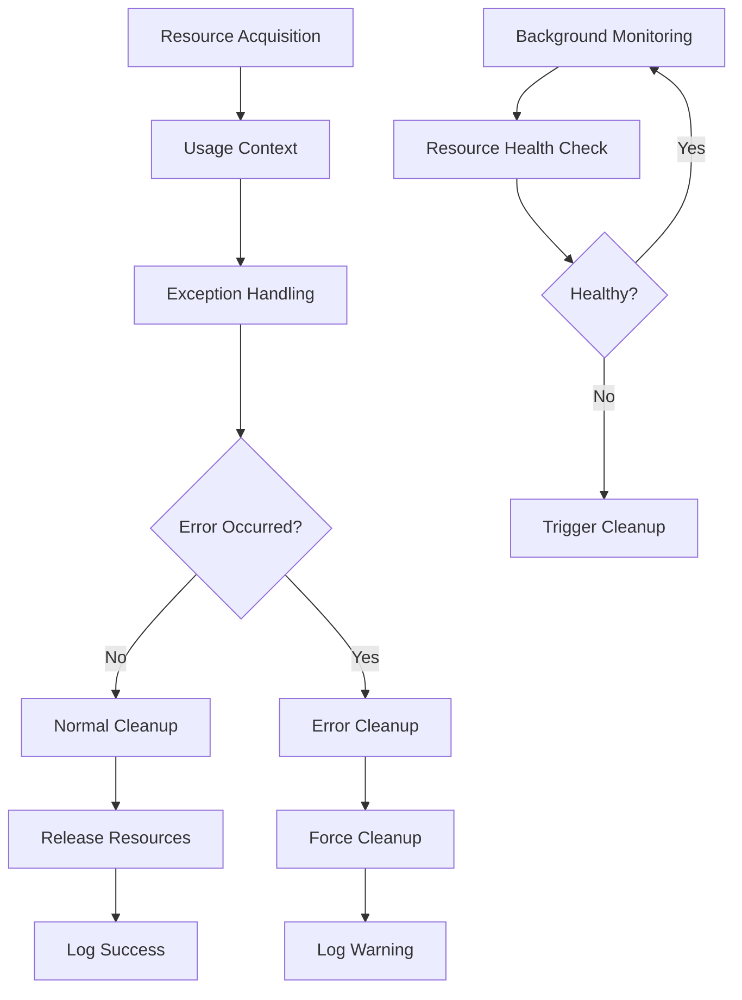

### Performance Optimization Pattern

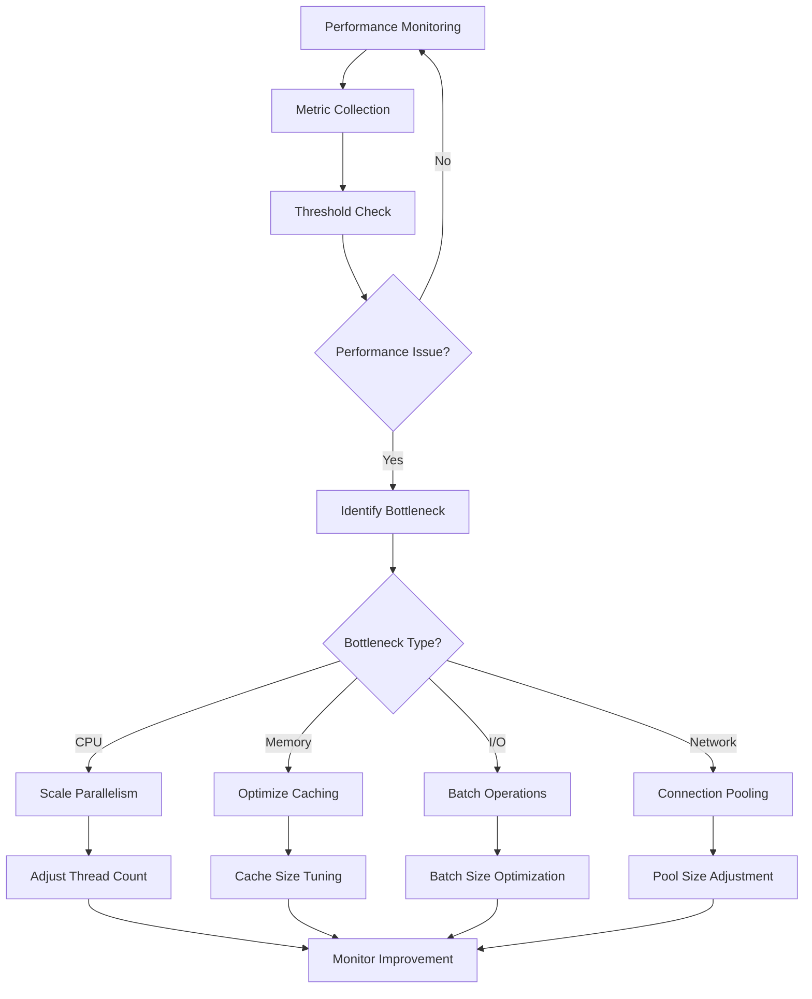

This comprehensive set of diagrams provides visual guidance for understanding the complex interactions, data flows, and error handling patterns within the decentralized AI simulation system. Each diagram illustrates key workflows and can be used for system design, debugging, and performance optimization.