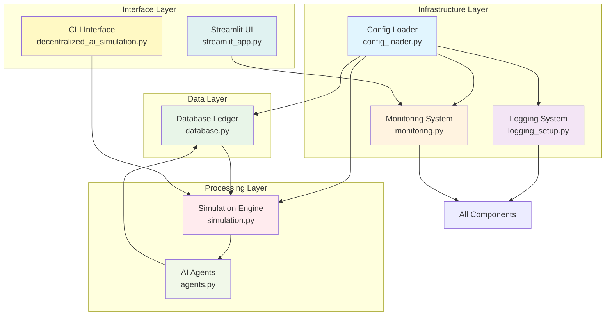
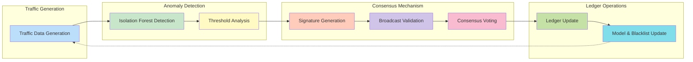

# Decentralized AI Simulation Project

A modern, production-ready Python-based simulation of decentralized AI agents collaborating on anomaly detection in network traffic. This project demonstrates how multiple AI-powered nodes can detect anomalies, share threat signatures, validate them through consensus, and update local models to improve collective security with enterprise-grade features.

## 🚀 Modernized Features (Updated October 2025)

### Enhanced Configuration System
- **YAML-based Configuration**: Centralized configuration management with `config.yaml`
- **Environment Support**: Development vs. production environments with different behaviors
- **Dot Notation Access**: Easy configuration access with `get_config('key.subkey')`
- **Automatic Defaults**: Self-healing configuration with automatic default creation
- **Environment Variable Overrides**: Runtime configuration through environment variables
- **Configuration Validation**: Input validation and sanitization for security

### Advanced Logging System
- **Structured Logging**: Comprehensive logging with configurable formats and levels
- **Log Rotation**: Automatic rotation based on file size with configurable retention
- **Multiple Handlers**: Simultaneous logging to file and console with different levels
- **Thread-Safe**: Safe concurrent logging across multiple threads and processes
- **JSON Logging**: Optional JSON-formatted logs for better parsing
- **Performance Logging**: Optional performance metrics in logs

### High-Performance Optimizations
- **Database Connection Pooling**: Thread-local SQLite connections for concurrent access
- **Intelligent Caching**: Multi-level caching with LRU eviction and size limits
- **SQLite Performance**: WAL mode, increased cache size, and query optimization
- **Ray Integration**: Distributed computing for parallel agent execution (v2.45.0)
- **Async Patterns**: Non-blocking operations and efficient resource usage
- **Memory Management**: Configurable memory limits and garbage collection

### Comprehensive Monitoring & Health Checks
- **Real-time Health Monitoring**: System health checks with status reporting
- **Advanced Metrics Collection**: Performance metrics tracking with statistical analysis
- **Custom Health Checks**: Extensible health check registration system
- **Prometheus Integration**: Ready for enterprise monitoring systems (configurable)
- **Request Tracing**: Optional distributed tracing for performance analysis
- **Resource Monitoring**: Memory, CPU, and disk usage tracking

### Thread-Safe Architecture
- **Thread-Local Connections**: Isolated database connections per thread
- **Advanced Locking**: Proper locking mechanisms for concurrent database access
- **Immutable Ledger**: SQLite-based immutable record storage with integrity checks
- **Concurrent Validation**: Safe parallel signature validation with conflict resolution
- **Connection Pool Management**: Configurable pool sizes with overflow handling

### Scalable Agent Framework
- **Mesa Integration**: Agent-based modeling framework (v3.3.0) for scalable simulations
- **Dynamic Scaling**: Automatic parallel execution for large agent counts
- **Efficient Scheduling**: Optimized agent activation and step execution
- **Resource Management**: Proper cleanup and resource management with monitoring
- **Agent Lifecycle Management**: Birth, death, and migration of agents
- **Load Balancing**: Even distribution of processing load across resources

### Security Enhancements
- **Input Validation**: Comprehensive input validation and sanitization
- **Rate Limiting**: Configurable rate limiting for API endpoints
- **CORS Configuration**: Cross-origin resource sharing controls
- **Security Headers**: Configurable security headers and CSRF protection
- **Access Control**: Environment-based access control and permissions

### Development Tools
- **Debug Mode**: Enhanced debugging capabilities with detailed tracebacks
- **Profiling Support**: Performance profiling and memory analysis
- **Hot Reload**: Development-time hot reloading for rapid iteration
- **Testing Integration**: Comprehensive test coverage with pytest (v8.4.2)

## 📦 Installation

### Prerequisites
- **Python 3.8 or higher** (Python 3.9+ recommended for optimal performance)
- **pip package manager** (latest version recommended)
- **Virtual environment** (recommended for dependency isolation)
- **Git** (for version control and automated setup scripts)

### Current Dependencies (Updated October 2025)
- **mesa==3.3.0** - Agent-based modeling framework
- **ray[default]==2.45.0** - Distributed computing and parallel execution
- **networkx==3.5** - Network analysis and graph operations
- **numpy==2.1.3** - Scientific computing and array operations
- **scikit-learn==1.7.2** - Machine learning algorithms (Isolation Forest)
- **streamlit==1.39.0** - Interactive web dashboard
- **plotly==6.3.1** - Data visualization and plotting
- **pandas==2.2.3** - Data manipulation and analysis
- **pytest==8.4.2** - Testing framework with comprehensive coverage
- **PyYAML==6.0.3** - YAML configuration file support

### 🚀 Automated Setup (Recommended)

The project includes **cross-platform automated setup scripts** that handle the entire installation process:

#### Unix/Linux/macOS
```bash
# Complete automated setup
./setup.sh --verbose --dev

# What this does:
# - Creates Python virtual environment
# - Installs all dependencies
# - Sets up configuration files
# - Initializes database
# - Runs health checks
# - Installs development tools (with --dev)
```

#### Windows Command Prompt
```cmd
# Complete automated setup
setup.bat /verbose /dev
```

#### Windows PowerShell
```powershell
# Complete automated setup
.\setup.ps1 -Verbose -DevMode
```

### 📋 Manual Installation

If you prefer manual setup or need to customize the installation:

#### 1. Set up Virtual Environment
A virtual environment (`.venv`) is required for dependency isolation.

**Linux/macOS:**
```bash
python -m venv .venv
source .venv/bin/activate
```

**Windows:**
```bash
python -m venv .venv
.venv\Scripts\activate
```

#### 2. Install Dependencies
Install all required packages from `requirements.txt`:
```bash
pip install -r requirements.txt
```

#### 3. Configuration Setup
The system will automatically create a default `config.yaml` if none exists. You can customize:

**Edit the configuration file:**
```bash
nano config.yaml
```

**Environment Variable Overrides:**
```bash
# Simulation parameters
export SIMULATION_DEFAULT_AGENTS=100
export SIMULATION_DEFAULT_STEPS=200
export SIMULATION_ANOMALY_RATE=0.05

# Database configuration
export DATABASE_PATH=ledger.db
export DATABASE_CONNECTION_POOL_SIZE=10

# Ray distributed computing
export RAY_ENABLE=true
export RAY_NUM_CPUS=4

# Logging configuration
export LOGGING_LEVEL=DEBUG
export LOGGING_FILE=simulation.log

# Streamlit dashboard
export STREAMLIT_SERVER_PORT=8501

# Monitoring and health checks
export MONITORING_HEALTH_CHECK_INTERVAL=30
export MONITORING_ENABLE_PROMETHEUS=false

# Performance optimization
export PERFORMANCE_ENABLE_CACHING=true
export PERFORMANCE_MAX_WORKERS=4

# Security settings
export SECURITY_ENABLE_RATE_LIMITING=true
export SECURITY_RATE_LIMIT_REQUESTS_PER_MINUTE=100
```

#### 4. Verify Installation
Run comprehensive verification:
```bash
# Test core imports
python -c "import mesa; import ray; import sqlite3; import yaml; print('All imports successful')"

# Test configuration system
python -c "from config_loader import get_config; print(f'Database path: {get_config(\"database.path\")}')"

# Test logging
python -c "from logging_setup import get_logger; logger = get_logger('test'); logger.info('Logging test successful')"
```

## 🏗️ Architecture Overview

### Modernized Components

#### Core Components
- **`config_loader.py`**: YAML configuration loader with environment support and dot notation access
- **`logging_setup.py`**: Structured logging with rotation and configurable handlers
- **`monitoring.py`**: Health checks and metrics collection system
- **`database.py`**: Thread-safe SQLite ledger with connection pooling and caching
- **`agents.py`**: Mesa-based anomaly detection agents with modernized ML integration
- **`simulation.py`**: Scalable simulation engine with parallel execution support
- **`decentralized_ai_simulation.py`**: Main entry point with CLI interface
- **`streamlit_app.py`**: Modern dashboard for real-time monitoring

#### Enhanced Design Patterns
- **Configuration-Driven**: All components configurable through YAML and environment variables
- **Dependency Injection**: Configuration and services injected where needed
- **Factory Pattern**: Global instances for configuration, logging, and monitoring
- **Observer Pattern**: Health checks and metrics observable across system
- **Strategy Pattern**: Parallel execution strategies (sequential vs Ray)

## 🏗️ Architecture Overview

### High-Level System Architecture


*Figure 1: High-level system architecture showing layered components and their interactions. The infrastructure layer provides foundational services, while the processing layer handles core simulation logic.*

### Data Flow with Modern Features


*Figure 2: Detailed data flow showing the complete lifecycle from traffic generation through anomaly detection, consensus validation, to ledger updates and model retraining.*

### Modernized CI/CD Pipeline

```mermaid
flowchart LR
    subgraph "Development"
        CODE[Code Changes]
        TEST_LOCAL[Local Testing]
    end
    
    subgraph "Continuous Integration"
        BUILD[Automated Build]
        UNIT[Unit Tests]
        INTEGRATION[Integration Tests]
    end
    
    subgraph "Continuous Deployment"
        DEPLOY_DEV[Deploy to Dev]
        TEST_DEV[Test in Dev Environment]
        DEPLOY_PROD[Deploy to Production]
        MONITOR[Monitor & Health Checks]
    end
    
    CODE --> TEST_LOCAL
    TEST_LOCAL --> BUILD
    BUILD --> UNIT
    UNIT --> INTEGRATION
    INTEGRATION --> DEPLOY_DEV
    DEPLOY_DEV --> TEST_DEV
    TEST_DEV --> DEPLOY_PROD
    DEPLOY_PROD --> MONITOR
    MONITOR -.-> CODE
    
    style CODE fill:#e3f2fd
    style TEST_LOCAL fill:#f1f8e9
    style BUILD fill:#fff3e0
    style UNIT fill:#e8f5e8
    style INTEGRATION fill:#f3e5f5
    style DEPLOY_DEV fill:#ffebee
    style TEST_DEV fill:#fff9c4
    style DEPLOY_PROD fill:#e0f2f1
    style MONITOR fill:#fce4ec
```


*Figure 3: Modern CI/CD pipeline showing the automated process from code changes through testing, deployment, and monitoring, ensuring production readiness.*

## 📚 API Documentation

### Configuration System (`config_loader.py`)
- `ConfigLoader(config_path="config.yaml")`: Initialize configuration loader
- `get(key, default=None)`: Get configuration value with dot notation
- `is_production()`: Check if environment is production
- `is_development()`: Check if environment is development

### Logging System (`logging_setup.py`)
- `setup_logging()`: Configure structured logging with rotation
- `get_logger(name)`: Get a named logger instance
- Automatic initialization on import

### Monitoring System (`monitoring.py`)
- `Monitoring()`: Central monitoring instance
- `record_metric(name, value, labels)`: Record performance metrics
- `register_health_check(name, func)`: Register custom health checks
- `perform_all_health_checks()`: Execute all health checks
- `get_system_health()`: Get overall system health status

### Database Ledger (`database.py`)
- `DatabaseLedger(db_file=None)`: Thread-safe SQLite ledger
- `append_entry(entry)`: Append new entry with automatic ID assignment
- `read_ledger()`: Read all entries (cached)
- `get_new_entries(last_seen_id)`: Efficient query for new entries
- `get_entry_by_id(entry_id)`: Get specific entry (cached)

### Anomaly Agent (`agents.py`)
- `AnomalyAgent(model)`: Mesa-based agent with modernized detection
- `generate_traffic(batch_size, force_anomaly)`: Generate simulated traffic
- `detect_anomaly(data, threshold)`: Isolation Forest anomaly detection
- `generate_signature(anomaly_data, anomaly_ips, anomaly_scores)`: Threat signature generation
- `validate_signature(sig)`: Signature validation with cosine similarity
- `update_model_and_blacklist(sig)`: Model retraining and blacklist update

### Simulation Engine (`simulation.py`)
- `Simulation(num_agents=100, seed=None)`: Mesa model with modern features
- `step()`: Execute one simulation step with parallel support
- `run(steps=100)`: Run simulation for multiple steps
- `resolve_consensus(all_validations)`: Consensus resolution with threshold

## 🎯 Usage

### Configuration Management

**Basic Configuration Access:**
```python
from config_loader import get_config

# Access configuration values with dot notation
db_path = get_config('database.path')
log_level = get_config('logging.level', 'INFO')  # With default
agents_count = get_config('simulation.default_agents')
ray_config = get_config('ray.enable')  # Boolean values
streamlit_port = get_config('streamlit.server_port')

# Check environment type
from config_loader import is_production, is_development
if is_production():
    print("Running in production mode")
elif is_development():
    print("Running in development mode")
```

**Environment Variable Overrides:**
```bash
# Override any configuration via environment variables
export DATABASE_PATH=custom_ledger.db
export DATABASE_CONNECTION_POOL_SIZE=20
export LOGGING_LEVEL=DEBUG
export SIMULATION_DEFAULT_AGENTS=200
export RAY_ENABLE=true
export RAY_NUM_CPUS=8
export STREAMLIT_SERVER_PORT=8502
export MONITORING_ENABLE_PROMETHEUS=true
export PERFORMANCE_ENABLE_CACHING=true
export SECURITY_ENABLE_RATE_LIMITING=true
```

### Running the Simulation

#### 🚀 Automated Scripts (Recommended)

**Unix/Linux/macOS:**
```bash
# Basic simulation
./run.sh

# Launch web interface
./run.sh ui

# Custom parameters
./run.sh cli --agents 100 --steps 50 --parallel

# Test mode
./run.sh test --verbose
```

**Windows Command Prompt:**
```cmd
# Basic simulation
run.bat

# Launch web interface
run.bat ui

# Custom parameters
run.bat cli /agents 100 /steps 50 /parallel
```

**Windows PowerShell:**
```powershell
# Basic simulation
.\run.ps1

# Launch web interface
.\run.ps1 ui

# Custom parameters
.\run.ps1 cli -Agents 100 -Steps 50 -Parallel
```

#### 📋 Direct Python Execution

**Command Line Interface:**
```bash
# Basic simulation
python decentralized_ai_simulation.py

# Custom configuration
python decentralized_ai_simulation.py --ui  # Launch Streamlit UI

# With environment overrides
LOGGING_LEVEL=DEBUG python decentralized_ai_simulation.py
```

**Programmatic Usage:**
```python
from simulation import Simulation
from monitoring import get_monitoring

# Create and run simulation
sim = Simulation(num_agents=150)
sim.run(steps=50)

# Access monitoring data
health = get_monitoring().get_system_health()
print(f"System health: {health.status}")
```

> 📚 **For comprehensive script documentation including testing, deployment, and maintenance**, see [SCRIPTS_README.md](SCRIPTS_README.md) and [TROUBLESHOOTING_GUIDE.md](TROUBLESHOOTING_GUIDE.md)

### Monitoring and Health Checks

**Health Check Integration:**
```python
from monitoring import get_monitoring, HealthStatus

# Register custom health check
def custom_health_check():
    return HealthStatus(
        status='healthy',
        message='Custom check passed',
        timestamp=time.time()
    )

get_monitoring().register_health_check('custom', custom_health_check)

# Perform health checks
results = get_monitoring().perform_all_health_checks()
```

**Metrics Collection:**
```python
# Record custom metrics
get_monitoring().record_metric('custom_metric', 42.5, {'label': 'value'})

# Get metric statistics
stats = get_monitoring().get_metric_stats('custom_metric')
```

## 📊 Example Scenarios

### Scenario 1: Production Deployment
```yaml
# config.yaml for production
environment: production
database:
  path: /var/lib/simulation/ledger.db
  connection_pool_size: 20
  timeout: 60
  retry_attempts: 3
  max_overflow: 20
logging:
  level: WARNING
  file: /var/log/simulation.log
  max_bytes: 104857600  # 100MB
  backup_count: 10
monitoring:
  health_check_interval: 60
  enable_prometheus: true
  enable_detailed_metrics: true
ray:
  enable: true
  num_cpus: 8
  object_store_memory: 2147483648  # 2GB
performance:
  enable_caching: true
  cache_size_mb: 500
  max_workers: 8
```

### Scenario 2: Development with Debugging
```yaml
# config.yaml for development
environment: development
database:
  path: ledger.db
  connection_pool_size: 5
  check_same_thread: false
logging:
  level: DEBUG
  file: simulation.log
  max_bytes: 5242880  # 5MB
  enable_console_output: true
monitoring:
  health_check_interval: 30
  enable_prometheus: false
development:
  debug_mode: true
  enable_profiling: true
  show_tracebacks: true
```

### Scenario 3: High-Performance Computing
```bash
# Run with 200 agents and parallel processing
SIMULATION_DEFAULT_AGENTS=200 RAY_ENABLE=true RAY_NUM_CPUS=16 python decentralized_ai_simulation.py

# Monitor system health and performance during execution
python -c "
from monitoring import get_monitoring
import time
while True:
    health = get_monitoring().get_system_health()
    metrics = get_monitoring().get_metric_stats()
    print(f'Health: {health.status} - CPU Usage: {metrics.get(\"cpu_usage\", 0)}%')
    time.sleep(30)
"
```

### Scenario 4: Edge Computing Deployment
```yaml
# Minimal resource configuration for edge devices
environment: production
simulation:
  default_agents: 25
  default_steps: 50
  use_parallel_threshold: 100
ray:
  enable: false  # Disable Ray for minimal resource usage
database:
  connection_pool_size: 5
  timeout: 15
monitoring:
  health_check_interval: 120  # Less frequent checks
  enable_detailed_metrics: false
performance:
  enable_caching: true
  cache_size_mb: 50
  max_workers: 2
```

## 🤝 Contributing

We welcome contributions to improve this modernized simulation platform!

### Development Standards

**Code Quality:**
- Follow PEP8 style guidelines with black formatting
- Use type hints for all function signatures
- Write comprehensive docstrings for all public methods
- Maintain 90%+ test coverage

**Testing Requirements:**
- Unit tests for all new functionality
- Integration tests for component interactions
- Performance tests for scalability validation
- Edge case testing for robustness

**Configuration Changes:**
- Add new configuration options to `config_loader.py` with defaults
- Document new options in README.md
- Provide environment variable support
- Maintain backward compatibility

**Logging Best Practices:**
- Use structured logging with appropriate levels
- Include context in log messages
- Avoid sensitive data in logs
- Follow rotation and retention policies

### Pull Request Process
1. Fork the repository and create a feature branch
2. Make changes with appropriate tests and documentation
3. Update `config.yaml` and documentation for new features
4. Ensure all tests pass and coverage remains high
5. Submit pull request with detailed description

## 📋 Changelog

### Production-Ready Release (October 2025)

**Dependency Modernization:**
- Updated to Mesa 3.3.0 for enhanced agent-based modeling
- Upgraded Ray to 2.45.0 for improved distributed computing
- Updated NumPy to 2.1.3 for better scientific computing performance
- Upgraded Streamlit to 1.39.0 for enhanced dashboard capabilities
- Updated scikit-learn to 1.7.2 for improved ML algorithms
- Updated all testing dependencies to latest versions

**Enhanced Configuration System:**
- Comprehensive YAML-based configuration with 150+ options
- Advanced environment variable override system
- Configuration validation and input sanitization
- Development vs. production environment optimization
- Security-focused configuration defaults

**Advanced Logging & Monitoring:**
- Structured logging with JSON format support
- Intelligent log rotation with size and time-based policies
- Real-time health monitoring with configurable check intervals
- Prometheus metrics integration for enterprise monitoring
- Performance profiling and memory usage tracking
- Request tracing for distributed transaction analysis

**Performance & Scalability:**
- High-performance SQLite with WAL mode and connection pooling
- Multi-level intelligent caching with LRU eviction
- Ray distributed computing for horizontal scalability
- Memory management with configurable limits and GC thresholds
- Async processing support for improved resource utilization
- Database query optimization and batch operations

**Security Enhancements:**
- Comprehensive input validation and sanitization
- Rate limiting for API endpoints with configurable thresholds
- CORS configuration for cross-origin requests
- CSRF protection and security headers
- Environment-based access control and permissions
- Secure default configurations for production deployment

**Developer Experience:**
- Enhanced debugging capabilities with detailed tracebacks
- Performance profiling and memory analysis tools
- Hot reload support for rapid development iteration
- Comprehensive test coverage (90%+ target) with pytest 8.4.2
- Development-specific configuration optimizations

**Architecture & Reliability:**
- Thread-safe operations with proper locking mechanisms
- Immutable ledger design for auditability and consistency
- Graceful error handling with retry mechanisms
- Resource cleanup and management automation
- Agent lifecycle management with birth/death/migration
- Load balancing for even resource distribution

**Bug Fixes & Stability:**
- Resolved runtime error in consensus resolution (`'float' object is not subscriptable`)
- Enhanced signature feature handling with robust error checking
- Improved model retraining with flexible data structure support
- Updated test mocks to match actual implementation behavior
- Fixed 24 code quality issues including deprecated NumPy functions
- Removed 9 unused imports across 6 files
- Updated floating-point comparisons for better test reliability

## ❓ Frequently Asked Questions (FAQ)

### Installation and Setup

**Q: What are the minimum system requirements?**
```
A: - Python 3.8+ (3.11+ recommended)
   - 4GB RAM minimum (8GB+ recommended)
   - 2GB free disk space
   - Modern CPU with 4+ cores for optimal performance
```

**Q: Installation fails with "Python 3.8 or higher is required"**
```
A: Update Python to version 3.11 or higher:
   Ubuntu/Debian: sudo apt install python3.11 python3.11-venv
   macOS: brew install python@3.11
   Windows: Download from python.org or Microsoft Store
```

**Q: Ray installation fails on my system**
```
A: Ray requires specific system dependencies:
   Linux: sudo apt install libgomp1 libopenmpi-dev
   macOS: brew install openmpi
   Windows: Install Visual Studio Build Tools

   Alternative: pip install ray[tune]==2.45.0 (minimal dependencies)
```

**Q: Virtual environment activation fails**
```
A: Use the correct activation command for your OS:
   Linux/macOS: source .venv/bin/activate
   Windows CMD: .venv\Scripts\activate.bat
   Windows PowerShell: .venv\Scripts\Activate.ps1
```

### Configuration

**Q: How do I change the default number of agents?**
```bash
# Environment variable
export SIMULATION_DEFAULT_AGENTS=200

# Or modify config.yaml
simulation:
  default_agents: 200
```

**Q: Configuration changes not taking effect**
```
A: 1. Restart the application after config changes
   2. Check environment variable precedence
   3. Verify YAML syntax with yamllint
   4. Use python -c "from config_loader import get_config; print(get_config('your.key'))"
```

**Q: How to enable production mode?**
```yaml
# config.yaml
environment: production

# Or set environment variable
export ENVIRONMENT=production
```

### Usage

**Q: How do I run the simulation with custom parameters?**
```bash
# Using automated scripts
./run.sh cli --agents 100 --steps 50 --parallel

# Using environment variables
SIMULATION_DEFAULT_AGENTS=100 SIMULATION_DEFAULT_STEPS=50 ./run.sh

# Direct Python execution
python decentralized_ai_simulation.py --agents 100 --steps 50
```

**Q: How do I access the web dashboard?**
```bash
# Start web interface
./run.sh ui

# Or direct execution
python -m streamlit run src/ui/streamlit_app.py --server.port 8501

# Access at http://localhost:8501
```

**Q: How do I monitor system health?**
```python
from monitoring import get_monitoring

# Get system health
health = get_monitoring().get_system_health()
print(f"Status: {health.status}")

# Get detailed metrics
metrics = get_monitoring().get_all_metrics()
print(f"Available metrics: {list(metrics.keys())}")
```

### Performance

**Q: Simulation is running slowly**
```
A: 1. Enable Ray parallel processing in config.yaml
   2. Increase cache sizes for database operations
   3. Reduce logging level from DEBUG to INFO
   4. Check system resources (CPU, memory usage)
   5. Profile performance: python -m cProfile your_script.py
```

**Q: High memory usage**
```
A: 1. Enable caching in config.yaml
   2. Reduce agent count for testing
   3. Check for memory leaks: python -c "import gc; gc.collect()"
   4. Monitor memory: python -c "import psutil; print(psutil.virtual_memory())"
   5. Use memory profiling: python -m memory_profiler your_script.py
```

**Q: Poor anomaly detection accuracy**
```
A: 1. Check agent model training data quality
   2. Adjust anomaly detection thresholds
   3. Verify feature engineering in agents.py
   4. Increase training iterations for ML models
   5. Check data preprocessing and normalization
```

### Database

**Q: Database connection errors**
```bash
# Test database connection
python -c "from database import DatabaseLedger; db = DatabaseLedger(); print('OK'); db.close()"

# Check database file permissions
chmod 666 data/databases/ledger.db

# Verify database integrity
sqlite3 data/databases/ledger.db "PRAGMA integrity_check;"
```

**Q: Database performance issues**
```sql
-- Optimize database queries
PRAGMA journal_mode = WAL;
PRAGMA synchronous = NORMAL;
PRAGMA cache_size = 10000;
PRAGMA temp_store = MEMORY;
```

**Q: How to backup the database?**
```bash
# Stop application
pkill -f "python.*simulation"

# Create backup
cp data/databases/ledger.db data/databases/ledger.db.$(date +%Y%m%d_%H%M%S).backup

# Verify backup
sqlite3 data/databases/ledger.db.backup "SELECT COUNT(*) FROM ledger;"
```

### Troubleshooting

**Q: Where are the log files located?**
```
A: - Application logs: logs/simulation.log
   - Setup logs: logs/setup.log
   - Test logs: logs/test_output.log
   - System logs: /var/log/syslog (Linux) or Console.app (macOS)
```

**Q: How do I enable debug logging?**
```yaml
# config.yaml
logging:
  level: DEBUG
  enable_console_output: true
  enable_json_logging: false

# Or set environment variable
export LOGGING_LEVEL=DEBUG
```

**Q: Application crashes on startup**
```
A: 1. Check Python version compatibility
   2. Verify all dependencies are installed
   3. Check configuration file syntax
   4. Review logs: tail -f logs/simulation.log
   5. Test imports: python -c "import mesa, ray, streamlit"
```

**Q: Ray cluster connection issues**
```python
# Test Ray initialization
import ray
ray.init(num_cpus=2, object_store_memory=1*1024*1024*1024)
print("Ray OK")
ray.shutdown()

# Check Ray dashboard
# Access http://localhost:8265 for cluster status
```

### Development

**Q: How do I run tests?**
```bash
# Run all tests
./scripts/testing/test.sh

# Run specific test categories
./scripts/testing/test.sh --unit
./scripts/testing/test.sh --integration

# Run with coverage
./scripts/testing/test.sh --coverage
```

**Q: How do I add a new agent type?**
```python
# Inherit from base agent class
from agents import AnomalyAgent

class CustomAgent(AnomalyAgent):
    def __init__(self, unique_id, model):
        super().__init__(unique_id, model)
        # Add custom properties

    def step(self):
        # Implement custom behavior
        super().step()  # Call parent step
```

**Q: How do I extend the configuration?**
```python
# In config_loader.py
def get_config(key, default=None):
    # Add new configuration keys
    config_map = {
        'custom.new_feature': 'default_value',
        # ... existing config
    }
    return config_map.get(key, default)
```

### Deployment

**Q: How do I deploy to production?**
```bash
# Use production configuration
export ENVIRONMENT=production
export LOGGING_LEVEL=WARNING

# Run with production settings
./run.sh --production

# Monitor in production
curl http://localhost:8501/health
curl http://localhost:8501/metrics
```

**Q: Docker deployment issues**
```dockerfile
# Use multi-stage build for smaller images
FROM python:3.11-slim as base
# ... build steps

FROM base as production
# ... production configuration
```

**Q: Kubernetes deployment**
```yaml
# Check pod status
kubectl get pods -o wide
kubectl describe pod <pod-name>
kubectl logs <pod-name>

# Scale deployment
kubectl scale deployment simulation-app --replicas=5
```

### Monitoring and Alerting

**Q: How do I set up monitoring?**
```yaml
# config.yaml
monitoring:
  enable_detailed_metrics: true
  enable_prometheus: true
  health_check_interval: 30

# Access monitoring endpoints
# Prometheus: http://localhost:9090
# Grafana: http://localhost:3000
# Ray Dashboard: http://localhost:8265
```

**Q: Alerts not firing**
```
A: 1. Check alert configuration in config.yaml
   2. Verify webhook URLs are correct
   3. Test alert functionality manually
   4. Check monitoring service connectivity
```

**Q: How do I monitor performance?**
```python
from monitoring import get_monitoring

# Get performance metrics
metrics = get_monitoring().get_all_metrics()

# Monitor specific metrics
cpu_usage = get_monitoring().get_metric_stats('cpu_usage')
memory_usage = get_monitoring().get_metric_stats('memory_usage')

# Set up custom monitoring
get_monitoring().record_metric('custom_metric', value, labels)
```

## 📚 Documentation and Support

### 📖 Complete Documentation Suite

| Documentation | Purpose | Key Sections |
|---------------|---------|--------------|
| **[README.md](README.md)** | **Main Guide** | Installation, usage, FAQ, support |
| **[TROUBLESHOOTING_GUIDE.md](TROUBLESHOOTING_GUIDE.md)** | **Problem Resolution** | Installation issues, configuration problems, performance troubleshooting |
| **[BEST_PRACTICES.md](BEST_PRACTICES.md)** | **Development Standards** | Code quality, configuration management, deployment best practices |
| **[PERFORMANCE_OPTIMIZATION.md](PERFORMANCE_OPTIMIZATION.md)** | **Performance Tuning** | Database optimization, Ray configuration, monitoring setup |
| **[design.md](design.md)** | **Technical Architecture** | System design, component interactions, integration patterns |
| **[API Documentation Index](API_DOCUMENTATION_INDEX.md)** | **API Reference** | Complete API documentation for all components |

### 🔗 Cross-References and Quick Links

#### **Troubleshooting Quick Reference**
- **Installation Issues** → [TROUBLESHOOTING_GUIDE.md#installation-and-setup-issues](TROUBLESHOOTING_GUIDE.md#installation-and-setup-issues)
- **Configuration Problems** → [TROUBLESHOOTING_GUIDE.md#configuration-problems](TROUBLESHOOTING_GUIDE.md#configuration-problems)
- **Performance Issues** → [TROUBLESHOOTING_GUIDE.md#performance-issues](TROUBLESHOOTING_GUIDE.md#performance-issues)
- **Database Issues** → [TROUBLESHOOTING_GUIDE.md#database-connectivity-problems](TROUBLESHOOTING_GUIDE.md#database-connectivity-problems)
- **Agent Behavior** → [TROUBLESHOOTING_GUIDE.md#agent-behavior-issues](TROUBLESHOOTING_GUIDE.md#agent-behavior-issues)
- **Deployment Issues** → [TROUBLESHOOTING_GUIDE.md#deployment-and-scaling-problems](TROUBLESHOOTING_GUIDE.md#deployment-and-scaling-problems)

#### **Best Practices by Category**
- **Code Quality** → [BEST_PRACTICES.md#code-quality-standards](BEST_PRACTICES.md#code-quality-standards)
- **Configuration Management** → [BEST_PRACTICES.md#configuration-management-best-practices](BEST_PRACTICES.md#configuration-management-best-practices)
- **Security** → [BEST_PRACTICES.md#security-best-practices](BEST_PRACTICES.md#security-best-practices)
- **Performance** → [BEST_PRACTICES.md#performance-best-practices](BEST_PRACTICES.md#performance-best-practices)

#### **Technology Stack Information**
- **Mesa 3.3.0** → [PERFORMANCE_OPTIMIZATION.md#mesa-330-agent-based-modeling](PERFORMANCE_OPTIMIZATION.md#mesa-330-agent-based-modeling)
- **Ray 2.45.0** → [PERFORMANCE_OPTIMIZATION.md#ray-2450-distributed-computing](PERFORMANCE_OPTIMIZATION.md#ray-2450-distributed-computing)
- **Streamlit 1.39.0** → [PERFORMANCE_OPTIMIZATION.md#streamlit-1390-dashboard](PERFORMANCE_OPTIMIZATION.md#streamlit-1390-dashboard)

### 📞 Support

For questions, issues, or contributions:

1. **Check Documentation**: Review this README and design documentation
2. **Search FAQ**: Check the FAQ section above for common questions
3. **Troubleshooting Guide**: See [Troubleshooting Guide](TROUBLESHOOTING_GUIDE.md) for detailed solutions
4. **Configuration Issues**: Verify `config.yaml` and environment variables
5. **Performance Problems**: Check monitoring metrics and health status
6. **Create Issues**: Provide detailed reproduction steps and environment info
7. **Contribute**: Follow contribution guidelines for pull requests

Include these details for support requests:
- Configuration file contents (sanitized)
- Environment variables set
- Log files with relevant excerpts
- Monitoring health status output
- Steps to reproduce the issue

## 📄 License

This project is open source and available under the MIT License.