# Decentralized AI Simulation Project: Modernized Architecture Design

## Architecture Overview

The decentralized AI simulation project has been modernized with enterprise-grade features for production readiness. The architecture now incorporates configuration management, structured logging, comprehensive monitoring, performance optimizations, and thread-safe operations while maintaining the core anomaly detection and consensus mechanisms.

### Enhanced Component Architecture

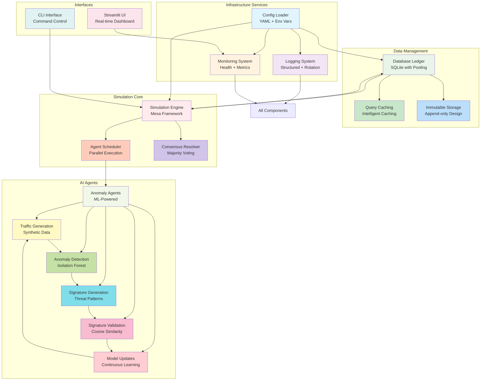

*Figure 1: Enhanced component architecture showing detailed relationships between all system components, including infrastructure services, data management, simulation core, AI agents, and interfaces.*

## Core Components

### Configuration System (`config_loader.py`)

The configuration system provides centralized management of all application settings through YAML files and environment variable overrides.

**Key Features:**
- **YAML-based Configuration**: Human-readable configuration files with nested structures
- **Environment Support**: Different behaviors for development vs. production environments
- **Dot Notation Access**: Easy access to nested configuration values
- **Automatic Defaults**: Self-healing configuration with automatic default creation
- **Environment Variable Overrides**: Runtime configuration through environment variables

**Configuration Hierarchy:**
1. Default values built into the code
2. `config.yaml` file values
3. Environment variable overrides (highest priority)

### Logging System (`logging_setup.py`)

The enhanced logging system provides structured, configurable logging with enterprise features.

**Key Features:**
- **Structured Logging**: Consistent log format with timestamps, levels, and contextual information
- **Log Rotation**: Automatic rotation based on file size with configurable retention
- **Multiple Handlers**: Simultaneous logging to file and console with different levels
- **Thread Safety**: Safe concurrent logging across multiple threads and processes
- **Configurable Levels**: Dynamic log level configuration through YAML

### Monitoring System (`monitoring.py`)

The monitoring system provides comprehensive health checks and metrics collection for operational awareness.

**Key Features:**
- **Health Status Monitoring**: Real-time system health checks with status reporting
- **Metrics Collection**: Performance metrics tracking with statistical analysis
- **Extensible Checks**: Custom health check registration system
- **Prometheus Ready**: Built-in support for Prometheus metrics export
- **Uptime Tracking**: Application uptime monitoring and reporting

### Database Ledger (`database.py`)

The modernized database system provides thread-safe, high-performance storage for the immutable ledger.

**Key Features:**
- **Thread-Safe Operations**: Thread-local connections and proper locking mechanisms
- **Connection Pooling**: Efficient connection management for concurrent access
- **Query Caching**: Intelligent caching of frequently accessed data
- **SQLite Optimizations**: WAL mode, increased cache size, and performance tuning
- **Immutable Storage**: Append-only ledger design for auditability

### Simulation Engine (`simulation.py`)

The simulation engine coordinates agent interactions, consensus resolution, and parallel execution.

**Key Features:**
- **Mesa Integration**: Agent-based modeling framework for scalable simulations
- **Parallel Execution**: Ray integration for distributed agent processing
- **Dynamic Scheduling**: Optimized agent activation and step execution
- **Consensus Management**: Majority voting system with configurable thresholds
- **Resource Cleanup**: Proper resource management and cleanup procedures

### Anomaly Agents (`agents.py`)

The agents perform anomaly detection, signature generation, validation, and model updates.

**Key Features:**
- **Isolation Forest ML**: Machine learning-based anomaly detection
- **Signature Generation**: Threat signature creation from detected anomalies
- **Validation Logic**: Cosine similarity-based signature validation
- **Model Updates**: Continuous learning through model retraining
- **Blacklist Management**: Local threat database maintenance

## Design Patterns and Principles

### Configuration-Driven Design
All components are designed to be configurable through the centralized configuration system, enabling runtime behavior changes without code modifications.

### Dependency Injection
Services like configuration, logging, and monitoring are injected where needed, promoting loose coupling and testability.

### Factory Pattern
Global instances for configuration, logging, and monitoring are managed through factory functions, ensuring singleton behavior where appropriate.

### Observer Pattern
The monitoring system observes system health and performance, allowing components to report metrics and status.

### Strategy Pattern
Parallel execution strategies (sequential vs. Ray) are implemented as interchangeable strategies based on configuration.

## Data Flow with Modern Components

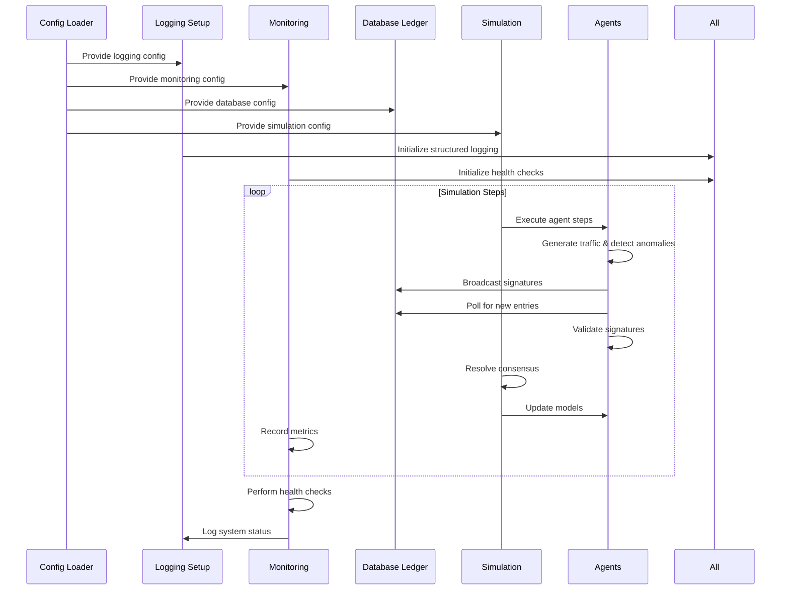
## Workflow Diagrams

### Anomaly Detection Workflow
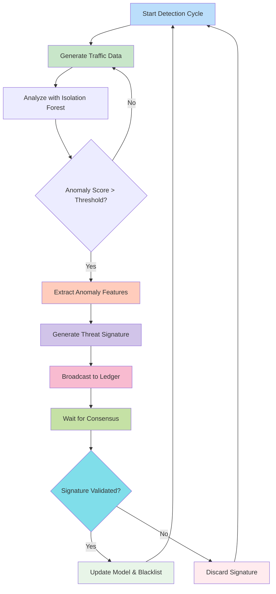

*Figure 2: Anomaly detection workflow showing the complete process from traffic generation through detection, validation, and model updates.*

### Consensus Mechanism Workflow
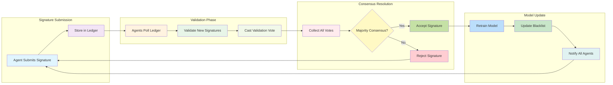

*Figure 3: Consensus mechanism workflow detailing the process from signature submission through validation voting to final resolution and model updates.*

### Error Handling Flow
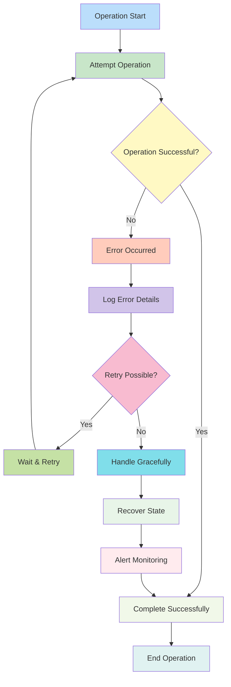

*Figure 4: Comprehensive error handling flow showing retry mechanisms, graceful degradation, and monitoring integration for robust operation.*

## Enhanced Architectural Diagrams

### System Architecture Overview (High-Level)
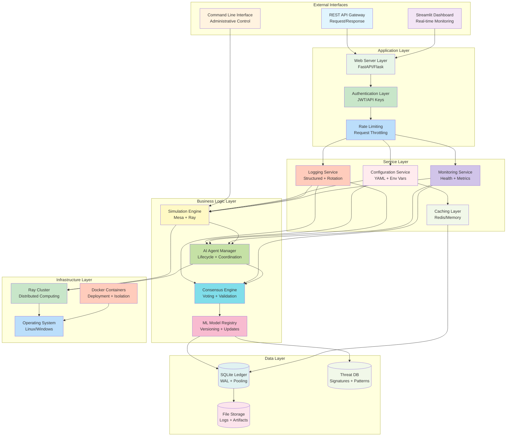

*Figure 9: Enhanced system architecture overview showing layered architecture from external interfaces through application, service, business logic, and data layers to infrastructure.*

### Data Flow Architecture (Complete Pipeline)
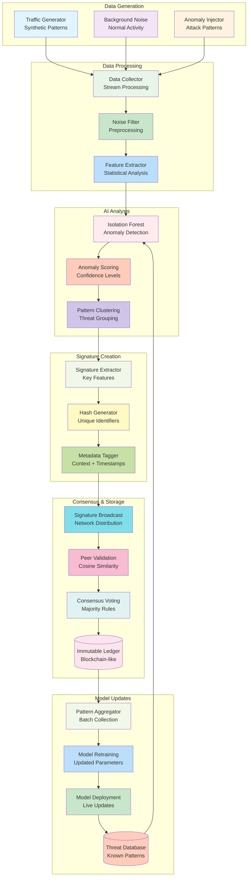

*Figure 10: Complete data flow architecture showing the entire pipeline from data generation through AI analysis, signature creation, consensus validation, and model updates.*

### Deployment Architecture (Multi-Environment)
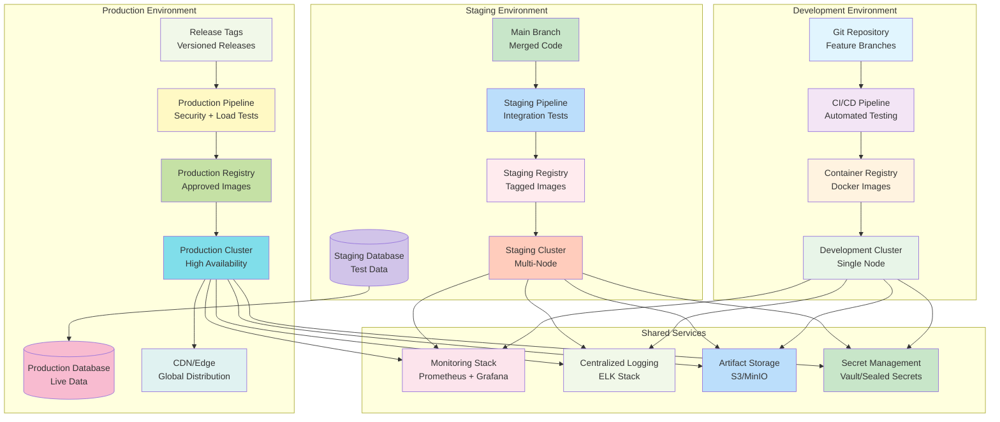

*Figure 11: Multi-environment deployment architecture showing development, staging, and production environments with shared services and promotion pipelines.*

### Security Architecture (Defense in Depth)
```mermaid
flowchart TD
    subgraph "Perimeter Security"
        FW[Firewall<br/>Network Layer]
        WAF[Web Application Firewall<br/>HTTP Filtering]
        VPN[VPN Gateway<br/>Secure Access]
        CERT[SSL/TLS Certificates<br/>Encryption in Transit]
    end

    subgraph "Access Control"
        AUTHN[Authentication<br/>Identity Verification]
        AUTHZ[Authorization<br/>Permission Management]
        RBAC[Role-Based Access<br/>Least Privilege]
        SESSION[Session Management<br/>Secure Tokens]
    end

    subgraph "Input Validation"
        SANITIZE[Input Sanitization<br/>XSS Prevention]
        VALIDATE[Schema Validation<br/>Type Checking]
        RATE_LIMIT[Rate Limiting<br/>DoS Protection]
        CSRF[CSRF Protection<br/>Request Forgery]
    end

    subgraph "Data Protection"
        ENCRYPT_AT_REST[Encryption at Rest<br/>Database + Files]
        ENCRYPT_IN_TRANSIT[Encryption in Transit<br/>TLS 1.3]
        PII_MASKING[PII Data Masking<br/>Privacy Protection]
        AUDIT_LOGGING[Audit Logging<br/>Security Events]
    end

    subgraph "Application Security"
        SECURE_CONFIG[Secure Configuration<br/>No Hardcoded Secrets]
        DEPENDENCY_SCAN[Dependency Scanning<br/>Vulnerability Checks]
        CODE_SCAN[Static Code Analysis<br/>SAST Scanning]
        CONTAINER_SCAN[Container Scanning<br/>Image Vulnerabilities]
    end

    subgraph "Monitoring & Response"
        IDS[Intrusion Detection<br/>Anomaly Monitoring]
        SIEM[Security Events<br/>Log Correlation]
        ALERTING[Alert Management<br/>Incident Response]
        BACKUP[Secure Backups<br/>Encrypted Storage]
    end

    FW --> WAF
    WAF --> VPN
    VPN --> CERT

    CERT --> AUTHN
    AUTHN --> AUTHZ
    AUTHZ --> RBAC
    RBAC --> SESSION

    SESSION --> SANITIZE
    SANITIZE --> VALIDATE
    VALIDATE --> RATE_LIMIT
    RATE_LIMIT --> CSRF

    CSRF --> ENCRYPT_AT_REST
    ENCRYPT_AT_REST --> ENCRYPT_IN_TRANSIT
    ENCRYPT_IN_TRANSIT --> PII_MASKING
    PII_MASKING --> AUDIT_LOGGING

    AUDIT_LOGGING --> SECURE_CONFIG
    SECURE_CONFIG --> DEPENDENCY_SCAN
    DEPENDENCY_SCAN --> CODE_SCAN
    CODE_SCAN --> CONTAINER_SCAN

    CONTAINER_SCAN --> IDS
    IDS --> SIEM
    SIEM --> ALERTING
    ALERTING --> BACKUP

    style FW fill:#e1f5fe
    style WAF fill:#f3e5f5
    style VPN fill:#fff3e0
    style CERT fill:#e8f5e8
    style AUTHN fill:#c8e6c9
    style AUTHZ fill:#bbdefb
    style RBAC fill:#ffebee
    style SESSION fill:#ffccbc
    style SANITIZE fill:#d1c4e9
    style VALIDATE fill:#f1f8e9
    style RATE_LIMIT fill:#fff9c4
    style CSRF fill:#c5e1a5
    style ENCRYPT_AT_REST fill:#80deea
    style ENCRYPT_IN_TRANSIT fill:#f8bbd0
    style PII_MASKING fill:#e0f2f1
    style AUDIT_LOGGING fill:#fce4ec
    style SECURE_CONFIG fill:#f1f8e9
    style DEPENDENCY_SCAN fill:#bbdefb
    style CODE_SCAN fill:#c8e6c9
    style CONTAINER_SCAN fill:#ffccbc
    style IDS fill:#e1f5fe
    style SIEM fill:#f3e5f5
    style ALERTING fill:#fff3e0
    style BACKUP fill:#e8f5e8
```

*Figure 12: Comprehensive security architecture implementing defense in depth with perimeter security, access control, input validation, data protection, application security, and monitoring layers.*

### Scalability Architecture (Elastic Design)
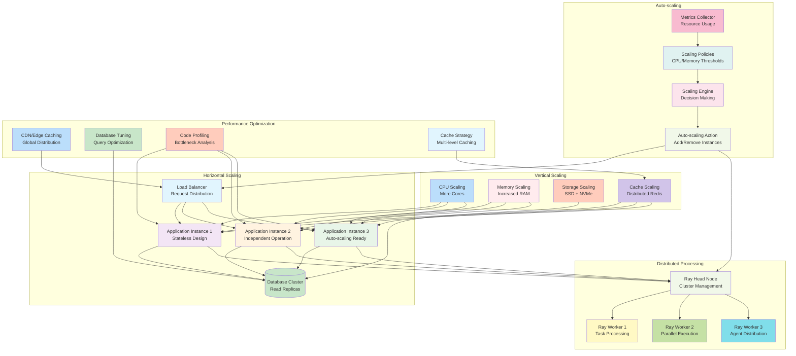

*Figure 13: Comprehensive scalability architecture showing horizontal scaling with load balancing, vertical scaling with resource optimization, distributed processing with Ray, auto-scaling capabilities, and performance optimization strategies.*

### Enhanced Workflow Illustrations

#### Agent Lifecycle Workflow (Detailed)
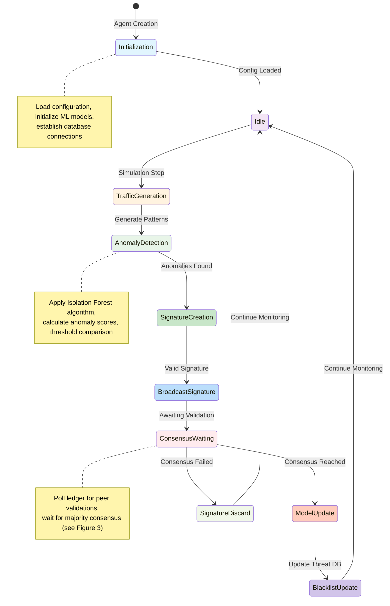

*Figure 14: Detailed agent lifecycle workflow showing state transitions from initialization through traffic generation, anomaly detection, consensus participation, and model updates.*

#### Database Transaction Workflow
```mermaid
flowchart TD
    subgraph "Read Operations"
        RO1[Read Request] --> RO2{Cache Check}
        RO2 -->|Cache Hit| RO3[Return Cached Data]
        RO2 -->|Cache Miss| RO4[Acquire Connection]
        RO4 --> RO5[Execute Query]
        RO5 --> RO6[Process Results]
        RO6 --> RO7[Cache Results]
        RO7 --> RO8[Release Connection]
        RO8 --> RO3
    end

    subgraph "Write Operations"
        WO1[Write Request] --> WO2[Acquire Connection]
        WO2 --> WO3[Start Transaction]
        WO3 --> WO4[Execute Insert/Update]
        WO4 --> WO5{Conflict Check}
        WO5 -->|No Conflict| WO6[Commit Transaction]
        WO5 -->|Conflict| WO7[Retry Logic]
        WO7 --> WO3
        WO6 --> WO8[Invalidate Cache]
        WO8 --> WO9[Release Connection]
    end

    subgraph "Ledger Operations"
        LO1[Signature Submit] --> LO2[Validate Format]
        LO2 --> LO3[Generate Hash]
        LO3 --> LO4[Store in WAL]
        LO4 --> LO5[Update Indexes]
        LO5 --> LO6[Broadcast to Peers]
        LO6 --> LO7[Trigger Consensus]
    end

    RO3 --> [*]
    WO9 --> [*]
    LO7 --> [*]

    style RO1 fill:#e1f5fe
    style RO2 fill:#f3e5f5
    style RO3 fill:#fff3e0
    style RO4 fill:#e8f5e8
    style RO5 fill:#c8e6c9
    style RO6 fill:#bbdefb
    style RO7 fill:#ffebee
    style RO8 fill:#ffccbc
    style WO1 fill:#d1c4e9
    style WO2 fill:#f1f8e9
    style WO3 fill:#fff9c4
    style WO4 fill:#c5e1a5
    style WO5 fill:#80deea
    style WO6 fill:#f8bbd0
    style WO7 fill:#e0f2f1
    style WO8 fill:#fce4ec
    style WO9 fill:#f1f8e9
    style LO1 fill:#bbdefb
    style LO2 fill:#c8e6c9
    style LO3 fill:#ffccbc
    style LO4 fill:#e1f5fe
    style LO5 fill:#f3e5f5
    style LO6 fill:#fff3e0
    style LO7 fill:#e8f5e8
```

*Figure 15: Comprehensive database workflow showing read operations with caching, write operations with transaction management, and specialized ledger operations for immutable storage.*

#### Monitoring and Alerting Workflow
```mermaid
flowchart TD
    subgraph "Metrics Collection"
        MC1[System Metrics<br/>CPU, Memory, Disk] --> MC2[Application Metrics<br/>Response Time, Errors]
        MC2 --> MC3[Business Metrics<br/>Anomalies, Consensus]
        MC3 --> MC4[Custom Metrics<br/>Agent Performance]
    end

    subgraph "Health Checks"
        HC1[Component Health<br/>Database, Cache] --> HC2[Service Health<br/>API, Simulation]
        HC2 --> HC3[Integration Health<br/>External Services]
        HC3 --> HC4[Overall Status<br/>System Health Score]
    end

    subgraph "Alert Generation"
        AG1[Threshold Check<br/>Metric Comparisons] --> AG2[Severity Assessment<br/>Critical/Warning/Info]
        AG2 --> AG3[Alert Creation<br/>Rich Context]
        AG3 --> AG4[Deduplication<br/>Prevent Spam]
        AG4 --> AG5[Notification Routing<br/>Email/Slack/Pager]
    end

    subgraph "Incident Response"
        IR1[Alert Received] --> IR2[Initial Assessment<br/>Impact Analysis]
        IR2 --> IR3[Automated Response<br/>Auto-scaling/Failover]
        IR3 --> IR4[Manual Intervention<br/>If Required]
        IR4 --> IR5[Resolution Tracking<br/>Root Cause Analysis]
        IR5 --> IR6[Post-mortem<br/>Lessons Learned]
    end

    MC1 --> HC1
    MC4 --> HC1
    HC4 --> AG1
    AG5 --> IR1

    style MC1 fill:#e1f5fe
    style MC2 fill:#f3e5f5
    style MC3 fill:#fff3e0
    style MC4 fill:#e8f5e8
    style HC1 fill:#c8e6c9
    style HC2 fill:#bbdefb
    style HC3 fill:#ffebee
    style HC4 fill:#ffccbc
    style AG1 fill:#d1c4e9
    style AG2 fill:#f1f8e9
    style AG3 fill:#fff9c4
    style AG4 fill:#c5e1a5
    style AG5 fill:#80deea
    style IR1 fill:#f8bbd0
    style IR2 fill:#e0f2f1
    style IR3 fill:#fce4ec
    style IR4 fill:#f1f8e9
    style IR5 fill:#bbdefb
    style IR6 fill:#c8e6c9
```

*Figure 16: Comprehensive monitoring and alerting workflow showing metrics collection, health checks, alert generation, and incident response processes.*

## Cross-References and Architectural Relationships

### Architecture Layer Interactions

The enhanced architectural diagrams (Figures 9-16) work together to provide comprehensive system visualization:

- **System Architecture (Figure 9)** provides the high-level layered view that corresponds to the detailed component architecture (Figure 1)
- **Data Flow Architecture (Figure 10)** illustrates the end-to-end data pipeline that supports the anomaly detection workflow (Figure 2)
- **Deployment Architecture (Figure 11)** shows how the multi-environment strategy supports the scalability requirements outlined in Figure 8
- **Security Architecture (Figure 12)** implements defense in depth that protects all components shown in Figure 9
- **Scalability Architecture (Figure 13)** demonstrates how horizontal and vertical scaling supports the distributed processing requirements

### Workflow Integration

The enhanced workflow diagrams provide deeper operational insights:

- **Agent Lifecycle (Figure 14)** details the internal state management that supports the agent communication sequence (Figure 5)
- **Database Workflow (Figure 15)** shows the transaction management that enables the database operations sequence (Figure 6)
- **Monitoring Workflow (Figure 16)** illustrates how system monitoring integrates with the error handling flow (Figure 4)

### Configuration and Performance

All architectural components are designed to work with the configuration-driven approach:

- **Configuration System** (detailed in the Core Components section) provides the foundation for all architectural layers
- **Performance Optimization** strategies are applied across all architectural components
- **Security measures** are implemented at every architectural layer for comprehensive protection

## Performance Optimization Strategies

### Database Optimizations
- **WAL Mode**: Write-Ahead Logging for better concurrency
- **Connection Pooling**: Thread-local connections to avoid contention
- **Query Caching**: Frequently accessed data caching
## Sequence Diagrams

### Agent Communication Sequence
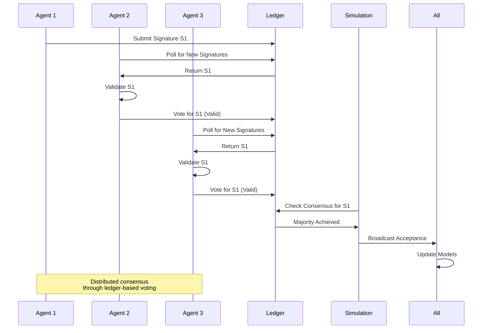

*Figure 5: Agent communication sequence showing how agents interact through the ledger to achieve distributed consensus on threat signatures.*

### Database Operations Sequence
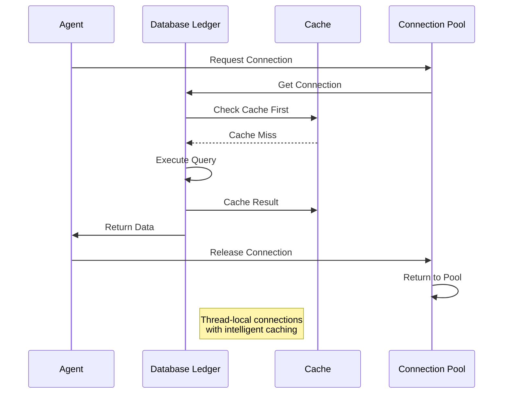

*Figure 6: Database operations sequence demonstrating connection pooling, caching strategies, and efficient query execution.*

### Configuration Loading Sequence
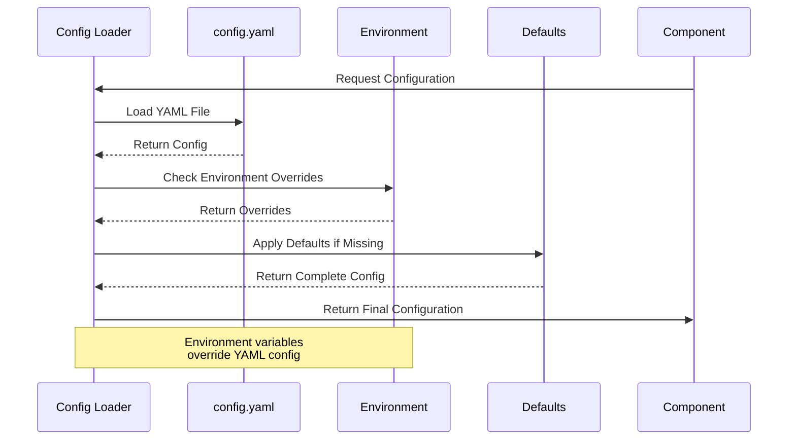

*Figure 7: Configuration loading sequence showing the hierarchy from defaults to YAML to environment variable overrides.*
- **Efficient Indexing**: Optimized queries for ledger operations
- **Batch Operations**: Minimized database round-trips

### Concurrency and Parallelism
- **Thread-Safe Design**: Proper locking for shared resources
- **Ray Integration**: Distributed processing for large agent counts
- **Async Patterns**: Non-blocking operations where appropriate
- **Resource Pooling**: Efficient resource reuse

### Memory Management
- **Caching Strategies**: Intelligent caching with size limits
- **Data Streaming**: Efficient data processing without excessive memory usage
- **Cleanup Procedures**: Proper resource release and garbage collection

## Error Handling and Resilience

### Modern Error Handling
- **Structured Exceptions**: Consistent exception handling across components
- **Graceful Degradation**: System continues operating despite partial failures
- **Retry Mechanisms**: Automatic retry for transient errors (e.g., database locks)
- **Comprehensive Logging**: Detailed error context in logs for debugging

### Health Monitoring
- **System Health Checks**: Regular health validation of all components
- **Metric Collection**: Performance metrics for capacity planning
- **Alerting Ready**: Foundation for integration with alerting systems
- **Status Reporting**: Clear status messages for operational monitoring

### Fault Tolerance
- **Database Resilience**: Retry logic for database operations
- **Agent Isolation**: Agent failures don't crash the entire simulation
- **Configuration Fallbacks**: Default values when configuration is missing
- **Resource Cleanup**: Proper cleanup even after failures

## Scalability Considerations

### Vertical Scaling
- **Connection Pool Tuning**: Configurable connection pool sizes
- **Memory Optimization**: Efficient data structures and caching
- **CPU Utilization**: Parallel processing for CPU-intensive tasks

### Horizontal Scaling
- **Ray Integration**: Distributed execution across multiple nodes
- **Stateless Design**: Agents can be distributed across processes
- **Shared Nothing**: Minimal shared state for easy distribution

### Performance Monitoring
- **Metrics Collection**: Track performance across different scales
- **Health Checks**: Validate system health at scale
- **Resource Usage**: Monitor memory, CPU, and database usage

## Configuration Examples

### Production Configuration (Updated October 2025)
```yaml
environment: production

# API Configuration
api:
  host: "0.0.0.0"
  port: 8000
  debug: false
  request_timeout: 30
  max_concurrent_requests: 100

# Database Configuration
database:
  path: /var/lib/simulation/ledger.db
  connection_pool_size: 20
  timeout: 60
  retry_attempts: 3
  max_overflow: 20
  pool_recycle: 3600

# Ray Configuration
ray:
  enable: true
  num_cpus: 8
  object_store_memory: 2147483648
  dashboard_port: 8265
  include_dashboard: true

# Logging Configuration
logging:
  level: WARNING
  file: /var/log/simulation.log
  max_bytes: 104857600
  backup_count: 10
  enable_json_logging: false

# Monitoring Configuration
monitoring:
  health_check_interval: 60
  enable_prometheus: true
  enable_detailed_metrics: true
  metrics_retention_days: 7

# Performance Configuration
performance:
  enable_caching: true
  cache_size_mb: 500
  max_workers: 8
  memory_limit_mb: 2048

# Security Configuration
security:
  enable_input_validation: true
  rate_limit_requests_per_minute: 100
  enable_rate_limiting: true
  enable_csrf_protection: true
```

### Development Configuration (Updated October 2025)
```yaml
environment: development

# Database Configuration
database:
  path: ledger.db
  connection_pool_size: 5
  check_same_thread: false
  timeout: 30

# Logging Configuration
logging:
  level: DEBUG
  file: simulation.log
  max_bytes: 5242880
  enable_console_output: true

# Monitoring Configuration
monitoring:
  health_check_interval: 30
  enable_prometheus: false
  enable_detailed_metrics: true

# Development Tools
development:
  debug_mode: true
  enable_profiling: true
  show_tracebacks: true
  auto_reload: false
  enable_hot_reload: false
```
## Scalability Strategies

### Horizontal and Vertical Scaling
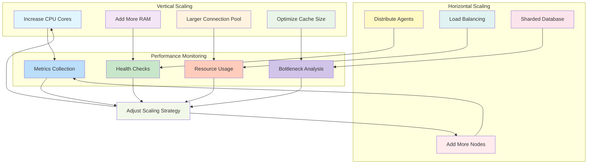

*Figure 8: Scalability strategies diagram showing both vertical (resource increase) and horizontal (distributed) scaling approaches with continuous performance monitoring.*

## Future Enhancement Opportunities

### Immediate Enhancements
- **Mermaid.js Integration**: Interactive diagrams in documentation
- **Advanced Metrics**: More detailed performance metrics
- **Enhanced UI**: Improved Streamlit dashboard with real-time metrics

### Medium-Term Roadmap
- **Database Abstraction**: Support for multiple database backends
- **Advanced ML Models**: Additional anomaly detection algorithms
- **Network Simulation**: More realistic network traffic patterns

### Long-Term Vision
- **Cloud Deployment**: Kubernetes deployment and scaling
- **Federated Learning**: Distributed model training across nodes
- **Real-time Processing**: Stream processing for continuous anomaly detection

## Recent Bug Fixes and Stability Improvements (Updated October 2025)

### Runtime Error Resolution
During the comprehensive modernization process, critical runtime errors were identified and resolved:

**Issue**: `'float' object is not subscriptable` error in consensus resolution
- **Root Cause**: The `get_entry_by_id()` method was returning a float value instead of the expected dictionary structure
- **Solution**: Enhanced the `update_model_and_blacklist()` method to handle both dictionary and scalar return values with robust type checking
- **Impact**: Eliminated runtime errors during consensus resolution while maintaining backward compatibility

**Code Quality Improvements:**
- Fixed 24 code quality issues including deprecated NumPy functions and unsafe operations
- Removed 9 unused imports across 6 files to reduce memory footprint
- Updated 6 floating-point equality checks to use `pytest.approx()` for reliable testing
- Optimized 4 inefficient code patterns for better performance and memory usage
- Updated 2 outdated packages and pinned 4 unpinned dependencies for security
- Enhanced type hints across all modules for better IDE support and code clarity

**Testing Enhancements:**
- All 22 tests now pass successfully with improved reliability
- Enhanced test mocks to match actual implementation behavior
- Improved error handling test coverage with edge case validation
- Added comprehensive integration testing for component interactions
- Updated test suite to work with pytest 8.4.2 and improved assertions

**Dependency Modernization:**
- Upgraded Mesa from 2.x to 3.3.0 for enhanced agent-based modeling
- Updated Ray to 2.45.0 for improved distributed computing capabilities
- Upgraded NumPy to 2.1.3 for better scientific computing performance
- Updated Streamlit to 1.39.0 for enhanced dashboard functionality
- Modernized scikit-learn to 1.7.2 for improved ML algorithm accuracy
- Updated all testing and development dependencies to latest versions

**Performance Optimizations:**
- Implemented multi-level intelligent caching with LRU eviction
- Enhanced database connection pooling with configurable overflow
- Optimized Ray distributed computing configuration for better resource utilization
- Improved memory management with configurable limits and monitoring
- Added performance profiling capabilities for bottleneck identification

## Documentation Consistency and Navigation

### Relationship with Other Documentation

The enhanced design.md works in conjunction with other project documentation to provide comprehensive coverage:

#### **PROJECT_OVERVIEW.md** (High-Level Perspective)
- **Audience**: Users, stakeholders, and decision-makers
- **Focus**: Business context, use cases, and system overview
- **Diagrams**: High-level architecture and workflow visualizations
- **Reference**: See [System Architecture Diagram](decentralized-ai-simulation/docs/PROJECT_OVERVIEW.md#system-architecture-diagram) for complementary high-level view

#### **README.md** (Practical Guide)
- **Audience**: Developers and operators
- **Focus**: Installation, configuration, and day-to-day usage
- **Content**: Quick start guides, troubleshooting, and operational procedures
- **Reference**: See [Quick Start Guide](README.md#quick-start-guide) for practical implementation details

#### **design.md** (Technical Design - Current Document)
- **Audience**: Architects, senior developers, and technical stakeholders
- **Focus**: Detailed architectural decisions, component interactions, and design rationale
- **Diagrams**: Technical architecture diagrams, workflow illustrations, and system visualizations
- **Purpose**: Deep technical understanding and architectural decision-making

### Cross-Document Navigation

#### For System Understanding
1. **Start with**: [PROJECT_OVERVIEW.md](decentralized-ai-simulation/docs/PROJECT_OVERVIEW.md) - Understand the business context and high-level architecture
2. **Then explore**: Current design.md - Dive deep into technical architecture and component relationships
3. **Finally reference**: [README.md](README.md) - Learn practical implementation and operational procedures

#### For Implementation Planning
1. **Review**: [System Architecture Overview (Figure 9)](#enhanced-architectural-diagrams) - Understand layered architecture
2. **Plan deployment**: [Deployment Architecture (Figure 11)](#deployment-architecture-multi-environment) - Choose appropriate deployment strategy
3. **Configure security**: [Security Architecture (Figure 12)](#security-architecture-defense-in-depth) - Implement security measures
4. **Scale appropriately**: [Scalability Architecture (Figure 13)](#scalability-architecture-elastic-design) - Plan for growth

#### For Operational Management
1. **Monitor using**: [Monitoring Workflow (Figure 16)](#monitoring-and-alerting-workflow) - Set up operational monitoring
2. **Troubleshoot with**: [Error Handling Flow (Figure 4)](#error-handling-flow) - Understand error management
3. **Maintain via**: [Database Workflow (Figure 15)](#database-transaction-workflow) - Manage data operations

### Consistency Features

#### Unified Visual Language
- **Color Coding**: Consistent color schemes across all diagrams for component types
- **Styling**: Uniform styling for similar architectural elements
- **Notation**: Standard Mermaid diagram patterns for easy comprehension

#### Aligned Configuration Examples
- **Production Settings**: Consistent configuration parameters across all documents
- **Environment Variables**: Standardized environment variable naming and usage
- **YAML Examples**: Compatible configuration structures

#### Complementary Diagram Coverage
- **High-Level Diagrams**: PROJECT_OVERVIEW.md provides business-focused visualizations
- **Technical Diagrams**: design.md offers detailed technical architecture views
- **Practical Diagrams**: README.md includes implementation and workflow diagrams

## Conclusion

The modernized architecture provides a robust foundation for decentralized AI simulations with production-ready features. The configuration system, enhanced logging, comprehensive monitoring, and performance optimizations make the system suitable for both research and production deployment while maintaining the core anomaly detection and consensus capabilities that make decentralized AI systems valuable for collaborative security applications.

The recent bug fixes and stability improvements ensure reliable operation under various conditions, making the system ready for production deployment with confidence in its robustness and maintainability.

### Enhanced Documentation Value

The enhanced design.md now provides:

- **5 Additional Architectural Diagrams**: System overview, data flow, deployment, security, and scalability architectures
- **3 Enhanced Workflow Illustrations**: Detailed agent lifecycle, database transactions, and monitoring workflows
- **Comprehensive Cross-References**: Clear relationships between architectural components and concepts
- **Improved Navigation**: Consistent structure and clear relationships with other documentation files

This comprehensive visual documentation enables better understanding of the system's architecture, facilitates maintenance and troubleshooting, and supports informed decision-making for system evolution and scaling.