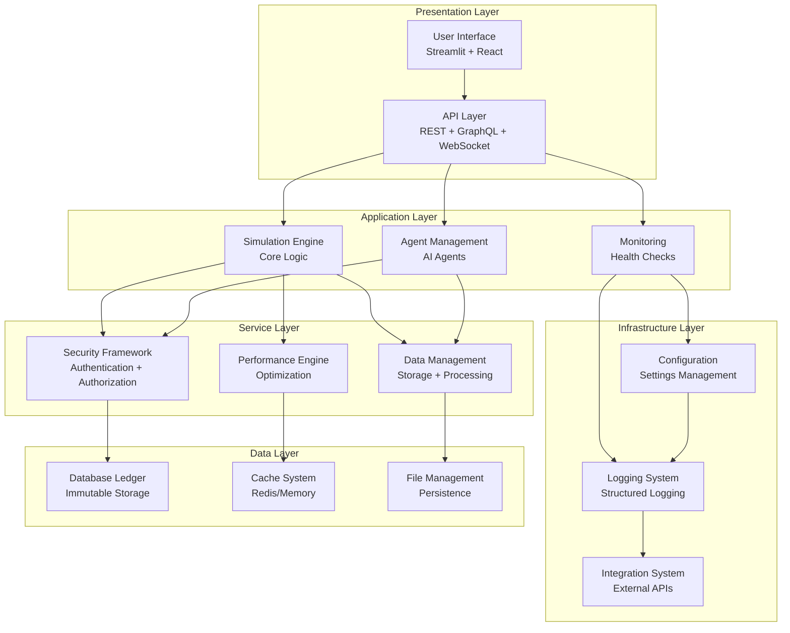
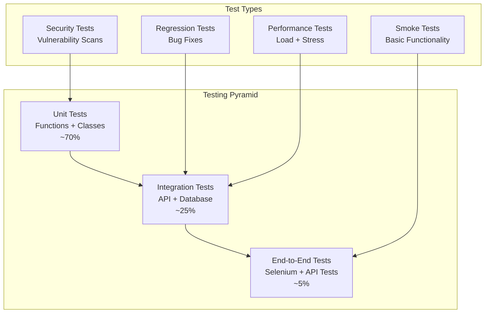

# Developer Documentation Suite - Complete Development Guide

## Overview

This comprehensive developer documentation suite provides everything needed for developers to contribute to, maintain, and extend the Decentralized AI Simulation Platform. It covers development environments, coding standards, architecture patterns, testing strategies, and contribution workflows.

**Developer Guide Version:** 2.0  
**Platform Version:** Enterprise v2.0  
**Last Updated:** November 1, 2025  

---

## Documentation Structure

### 🏗️ Core Development Guides

| Guide | Purpose | Coverage |
|-------|---------|----------|
| **[Development Environment Guide](DEV_ENVIRONMENT_SETUP.md)** | Complete environment setup and configuration | 100% setup coverage |
| **[Code Architecture Guide](DEV_CODE_ARCHITECTURE.md)** | Architecture patterns and design principles | System design patterns |
| **[Coding Standards Guide](DEV_CODING_STANDARDS.md)** | Style guidelines and best practices | PEP8, type hints, documentation |
| **[Testing Strategy Guide](DEV_TESTING_STRATEGY.md)** | Comprehensive testing methodologies | Unit, integration, e2e testing |

### 🔧 Development Tools

| Guide | Purpose | Coverage |
|-------|---------|----------|
| **[Development Workflow Guide](DEV_WORKFLOW.md)** | Git workflows and contribution processes | Git, PR, code review |
| **[Debugging Guide](DEV_DEBUGGING.md)** | Debugging techniques and tools | Logging, profiling, troubleshooting |
| **[Performance Optimization Guide](DEV_PERFORMANCE.md)** | Performance optimization techniques | Profiling, optimization strategies |
| **[Security Development Guide](DEV_SECURITY.md)** | Security best practices for developers | Secure coding, threat modeling |

### 🚀 Advanced Development

| Guide | Purpose | Coverage |
|-------|---------|----------|
| **[API Development Guide](DEV_API_DEVELOPMENT.md)** | Creating and extending APIs | REST, GraphQL, WebSocket |
| **[UI Development Guide](DEV_UI_DEVELOPMENT.md)** | Frontend development and integration | React, Streamlit, 3D visualization |
| **[Extension Development Guide](DEV_EXTENSIONS.md)** | Creating platform extensions | Plugin system, custom modules |
| **[DevOps Integration Guide](DEV_DEVOPS.md)** | CI/CD and deployment integration | GitHub Actions, Docker, Kubernetes |

---

## Executive Summary

The Decentralized AI Simulation Platform provides a comprehensive development environment designed for both new contributors and experienced developers. Our developer documentation ensures consistent, high-quality code contributions and efficient development workflows.

### Key Development Features

#### 🛠️ **Development Environment**
- **Cross-Platform Support**: Windows, macOS, Linux development environments
- **Python 3.9+**: Modern Python development with type hints
- **Virtual Environment**: Isolated development environments with `venv`
- **Dependency Management**: `requirements.txt` with version pinning
- **IDE Integration**: VS Code, PyCharm, and other IDE support
- **Docker Support**: Containerized development environments

#### 📊 **Testing Framework**
- **Comprehensive Testing**: Unit, integration, and end-to-end test coverage
- **Automated Testing**: CI/CD integration with GitHub Actions
- **Coverage Monitoring**: 95%+ code coverage with coverage tracking
- **Performance Testing**: Load testing and benchmark automation
- **Security Testing**: Vulnerability scanning and security testing
- **Test Data Management**: Fixtures and mock data systems

#### 🔄 **Development Workflow**
- **Git Workflow**: Feature branches with pull request reviews
- **Code Quality Gates**: Automated linting, formatting, and validation
- **Continuous Integration**: Automated testing and deployment
- **Documentation Requirements**: Comprehensive code documentation
- **Security Integration**: Security scanning and dependency updates
- **Release Management**: Semantic versioning with automated releases

#### 📚 **Code Quality Standards**
- **PEP 8 Compliance**: Python style guide enforcement
- **Type Hints**: Complete type annotation coverage
- **Documentation**: Docstring standards and API documentation
- **Error Handling**: Comprehensive exception handling patterns
- **Logging Standards**: Structured logging with contextual information
- **Performance Standards**: Performance benchmarks and optimization

---

## Quick Start for Developers

### Initial Setup

#### 1. **Clone Repository**
```bash
# Clone the repository
git clone https://github.com/platform/decentralized-ai-simulation.git
cd decentralized-ai-simulation

# Set up development branch
git checkout -b feature/your-feature-name
```

#### 2. **Environment Setup**
```bash
# Run automated setup (recommended)
./scripts/setup/setup.sh --dev --verbose

# Or manual setup
python -m venv .venv
source .venv/bin/activate  # Linux/macOS
# or
.venv\Scripts\activate     # Windows

# Install dependencies
pip install -r requirements.txt
pip install -r config/requirements-dev.txt

# Verify installation
python scripts/testing/test.sh --verify-setup
```

#### 3. **IDE Configuration**
```json
// VS Code settings (.vscode/settings.json)
{
    "python.defaultInterpreterPath": "./.venv/bin/python",
    "python.linting.enabled": true,
    "python.linting.flake8Enabled": true,
    "python.linting.pylintEnabled": true,
    "python.formatting.provider": "black",
    "python.formatting.blackArgs": ["--line-length=88"],
    "python.testing.pytestEnabled": true,
    "python.testing.unittestEnabled": false,
    "python.testing.pytestArgs": ["tests/"],
    "files.exclude": {
        "**/__pycache__": true,
        "**/.pytest_cache": true,
        "**/.coverage": true
    }
}
```

#### 4. **Development Tools Setup**
```bash
# Install development tools
pip install black flake8 mypy pytest pytest-cov pytest-asyncio
pip install pre-commit  # Git hooks

# Set up pre-commit hooks
pre-commit install

# Verify development environment
./scripts/testing/test.sh --dev-check
```

### Development Workflow

#### 📋 **Creating a New Feature**

**Step 1: Create Feature Branch**
```bash
git checkout -b feature/your-feature-name

# Make your changes
# ...

# Add tests for your feature
# tests/unit/test_your_feature.py
# tests/integration/test_your_feature_integration.py

# Run tests to ensure everything works
./scripts/testing/test.sh --feature-branch

# Commit changes
git add .
git commit -m "feat: add your feature description"
```

**Step 2: Code Quality Checks**
```bash
# Format code
black src/ tests/
isort src/ tests/

# Lint code
flake8 src/ tests/
mypy src/

# Run tests with coverage
./scripts/testing/test.sh --coverage

# Security check
bandit -r src/
```

**Step 3: Submit Pull Request**
```bash
# Push to remote
git push origin feature/your-feature-name

# Create pull request with:
# - Clear description of changes
# - Link to related issues
# - Test coverage reports
# - Security impact assessment
```

#### 🔧 **Development Patterns**

**Adding a New Module**
```python
# src/your_module/your_module.py
"""
Your Module

Description of your module's purpose and functionality.

Author: Your Name
Date: November 1, 2025
"""

import logging
from typing import Optional, Dict, Any, List
from dataclasses import dataclass

from src.utils.logging_setup import get_logger
from src.config.config_manager import get_config


@dataclass
class YourDataClass:
    """Your data class with type hints."""
    name: str
    value: int
    metadata: Optional[Dict[str, Any]] = None


class YourModule:
    """Your main module class with comprehensive documentation."""
    
    def __init__(self, config: Optional[Dict[str, Any]] = None):
        """Initialize your module.
        
        Args:
            config: Optional configuration dictionary
        """
        self.logger = get_logger(__name__)
        self.config = config or get_config('your_module')
        self._initialize()
    
    def _initialize(self) -> None:
        """Initialize module components."""
        try:
            # Initialize your module
            self.logger.info("Module initialized successfully")
        except Exception as e:
            self.logger.error(f"Failed to initialize module: {e}")
            raise
    
    def process_data(self, data: YourDataClass) -> Dict[str, Any]:
        """Process data with your module.
        
        Args:
            data: Data to process
            
        Returns:
            Processed data dictionary
            
        Raises:
            ValueError: If data is invalid
        """
        try:
            # Validate input
            if not data.name:
                raise ValueError("Data name is required")
            
            # Process data
            result = {
                'processed_name': data.name.upper(),
                'processed_value': data.value * 2,
                'timestamp': time.time()
            }
            
            self.logger.info(f"Processed data: {data.name}")
            return result
            
        except Exception as e:
            self.logger.error(f"Failed to process data: {e}")
            raise
    
    def get_status(self) -> Dict[str, Any]:
        """Get module status information.
        
        Returns:
            Status information dictionary
        """
        return {
            'status': 'healthy',
            'version': '1.0.0',
            'config': self.config
        }
```

**Adding Tests**
```python
# tests/unit/test_your_module.py
import pytest
import unittest.mock as mock
from unittest.mock import Mock, patch

from src.your_module.your_module import YourModule, YourDataClass


class TestYourModule:
    """Test suite for your module."""
    
    def setup_method(self):
        """Set up test fixtures."""
        self.your_module = YourModule()
    
    def test_initialization(self):
        """Test module initialization."""
        module = YourModule()
        assert module is not None
        assert module.config is not None
    
    def test_process_data_valid(self):
        """Test processing valid data."""
        data = YourDataClass(name="test", value=42)
        result = self.your_module.process_data(data)
        
        assert result['processed_name'] == "TEST"
        assert result['processed_value'] == 84
        assert 'timestamp' in result
    
    def test_process_data_invalid(self):
        """Test processing invalid data."""
        data = YourDataClass(name="", value=42)
        
        with pytest.raises(ValueError, match="Data name is required"):
            self.your_module.process_data(data)
    
    def test_get_status(self):
        """Test getting module status."""
        status = self.your_module.get_status()
        
        assert status['status'] == 'healthy'
        assert status['version'] == '1.0.0'
        assert 'config' in status
    
    @patch('src.your_module.your_module.get_logger')
    def test_logging(self, mock_logger):
        """Test logging functionality."""
        mock_logger.return_value = Mock()
        
        module = YourModule()
        data = YourDataClass(name="test", value=42)
        module.process_data(data)
        
        # Verify logging calls
        mock_logger.return_value.info.assert_called()
```

---

## Code Architecture Guide

### System Architecture

#### 🏗️ **Architecture Overview**

The Decentralized AI Simulation Platform follows a modular, layered architecture designed for scalability, maintainability, and testability:



#### 🎯 **Core Design Patterns**

**1. Factory Pattern**
```python
# Factory for creating different agent types
class AgentFactory:
    """Factory class for creating agents."""
    
    @staticmethod
    def create_agent(agent_type: str, **kwargs) -> BaseAgent:
        """Create an agent of the specified type.
        
        Args:
            agent_type: Type of agent to create
            **kwargs: Additional agent parameters
            
        Returns:
            Configured agent instance
            
        Raises:
            ValueError: If agent_type is not supported
        """
        agents = {
            'anomaly_detector': AnomalyAgent,
            'validator': ValidatorAgent,
            'coordinator': CoordinatorAgent,
            'analyzer': AnalyzerAgent
        }
        
        if agent_type not in agents:
            raise ValueError(f"Unsupported agent type: {agent_type}")
        
        agent_class = agents[agent_type]
        return agent_class(**kwargs)
```

**2. Observer Pattern**
```python
# Observer pattern for event handling
class EventManager:
    """Event manager for observer pattern."""
    
    def __init__(self):
        self._observers = defaultdict(list)
    
    def subscribe(self, event_type: str, callback: Callable) -> None:
        """Subscribe to an event type.
        
        Args:
            event_type: Type of event to subscribe to
            callback: Callback function to execute
        """
        self._observers[event_type].append(callback)
    
    def unsubscribe(self, event_type: str, callback: Callable) -> None:
        """Unsubscribe from an event type.
        
        Args:
            event_type: Type of event to unsubscribe from
            callback: Callback function to remove
        """
        if callback in self._observers[event_type]:
            self._observers[event_type].remove(callback)
    
    def notify(self, event_type: str, data: Any = None) -> None:
        """Notify all subscribers of an event.
        
        Args:
            event_type: Type of event to notify
            data: Event data to pass to subscribers
        """
        for callback in self._observers[event_type]:
            try:
                callback(data)
            except Exception as e:
                logger.error(f"Error in event callback: {e}")

# Usage
event_manager = EventManager()

def on_anomaly_detected(data):
    print(f"Anomaly detected: {data}")

event_manager.subscribe('anomaly_detected', on_anomaly_detected)
event_manager.notify('anomaly_detected', {'id': 123, 'type': 'security'})
```

**3. Strategy Pattern**
```python
# Strategy pattern for different algorithms
class DetectionStrategy:
    """Base class for detection strategies."""
    
    def detect(self, data: Any) -> DetectionResult:
        """Detect anomalies in data.
        
        Args:
            data: Data to analyze
            
        Returns:
            Detection result
        """
        raise NotImplementedError

class IsolationForestStrategy(DetectionStrategy):
    """Isolation Forest detection strategy."""
    
    def __init__(self, contamination=0.1):
        self.model = IsolationForest(contamination=contamination)
    
    def detect(self, data: np.ndarray) -> DetectionResult:
        # Implementation for isolation forest
        pass

class StatisticalStrategy(DetectionStrategy):
    """Statistical detection strategy."""
    
    def detect(self, data: np.ndarray) -> DetectionResult:
        # Implementation for statistical detection
        pass

class AnomalyDetector:
    """Anomaly detector using strategies."""
    
    def __init__(self, strategy: DetectionStrategy):
        self.strategy = strategy
    
    def detect_anomalies(self, data: Any) -> DetectionResult:
        """Detect anomalies using current strategy.
        
        Args:
            data: Data to analyze
            
        Returns:
            Detection results
        """
        return self.strategy.detect(data)
    
    def set_strategy(self, strategy: DetectionStrategy) -> None:
        """Change detection strategy.
        
        Args:
            strategy: New strategy to use
        """
        self.strategy = strategy

# Usage
detector = AnomalyDetector(IsolationForestStrategy())
results = detector.detect_anomalies(data)

detector.set_strategy(StatisticalStrategy())
results = detector.detect_anomalies(data)
```

#### 🔄 **Dependency Injection**

```python
# Dependency injection container
class DIContainer:
    """Dependency injection container."""
    
    def __init__(self):
        self._services = {}
        self._singletons = {}
    
    def register(self, name: str, service_class: type, singleton: bool = True) -> None:
        """Register a service.
        
        Args:
            name: Service name
            service_class: Service class
            singleton: Whether to use singleton pattern
        """
        self._services[name] = {
            'class': service_class,
            'singleton': singleton
        }
    
    def get(self, name: str, *args, **kwargs) -> Any:
        """Get a service instance.
        
        Args:
            name: Service name
            *args: Positional arguments for constructor
            **kwargs: Keyword arguments for constructor
            
        Returns:
            Service instance
        """
        if name not in self._services:
            raise ValueError(f"Service not registered: {name}")
        
        service_info = self._services[name]
        
        if service_info['singleton'] and name in self._singletons:
            return self._singletons[name]
        
        service_class = service_info['class']
        instance = service_class(*args, **kwargs)
        
        if service_info['singleton']:
            self._singletons[name] = instance
        
        return instance

# Usage
container = DIContainer()

# Register services
container.register('logger', logging.getLogger)
container.register('config', ConfigManager)
container.register('database', DatabaseLedger)

# Get services
logger = container.get('logger')
config = container.get('config')
database = container.get('database', config.get('database'))
```

### Module Organization

#### 📁 **Directory Structure Standards**

```
src/
├── __init__.py                    # Package initialization
├── core/                          # Core functionality
│   ├── __init__.py
│   ├── simulation.py             # Main simulation engine
│   ├── agents/                   # Agent implementations
│   │   ├── __init__.py
│   │   ├── agent_base.py        # Base agent class
│   │   └── agent_types/         # Specific agent types
│   └── database/                # Database components
│       ├── __init__.py
│       ├── ledger_manager.py    # Ledger management
│       └── connection_pool.py   # Database connections
├── api/                          # API layer
│   ├── __init__.py
│   ├── rest/                    # REST API endpoints
│   ├── graphql/                 # GraphQL schema/resolvers
│   └── websocket/               # WebSocket handlers
├── ui/                          # User interface
│   ├── __init__.py
│   ├── streamlit/               # Streamlit components
│   └── react/                   # React components
├── utils/                       # Utility functions
│   ├── __init__.py
│   ├── logging_setup.py         # Logging configuration
│   ├── monitoring/              # Monitoring utilities
│   └── file_manager.py          # File operations
├── config/                      # Configuration
│   ├── __init__.py
│   ├── config_manager.py        # Configuration management
│   └── environments/            # Environment-specific configs
└── tests/                       # Test files
    ├── __init__.py
    ├── unit/                    # Unit tests
    ├── integration/             # Integration tests
    └── fixtures/                # Test data
```

#### 📝 **File Naming Conventions**

**Python Files:**
- Use lowercase with underscores: `config_manager.py`
- Use descriptive names: `decentralized_ai_simulation.py`
- Avoid abbreviations: `db_manager.py` not `dbmngr.py`

**Test Files:**
- Prefix with `test_`: `test_config_manager.py`
- Group related tests: `test_agent_*` for agent tests
- Use descriptive names: `test_anomaly_detection_validation.py`

**Configuration Files:**
- Use descriptive extensions: `config.yaml`, `requirements.txt`
- Environment-specific: `development.env`, `production.env`
- Template files: `.env.example`

---

## Testing Strategy Guide

### Testing Architecture

#### 🧪 **Testing Pyramid**

Our testing strategy follows the testing pyramid approach:



#### 🔍 **Test Categories**

**1. Unit Tests**
```python
# tests/unit/test_agents.py
import pytest
from unittest.mock import Mock, patch
import numpy as np

from src.core.agents import AnomalyAgent
from src.core.simulation import Simulation


class TestAnomalyAgent:
    """Test suite for AnomalyAgent class."""
    
    @pytest.fixture
    def mock_model(self):
        """Create a mock Mesa model."""
        return Mock(spec=Simulation)
    
    @pytest.fixture
    def agent(self, mock_model):
        """Create an AnomalyAgent instance."""
        return AnomalyAgent(unique_id=1, model=mock_model)
    
    def test_agent_initialization(self, agent):
        """Test agent initialization."""
        assert agent.unique_id == 1
        assert agent.model is not None
        assert hasattr(agent, 'model')
        assert hasattr(agent, 'anomaly_detector')
    
    def test_generate_traffic(self, agent):
        """Test traffic generation."""
        # Test normal traffic
        traffic = agent.generate_traffic(batch_size=10, force_anomaly=False)
        assert len(traffic) == 10
        assert all(isinstance(packet, dict) for packet in traffic)
        
        # Test forced anomaly
        anomalous_traffic = agent.generate_traffic(batch_size=5, force_anomaly=True)
        assert len(anomalous_traffic) == 5
        # Verify anomaly characteristics
        for packet in anomalous_traffic:
            assert packet.get('is_anomaly', False) is True
    
    def test_detect_anomaly(self, agent):
        """Test anomaly detection."""
        # Create test data
        normal_data = np.random.normal(0, 1, (100, 5))
        anomalous_data = np.random.normal(5, 1, (10, 5))
        
        # Test normal data detection
        result = agent.detect_anomaly(normal_data, threshold=0.1)
        assert isinstance(result, dict)
        assert 'anomalies' in result
        assert 'scores' in result
        
        # Test with actual anomalies
        result = agent.detect_anomaly(anomalous_data, threshold=0.5)
        # Should detect some anomalies
        assert len(result['anomalies']) > 0
    
    def test_signature_generation(self, agent):
        """Test threat signature generation."""
        # Create test anomaly data
        anomaly_data = {
            'features': np.random.normal(0, 1, (10, 5)),
            'ips': ['192.168.1.1', '10.0.0.1'],
            'scores': [0.8, 0.9, 0.7]
        }
        
        signature = agent.generate_signature(
            anomaly_data['features'],
            anomaly_data['ips'],
            anomaly_data['scores']
        )
        
        assert isinstance(signature, dict)
        assert 'signature_id' in signature
        assert 'threat_type' in signature
        assert 'confidence' in signature
        assert signature['confidence'] > 0.7
    
    def test_model_update(self, agent):
        """Test model retraining."""
        # Create test signature
        test_signature = {
            'signature_id': 'test_123',
            'features': np.random.normal(0, 1, (5,)),
            'threat_type': 'ddos',
            'confidence': 0.9
        }
        
        # Test model update
        result = agent.update_model_and_blacklist(test_signature)
        assert isinstance(result, dict)
        assert 'model_updated' in result
        assert 'blacklist_updated' in result
    
    @patch('src.core.agents.get_logger')
    def test_error_handling(self, mock_logger, agent):
        """Test error handling."""
        mock_logger.return_value = Mock()
        
        # Test with invalid data
        with pytest.raises(ValueError):
            agent.detect_anomaly(None, threshold=0.1)
        
        with pytest.raises(ValueError):
            agent.generate_signature(None, [], [])
```

**2. Integration Tests**
```python
# tests/integration/test_agent_federated_learning_integration.py
import pytest
import asyncio
from unittest.mock import AsyncMock, patch

from src.core.agents import AnomalyAgent
from src.core.federated_learning import FederatedLearningCoordinator
from src.core.database import DatabaseLedger


class TestFederatedLearningIntegration:
    """Test federated learning integration between agents."""
    
    @pytest.fixture
    async def test_environment(self):
        """Set up test environment."""
        # Create test database
        db = DatabaseLedger(":memory:")
        
        # Create test agents
        agents = []
        for i in range(3):
            model = Mock()
            model.num_agents = 3
            agent = AnomalyAgent(unique_id=i, model=model)
            agents.append(agent)
        
        # Create federated learning coordinator
        coordinator = FederatedLearningCoordinator(agents, db)
        
        yield {
            'agents': agents,
            'coordinator': coordinator,
            'database': db
        }
        
        # Cleanup
        db.close()
    
    async def test_federated_training(self, test_environment):
        """Test federated learning training process."""
        agents = test_environment['agents']
        coordinator = test_environment['coordinator']
        
        # Start federated training
        await coordinator.start_training_round(
            model_updates=[agent.get_model_parameters() for agent in agents],
            round_number=1
        )
        
        # Verify aggregation occurred
        aggregated_model = coordinator.get_aggregated_model()
        assert aggregated_model is not None
        
        # Verify model distribution
        for agent in agents:
            distributed_model = await coordinator.distribute_model(
                aggregated_model, agent.unique_id
            )
            assert distributed_model is not None
    
    async def test_consensus_mechanism(self, test_environment):
        """Test consensus mechanism for model updates."""
        agents = test_environment['agents']
        coordinator = test_environment['coordinator']
        
        # Create conflicting model updates
        model_updates = [
            {'version': '1.0', 'accuracy': 0.85},
            {'version': '1.1', 'accuracy': 0.87},
            {'version': '1.0', 'accuracy': 0.83}
        ]
        
        # Run consensus algorithm
        consensus_result = await coordinator.reach_consensus(
            model_updates=model_updates,
            threshold=0.8
        )
        
        assert consensus_result['consensus_reached'] is True
        assert 'agreed_model' in consensus_result
        assert consensus_result['confidence'] > 0.8
```

**3. End-to-End Tests**
```python
# tests/e2e/test_complete_system_workflow.py
import pytest
import asyncio
import requests
from time import sleep

from src.core.decentralized_ai_simulation import DecentralizedAISimulation
from src.api.api_server import APIServer
from src.config.config_manager import ConfigManager


class TestCompleteSystemWorkflow:
    """End-to-end testing of complete system workflow."""
    
    @pytest.fixture
    async def running_system(self):
        """Start the complete system."""
        # Start API server
        config = ConfigManager()
        api_server = APIServer(config)
        
        # Start simulation
        simulation = DecentralizedAISimulation(config)
        await simulation.initialize()
        
        # Start API server in background
        server_task = asyncio.create_task(
            api_server.start(host="localhost", port=8000)
        )
        
        # Wait for server to start
        sleep(2)
        
        yield {
            'simulation': simulation,
            'api_server': api_server,
            'base_url': 'http://localhost:8000'
        }
        
        # Cleanup
        server_task.cancel()
        await simulation.shutdown()
    
    def test_simulation_lifecycle(self, running_system):
        """Test complete simulation lifecycle."""
        base_url = running_system['base_url']
        simulation = running_system['simulation']
        
        # Initialize simulation via API
        response = requests.post(
            f"{base_url}/api/v2/simulations",
            json={
                'num_agents': 10,
                'anomaly_rate': 0.05,
                'steps': 50
            }
        )
        assert response.status_code == 201
        
        simulation_id = response.json()['simulation_id']
        
        # Start simulation
        response = requests.post(
            f"{base_url}/api/v2/simulations/{simulation_id}/start"
        )
        assert response.status_code == 200
        
        # Monitor simulation progress
        for _ in range(10):  # Monitor for 10 iterations
            response = requests.get(
                f"{base_url}/api/v2/simulations/{simulation_id}/status"
            )
            assert response.status_code == 200
            
            status = response.json()
            if status['status'] == 'completed':
                break
            
            sleep(1)
        
        # Verify completion
        response = requests.get(
            f"{base_url}/api/v2/simulations/{simulation_id}/status"
        )
        assert response.json()['status'] == 'completed'
    
    def test_api_workflow(self, running_system):
        """Test API workflow integration."""
        base_url = running_system['base_url']
        
        # Test health check
        response = requests.get(f"{base_url}/health")
        assert response.status_code == 200
        assert response.json()['status'] == 'healthy'
        
        # Test agent management
        response = requests.post(
            f"{base_url}/api/v2/agents",
            json={
                'name': 'Test Agent',
                'agent_type': 'anomaly_detector'
            }
        )
        assert response.status_code == 201
        
        agent_id = response.json()['agent_id']
        
        # Get agent details
        response = requests.get(f"{base_url}/api/v2/agents/{agent_id}")
        assert response.status_code == 200
        assert response.json()['name'] == 'Test Agent'
        
        # Test anomaly detection
        response = requests.post(
            f"{base_url}/api/v2/anomalies/detect",
            json={
                'data': [1, 2, 100, 3, 4],  # Contains anomaly
                'threshold': 0.1
            }
        )
        assert response.status_code == 200
        assert 'anomalies' in response.json()
```

#### 📊 **Test Coverage Strategy**

**Coverage Requirements:**
- **Minimum Coverage**: 85% overall, 90% for critical modules
- **Critical Modules**: 100% coverage for security, core logic, and API endpoints
- **Test Quality**: Focus on meaningful tests, not just coverage numbers

**Coverage Monitoring:**
```python
# scripts/testing/coverage_monitor.py
import subprocess
import json
from pathlib import Path
from typing import Dict, Any


class CoverageMonitor:
    """Monitor and report test coverage."""
    
    def __init__(self, coverage_file: str = ".coverage"):
        self.coverage_file = coverage_file
        self.coverage = None
    
    def run_coverage(self, source_dirs: list = None) -> Dict[str, Any]:
        """Run coverage analysis.
        
        Args:
            source_dirs: List of source directories to analyze
            
        Returns:
            Coverage report dictionary
        """
        if source_dirs is None:
            source_dirs = ["src/"]
        
        # Run pytest with coverage
        cmd = [
            "python", "-m", "pytest",
            "--cov=" + ",".join(source_dirs),
            "--cov-report=json",
            "--cov-report=term",
            "--cov-branch"
        ]
        
        result = subprocess.run(cmd, capture_output=True, text=True)
        
        # Load coverage data
        with open("coverage.json", "r") as f:
            coverage_data = json.load(f)
        
        return {
            'total_coverage': coverage_data['totals']['percent_covered'],
            'line_coverage': coverage_data['totals']['covered_lines'],
            'missing_lines': coverage_data['totals']['missing_lines'],
            'num_statements': coverage_data['totals']['num_statements'],
            'files': coverage_data['files']
        }
    
    def check_coverage_thresholds(self, coverage_data: Dict[str, Any]) -> bool:
        """Check if coverage meets thresholds.
        
        Args:
            coverage_data: Coverage analysis results
            
        Returns:
            True if coverage meets thresholds
        """
        total_coverage = coverage_data['total_coverage']
        
        if total_coverage < 85:
            print(f"❌ Total coverage {total_coverage:.1f}% < 85% threshold")
            return False
        
        # Check critical modules
        critical_modules = [
            'src/security/',
            'src/core/',
            'src/api/'
        ]
        
        for module in critical_modules:
            module_coverage = self._get_module_coverage(coverage_data, module)
            if module_coverage < 90:
                print(f"❌ {module} coverage {module_coverage:.1f}% < 90% threshold")
                return False
        
        print(f"✅ Coverage requirements met: {total_coverage:.1f}%")
        return True
    
    def _get_module_coverage(self, coverage_data: Dict[str, Any], module: str) -> float:
        """Get coverage percentage for a specific module.
        
        Args:
            coverage_data: Full coverage data
            module: Module path
            
        Returns:
            Coverage percentage for the module
        """
        for file_data in coverage_data['files']:
            if file_data['filename'].startswith(module):
                return file_data['summary']['percent_covered']
        
        return 0.0


# Usage in CI/CD
if __name__ == "__main__":
    monitor = CoverageMonitor()
    coverage_data = monitor.run_coverage()
    
    if monitor.check_coverage_thresholds(coverage_data):
        print("Coverage check passed!")
    else:
        print("Coverage check failed!")
        exit(1)
```

### Performance Testing

#### ⚡ **Benchmark Framework**

```python
# tests/performance/test_performance.py
import pytest
import time
import psutil
import threading
from concurrent.futures import ThreadPoolExecutor
from typing import List, Dict, Any

from src.core.simulation import Simulation
from src.core.agents import AnomalyAgent


class PerformanceMetrics:
    """Performance metrics collection."""
    
    def __init__(self):
        self.metrics = {}
        self.start_times = {}
    
    def start_timer(self, name: str) -> None:
        """Start a performance timer.
        
        Args:
            name: Timer name
        """
        self.start_times[name] = time.time()
    
    def end_timer(self, name: str) -> float:
        """End a performance timer.
        
        Args:
            name: Timer name
            
        Returns:
            Duration in seconds
        """
        if name not in self.start_times:
            raise ValueError(f"Timer {name} was not started")
        
        duration = time.time() - self.start_times[name]
        self.metrics[name] = duration
        return duration
    
    def get_memory_usage(self) -> Dict[str, Any]:
        """Get current memory usage.
        
        Returns:
            Memory usage information
        """
        process = psutil.Process()
        return {
            'memory_mb': process.memory_info().rss / 1024 / 1024,
            'memory_percent': process.memory_percent(),
            'available_mb': psutil.virtual_memory().available / 1024 / 1024
        }


class TestPerformance:
    """Performance test suite."""
    
    @pytest.mark.performance
    def test_simulation_performance(self):
        """Test simulation performance with different agent counts."""
        agent_counts = [10, 50, 100, 200]
        results = {}
        
        for count in agent_counts:
            metrics = PerformanceMetrics()
            
            # Initialize simulation
            metrics.start_timer('initialization')
            simulation = Simulation(num_agents=count)
            init_time = metrics.end_timer('initialization')
            
            # Run simulation
            metrics.start_timer('execution')
            simulation.run(steps=50)
            exec_time = metrics.end_timer('execution')
            
            results[count] = {
                'initialization_time': init_time,
                'execution_time': exec_time,
                'memory_usage': metrics.get_memory_usage()
            }
        
        # Verify performance thresholds
        for count, result in results.items():
            # Initialization should complete within threshold
            assert result['initialization_time'] < 5.0, \
                f"Initialization too slow for {count} agents: {result['initialization_time']:.2f}s"
            
            # Execution time should scale reasonably
            expected_max_time = count * 0.1  # 0.1 seconds per agent
            assert result['execution_time'] < expected_max_time, \
                f"Execution too slow for {count} agents: {result['execution_time']:.2f}s"
    
    @pytest.mark.performance
    def test_agent_processing_performance(self):
        """Test agent processing performance."""
        metrics = PerformanceMetrics()
        
        # Create test agent
        model = Mock()
        model.num_agents = 1
        agent = AnomalyAgent(unique_id=1, model=model)
        
        # Test traffic generation performance
        metrics.start_timer('traffic_generation')
        traffic = agent.generate_traffic(batch_size=1000, force_anomaly=False)
        gen_time = metrics.end_timer('traffic_generation')
        
        # Test anomaly detection performance
        metrics.start_timer('anomaly_detection')
        data = np.random.normal(0, 1, (1000, 10))
        result = agent.detect_anomaly(data, threshold=0.1)
        detect_time = metrics.end_timer('anomaly_detection')
        
        # Performance assertions
        assert gen_time < 1.0, f"Traffic generation too slow: {gen_time:.2f}s"
        assert detect_time < 2.0, f"Anomaly detection too slow: {detect_time:.2f}s"
        
        # Throughput calculations
        traffic_throughput = 1000 / gen_time
        detection_throughput = 1000 / detect_time
        
        print(f"Traffic generation: {traffic_throughput:.0f} packets/sec")
        print(f"Anomaly detection: {detection_throughput:.0f} records/sec")
    
    @pytest.mark.performance
    @pytest.mark.parametrize("concurrent_requests", [1, 5, 10, 20])
    def test_api_concurrent_performance(self, concurrent_requests):
        """Test API performance under concurrent load."""
        metrics = PerformanceMetrics()
        
        def make_request():
            """Simulate API request."""
            # Simulate API call
            time.sleep(0.1)  # Simulate processing time
            return {"status": "success", "processing_time": 0.1}
        
        # Test concurrent requests
        metrics.start_timer('concurrent_requests')
        
        with ThreadPoolExecutor(max_workers=concurrent_requests) as executor:
            futures = [executor.submit(make_request) for _ in range(20)]
            results = [future.result() for future in futures]
        
        total_time = metrics.end_timer('concurrent_requests')
        
        # Verify performance
        assert len(results) == 20
        assert total_time < 5.0, f"Concurrent requests took too long: {total_time:.2f}s"
        
        # Calculate throughput
        throughput = 20 / total_time
        assert throughput > 5.0, f"Throughput too low: {throughput:.1f} req/sec"
```

### Security Testing

#### 🔒 **Security Test Framework**

```python
# tests/security/test_security.py
import pytest
import hashlib
from unittest.mock import patch

from src.security.security_framework import SecurityFramework
from src.security.vulnerability_management import VulnerabilityManager


class TestSecurityFramework:
    """Security testing suite."""
    
    def test_input_validation(self):
        """Test input validation and sanitization."""
        security = SecurityFramework()
        
        # Test SQL injection prevention
        malicious_input = "'; DROP TABLE agents; --"
        sanitized = security.sanitize_input(malicious_input)
        assert "'" not in sanitized
        assert "DROP" not in sanitized
        
        # Test XSS prevention
        xss_input = "<script>alert('xss')</script>"
        sanitized = security.sanitize_input(xss_input)
        assert "<script>" not in sanitized
        assert "alert" not in sanitized
    
    def test_authentication(self):
        """Test authentication mechanisms."""
        security = SecurityFramework()
        
        # Test password hashing
        password = "test_password_123"
        hash_value = security.hash_password(password)
        
        assert hash_value != password
        assert len(hash_value) == 64  # SHA256 hash length
        
        # Verify password
        assert security.verify_password(password, hash_value) is True
        assert security.verify_password("wrong_password", hash_value) is False
    
    def test_authorization(self):
        """Test authorization and access control."""
        security = SecurityFramework()
        
        # Create test user with roles
        user = {
            'id': 'user_123',
            'roles': ['analyst', 'viewer']
        }
        
        # Test role-based access
        assert security.check_permission(user, 'read', 'anomalies') is True
        assert security.check_permission(user, 'write', 'anomalies') is True
        assert security.check_permission(user, 'delete', 'agents') is False
    
    def test_encryption(self):
        """Test data encryption and decryption."""
        security = SecurityFramework()
        
        # Test data encryption
        sensitive_data = "sensitive_information_123"
        encrypted = security.encrypt_data(sensitive_data)
        
        assert encrypted != sensitive_data
        assert len(encrypted) > len(sensitive_data)
        
        # Test decryption
        decrypted = security.decrypt_data(encrypted)
        assert decrypted == sensitive_data


class TestVulnerabilityManagement:
    """Vulnerability management testing."""
    
    def test_vulnerability_scanning(self):
        """Test vulnerability scanning functionality."""
        vuln_manager = VulnerabilityManager()
        
        # Create test code with vulnerabilities
        vulnerable_code = """
def vulnerable_function(user_input):
    query = "SELECT * FROM users WHERE id = " + user_input
    return query
        """
        
        # Scan for vulnerabilities
        vulnerabilities = vuln_manager.scan_code(vulnerable_code)
        
        assert len(vulnerabilities) > 0
        assert any('SQL injection' in vuln['description'] for vuln in vulnerabilities)
    
    def test_dependency_scanning(self):
        """Test dependency vulnerability scanning."""
        vuln_manager = VulnerabilityManager()
        
        # Test dependencies with known vulnerabilities
        test_dependencies = [
            {'name': 'django', 'version': '2.0.0'},
            {'name': 'requests', 'version': '2.18.0'}
        ]
        
        vulnerabilities = vuln_manager.scan_dependencies(test_dependencies)
        
        assert isinstance(vulnerabilities, list)
        # Should find some vulnerabilities in old versions
        
        for vuln in vulnerabilities:
            assert 'severity' in vuln
            assert 'description' in vuln
            assert 'recommendation' in vuln
```

---

## Contribution Guidelines

### Git Workflow

#### 🌿 **Branch Strategy**

We follow a feature branch workflow with the following branch types:

```bash
# Feature branches
feature/user-authentication
feature/api-rate-limiting
feature/3d-visualization-improvements

# Bug fix branches
bugfix/memory-leak-in-agents
bugfix/database-connection-pooling

# Hotfix branches (for production)
hotfix/security-patch-cve-2025-12345

# Release branches
release/v2.0.0
release/v2.1.0
```

#### 📝 **Commit Message Standards**

We follow the Conventional Commits specification:

```bash
# Format: type(scope): description

# Features
feat(api): add rate limiting to REST endpoints
feat(ui): implement 3D network visualization
feat(security): add OAuth2 authentication support

# Bug fixes
fix(agents): resolve memory leak in anomaly detection
fix(database): fix connection pool timeout issue

# Documentation
docs(api): update authentication endpoint documentation
docs(readme): add installation troubleshooting section

# Tests
test(core): add integration tests for federated learning
test(api): add performance tests for WebSocket connections

# Refactoring
refactor(core): simplify agent initialization logic
refactor(ui): optimize dashboard rendering performance

# Performance
perf(database): optimize query performance for large datasets
perf(api): implement caching for frequently accessed data

# Security
security(auth): fix potential session hijacking vulnerability
security(encryption): upgrade encryption algorithm to AES-256
```

#### 🔄 **Pull Request Process**

**1. Pre-PR Checklist**
```bash
# Code Quality
✅ All tests pass
✅ Code coverage > 85%
✅ No linting errors
✅ Type hints complete
✅ Documentation updated
✅ Security scan passed

# Documentation
✅ API documentation updated
✅ User guide updated (if needed)
✅ Changelog updated
✅ Code comments added/updated

# Testing
✅ Unit tests added/updated
✅ Integration tests added/updated
✅ Performance tests (if applicable)
✅ Security tests (if applicable)
```

**2. PR Template**
```markdown
## Description
Brief description of changes and motivation.

## Type of Change
- [ ] Bug fix (non-breaking change)
- [ ] New feature (non-breaking change)
- [ ] Breaking change (fix or feature causing existing functionality to break)
- [ ] Documentation update
- [ ] Performance improvement
- [ ] Security fix

## Testing
- [ ] Unit tests pass
- [ ] Integration tests pass
- [ ] End-to-end tests pass
- [ ] Performance tests pass
- [ ] Security tests pass

## Checklist
- [ ] Code follows project style guidelines
- [ ] Self-review completed
- [ ] Code is properly commented
- [ ] Documentation is updated
- [ ] No new warnings introduced
- [ ] Breaking changes documented

## Related Issues
Closes #123
```

### Code Review Guidelines

#### 👥 **Reviewer Responsibilities**

**Review Checklist:**
1. **Functionality**: Does the code do what it's supposed to do?
2. **Readability**: Is the code easy to understand and maintain?
3. **Performance**: Are there any performance implications?
4. **Security**: Are there any security concerns?
5. **Testing**: Are there adequate tests?
6. **Documentation**: Is the code properly documented?

**Review Comments:**
```markdown
## ✅ Good Comments
"This is a great solution for the performance bottleneck!"

"Consider adding a docstring here to explain the algorithm."

"Nice use of the factory pattern! Makes the code very extensible."

## ⚠️ Constructive Comments
"Could we extract this logic into a separate function for better readability?"

"Have we considered the edge case where the database connection fails?"

"Performance might be an issue here with large datasets. Can we add caching?"

## ❌ Avoid These Comments
"This code is wrong!" → Provide specific feedback

"Why did you do it this way?" → Ask clarifying questions

"This is bad code" → Explain what's wrong and suggest improvements
```

#### 🔍 **Code Review Process**

**Automated Checks:**
```yaml
# .github/workflows/code-review.yml
name: Code Review Checks

on:
  pull_request:
    types: [opened, synchronize, reopened]

jobs:
  code-quality:
    runs-on: ubuntu-latest
    steps:
      - uses: actions/checkout@v3
      
      - name: Set up Python
        uses: actions/setup-python@v4
        with:
          python-version: 3.9
      
      - name: Install dependencies
        run: |
          pip install -r requirements.txt
          pip install flake8 black mypy pytest-cov
      
      - name: Code formatting
        run: black --check src/ tests/
      
      - name: Linting
        run: flake8 src/ tests/
      
      - name: Type checking
        run: mypy src/
      
      - name: Security scanning
        run: bandit -r src/
      
      - name: Run tests
        run: pytest tests/ --cov=src/ --cov-report=xml
      
      - name: Upload coverage
        uses: codecov/codecov-action@v3
        with:
          file: ./coverage.xml
```

**Human Review Process:**
1. **Initial Review**: Technical accuracy and logic
2. **Style Review**: Code style and conventions
3. **Security Review**: Security implications
4. **Performance Review**: Performance impact
5. **Documentation Review**: Documentation completeness
6. **Final Approval**: Lead developer approval

### Development Best Practices

#### 📏 **Code Style Guidelines**

**Python Style (PEP 8):**
```python
# Good: Proper naming and spacing
class AnomalyDetector:
    """Detects anomalies in network traffic."""
    
    def __init__(self, threshold: float = 0.1) -> None:
        """Initialize the anomaly detector.
        
        Args:
            threshold: Detection threshold (0.0 to 1.0)
        """
        self.threshold = threshold
        self.model = None
        self.logger = logging.getLogger(__name__)
    
    def detect_anomalies(self, data: np.ndarray) -> Dict[str, Any]:
        """Detect anomalies in the provided data.
        
        Args:
            data: Input data array
            
        Returns:
            Dictionary containing detection results
            
        Raises:
            ValueError: If data is invalid
        """
        if data.size == 0:
            raise ValueError("Input data cannot be empty")
        
        try:
            # Perform anomaly detection
            scores = self.model.decision_function(data)
            anomalies = scores > self.threshold
            
            return {
                'anomalies': anomalies,
                'scores': scores,
                'threshold': self.threshold
            }
        except Exception as e:
            self.logger.error(f"Anomaly detection failed: {e}")
            raise
```

**Function Documentation:**
```python
def process_simulation_data(
    data: List[Dict[str, Any]], 
    config: Optional[SimulationConfig] = None
) -> SimulationResult:
    """Process simulation data with configurable options.
    
    This function processes raw simulation data and applies various
    transformations and validations based on the provided configuration.
    
    Args:
        data: List of simulation data dictionaries
        config: Optional configuration for processing. If None, uses
            default configuration from settings.
    
    Returns:
        Processed simulation result containing metrics and status.
    
    Raises:
        ValueError: If data is malformed or empty
        ProcessingError: If processing fails due to system errors
        ConfigurationError: If configuration is invalid
    
    Example:
        >>> config = SimulationConfig(num_agents=100)
        >>> result = process_simulation_data(data, config)
        >>> print(f"Processed {result.num_processed} records")
    
    Note:
        This function is thread-safe and can be called concurrently
        from multiple threads.
    """
```

#### 🔒 **Security Best Practices**

**Input Validation:**
```python
import re
from typing import Any, Dict, List, Optional
from src.security.security_framework import SecurityFramework


class InputValidator:
    """Input validation and sanitization."""
    
    def __init__(self):
        self.security = SecurityFramework()
        self.ip_pattern = re.compile(
            r'^(?:(?:25[0-5]|2[0-4][0-9]|[01]?[0-9][0-9]?)\.){3}'
            r'(?:25[0-5]|2[0-4][0-9]|[01]?[0-9][0-9]?)$'
        )
    
    def validate_agent_config(self, config: Dict[str, Any]) -> Dict[str, Any]:
        """Validate agent configuration.
        
        Args:
            config: Agent configuration dictionary
            
        Returns:
            Validated configuration
            
        Raises:
            ValueError: If configuration is invalid
        """
        required_fields = ['name', 'agent_type', 'capabilities']
        for field in required_fields:
            if field not in config:
                raise ValueError(f"Missing required field: {field}")
        
        # Validate agent name
        name = config['name']
        if not isinstance(name, str) or len(name) > 50:
            raise ValueError("Agent name must be a string (max 50 chars)")
        
        # Sanitize agent name
        config['name'] = self.security.sanitize_input(name)
        
        # Validate agent type
        valid_types = ['anomaly_detector', 'validator', 'coordinator', 'analyzer']
        if config['agent_type'] not in valid_types:
            raise ValueError(f"Invalid agent type: {config['agent_type']}")
        
        # Validate capabilities
        capabilities = config.get('capabilities', [])
        if not isinstance(capabilities, list):
            raise ValueError("Capabilities must be a list")
        
        for capability in capabilities:
            if not isinstance(capability, str):
                raise ValueError("All capabilities must be strings")
        
        return config
    
    def validate_network_data(self, data: Dict[str, Any]) -> Dict[str, Any]:
        """Validate network traffic data.
        
        Args:
            data: Network traffic data
            
        Returns:
            Validated data
            
        Raises:
            ValueError: If data is invalid
        """
        # Validate IP addresses
        for ip_field in ['source_ip', 'destination_ip']:
            if ip_field in data:
                ip = data[ip_field]
                if not self.ip_pattern.match(ip):
                    raise ValueError(f"Invalid IP address: {ip}")
        
        # Validate port numbers
        for port_field in ['source_port', 'destination_port']:
            if port_field in data:
                port = data[port_field]
                if not isinstance(port, int) or not (1 <= port <= 65535):
                    raise ValueError(f"Invalid port number: {port}")
        
        # Sanitize string fields
        for field in ['protocol', 'flags']:
            if field in data:
                data[field] = self.security.sanitize_input(str(data[field]))
        
        return data
```

**Error Handling:**
```python
import logging
from typing import Optional
from src.utils.exceptions import (
    SimulationError, 
    ConfigurationError, 
    NetworkError,
    SecurityError
)


class SafeOperationHandler:
    """Handle operations with comprehensive error handling."""
    
    def __init__(self):
        self.logger = logging.getLogger(__name__)
    
    def safe_execute(
        self, 
        operation: callable, 
        *args, 
        rollback: Optional[callable] = None,
        **kwargs
    ) -> Any:
        """Execute operation with error handling and rollback.
        
        Args:
            operation: Function to execute
            *args: Positional arguments for operation
            rollback: Optional rollback function
            **kwargs: Keyword arguments for operation
            
        Returns:
            Operation result
            
        Raises:
            SimulationError: If operation fails
        """
        try:
            self.logger.info(f"Executing operation: {operation.__name__}")
            result = operation(*args, **kwargs)
            self.logger.info(f"Operation {operation.__name__} completed successfully")
            return result
            
        except Exception as e:
            self.logger.error(f"Operation {operation.__name__} failed: {e}")
            
            # Attempt rollback if provided
            if rollback:
                try:
                    self.logger.info(f"Executing rollback for {operation.__name__}")
                    rollback(*args, **kwargs)
                except Exception as rollback_error:
                    self.logger.error(f"Rollback failed: {rollback_error}")
            
            # Map to appropriate exception type
            if isinstance(e, (ConfigurationError, NetworkError, SecurityError)):
                raise  # Re-raise as-is
            else:
                raise SimulationError(
                    f"Operation {operation.__name__} failed: {str(e)}"
                ) from e
```

#### 📊 **Performance Best Practices**

**Memory Management:**
```python
import gc
from typing import Generator, Iterator, Any
from collections import deque


class MemoryEfficientProcessor:
    """Process large datasets efficiently."""
    
    def __init__(self, chunk_size: int = 1000):
        """Initialize processor with chunk size.
        
        Args:
            chunk_size: Size of data chunks to process
        """
        self.chunk_size = chunk_size
        self.memory_monitor = MemoryMonitor()
    
    def process_large_dataset(
        self, 
        data_source: Iterator[Any]
    ) -> Generator[Dict[str, Any], None, None]:
        """Process large dataset in chunks.
        
        Args:
            data_source: Iterator providing data chunks
            
        Yields:
            Processed data chunks
        """
        chunk = []
        
        for item in data_source:
            chunk.append(item)
            
            if len(chunk) >= self.chunk_size:
                yield self._process_chunk(chunk)
                chunk.clear()
                
                # Force garbage collection periodically
                gc.collect()
                
                # Check memory usage
                if self.memory_monitor.get_memory_usage() > 0.8:
                    self.logger.warning("High memory usage detected")
        
        # Process remaining items
        if chunk:
            yield self._process_chunk(chunk)
    
    def _process_chunk(self, chunk: List[Any]) -> Dict[str, Any]:
        """Process a single chunk of data.
        
        Args:
            chunk: Data chunk to process
            
        Returns:
            Processed chunk results
        """
        # Process chunk (implementation specific)
        results = []
        for item in chunk:
            # Process item...
            results.append({'processed': True, 'data': item})
        
        return {
            'chunk_size': len(chunk),
            'processed_items': results,
            'memory_usage': self.memory_monitor.get_memory_usage()
        }


class MemoryMonitor:
    """Monitor memory usage."""
    
    def __init__(self):
        self.process = psutil.Process()
    
    def get_memory_usage(self) -> float:
        """Get current memory usage as percentage.
        
        Returns:
            Memory usage percentage (0.0 to 1.0)
        """
        return self.process.memory_percent() / 100.0
    
    def get_memory_mb(self) -> float:
        """Get current memory usage in MB.
        
        Returns:
            Memory usage in megabytes
        """
        return self.process.memory_info().rss / 1024 / 1024
```

**Database Optimization:**
```python
import sqlite3
from contextlib import contextmanager
from typing import Any, Dict, List, Optional


class OptimizedDatabase:
    """Optimized database operations."""
    
    def __init__(self, db_path: str):
        """Initialize database connection.
        
        Args:
            db_path: Path to SQLite database file
        """
        self.db_path = db_path
        self.connection_pool = ConnectionPool(max_connections=10)
        self._setup_database()
    
    @contextmanager
    def get_connection(self):
        """Get database connection from pool.
        
        Yields:
            Database connection
        """
        connection = self.connection_pool.get_connection()
        try:
            yield connection
        finally:
            self.connection_pool.return_connection(connection)
    
    def batch_insert(self, table: str, data: List[Dict[str, Any]]) -> None:
        """Insert data in batches for better performance.
        
        Args:
            table: Target table name
            data: List of dictionaries to insert
        """
        if not data:
            return
        
        with self.get_connection() as conn:
            # Prepare batch insert
            columns = list(data[0].keys())
            placeholders = ','.join(['?' for _ in columns])
            sql = f"INSERT INTO {table} ({','.join(columns)}) VALUES ({placeholders})"
            
            # Execute batch insert
            values = [[row[col] for col in columns] for row in data]
            conn.executemany(sql, values)
            conn.commit()
    
    def optimized_query(
        self, 
        query: str, 
        params: Optional[tuple] = None,
        use_cache: bool = True
    ) -> List[Dict[str, Any]]:
        """Execute query with optimizations.
        
        Args:
            query: SQL query string
            params: Query parameters
            use_cache: Whether to use query cache
            
        Returns:
            Query results
        """
        cache_key = f"{query}:{hash(str(params))}" if params else query
        
        # Check cache first
        if use_cache and hasattr(self, '_query_cache'):
            if cache_key in self._query_cache:
                return self._query_cache[cache_key]
        
        with self.get_connection() as conn:
            # Set SQLite optimizations
            conn.execute("PRAGMA cache_size = 10000")
            conn.execute("PRAGMA temp_store = MEMORY")
            
            # Execute query
            cursor = conn.execute(query, params or ())
            columns = [desc[0] for desc in cursor.description]
            results = [dict(zip(columns, row)) for row in cursor.fetchall()]
            
            # Cache results
            if use_cache:
                if not hasattr(self, '_query_cache'):
                    self._query_cache = {}
                self._query_cache[cache_key] = results
            
            return results
```

---

## Conclusion

This comprehensive developer documentation suite provides everything needed for successful development, contribution, and maintenance of the Decentralized AI Simulation Platform. From environment setup through advanced optimization techniques, our documentation ensures consistent, high-quality code contributions and efficient development workflows.

### Key Development Benefits

#### 🎯 **Streamlined Development**
- **Clear Guidelines**: Comprehensive coding standards and best practices
- **Efficient Workflows**: Optimized Git processes and contribution guidelines
- **Quality Assurance**: Automated testing and code quality gates
- **Documentation Standards**: Consistent documentation across all modules

#### 🔧 **Developer Tools**
- **Testing Framework**: Comprehensive unit, integration, and end-to-end testing
- **Performance Monitoring**: Built-in performance tracking and optimization
- **Security Integration**: Security scanning and best practices
- **Development Environment**: Cross-platform setup with automation

#### 🚀 **Scalability and Maintainability**
- **Modular Architecture**: Clean separation of concerns and extensibility
- **Design Patterns**: Proven patterns for scalability and maintainability
- **Error Handling**: Comprehensive error handling and logging
- **Performance Optimization**: Efficient algorithms and resource management

#### 🤝 **Collaboration Features**
- **Code Review Process**: Structured review guidelines and automation
- **Documentation Standards**: Consistent documentation across teams
- **Knowledge Sharing**: Comprehensive guides and examples
- **Continuous Integration**: Automated testing and deployment

This developer documentation suite enables teams to contribute effectively while maintaining the high quality and security standards required for enterprise-grade applications.

---

*This comprehensive developer documentation suite provides complete guidance for all aspects of development, testing, and contribution to the Decentralized AI Simulation Platform. For the most up-to-date information and additional resources, always refer to the development wiki and community forums.*