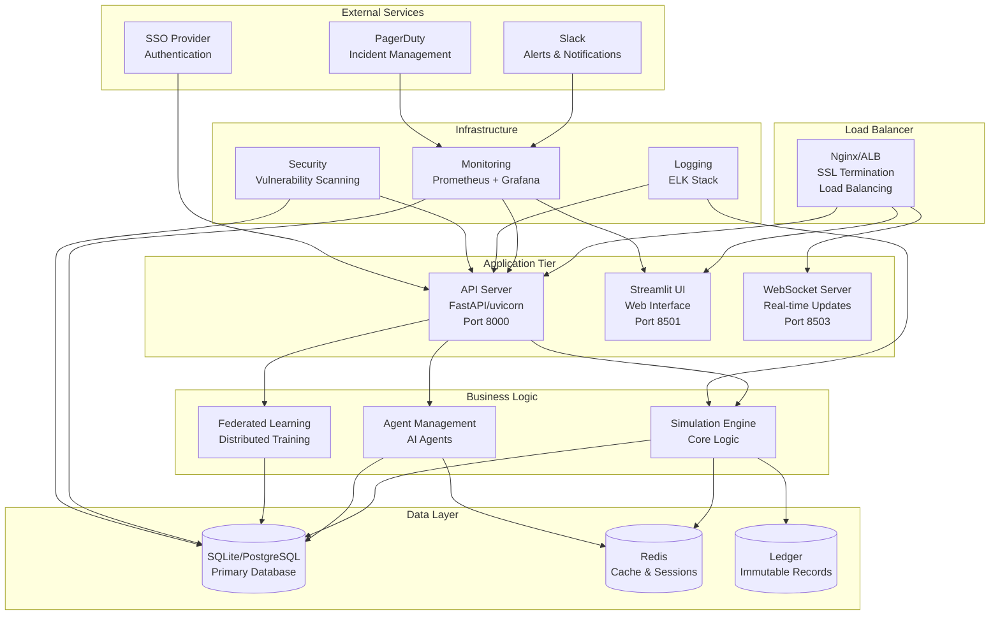

# Operations Documentation Suite - Complete System Administration Guide

## Overview

This comprehensive operations documentation suite provides system administrators, DevOps engineers, and operations teams with everything needed to deploy, monitor, maintain, and scale the Decentralized AI Simulation Platform in production environments.

**Operations Guide Version:** 2.0  
**Platform Version:** Enterprise v2.0  
**Last Updated:** November 1, 2025  

---

## Documentation Structure

### 🚀 Deployment & Infrastructure

| Guide | Purpose | Coverage |
|-------|---------|----------|
| **[Deployment Guide](OPS_DEPLOYMENT.md)** | Complete deployment procedures and environments | Staging, Production, Docker, Kubernetes |
| **[Infrastructure Management](OPS_INFRASTRUCTURE.md)** | Infrastructure setup and configuration | Docker, Kubernetes, Cloud providers |
| **[CI/CD Operations](OPS_CICD.md)** | Continuous Integration and Deployment operations | GitHub Actions, automated pipelines |
| **[Environment Management](OPS_ENVIRONMENTS.md)** | Environment configuration and management | Development, Staging, Production |

### 📊 Monitoring & Observability

| Guide | Purpose | Coverage |
|-------|---------|----------|
| **[Monitoring Guide](OPS_MONITORING.md)** | System monitoring and alerting setup | Prometheus, Grafana, custom metrics |
| **[Performance Operations](OPS_PERFORMANCE.md)** | Performance tuning and optimization | Load testing, scalability, optimization |
| **[Log Management](OPS_LOGGING.md)** | Centralized logging and log analysis | Log aggregation, analysis, retention |
| **[Alert Management](OPS_ALERTING.md)** | Alert configuration and response | PagerDuty, Slack, email alerts |

### 🔒 Security Operations

| Guide | Purpose | Coverage |
|-------|---------|----------|
| **[Security Operations](OPS_SECURITY.md)** | Security monitoring and incident response | Vulnerability scanning, incident handling |
| **[Access Control](OPS_ACCESS_CONTROL.md)** | User management and permissions | SSO, RBAC, audit trails |
| **[Compliance Operations](OPS_COMPLIANCE.md)** | Compliance monitoring and reporting | SOC2, ISO27001, GDPR compliance |

### 🔧 System Administration

| Guide | Purpose | Coverage |
|-------|---------|----------|
| **[System Administration](OPS_SYSTEM_ADMIN.md)** | Daily operations and maintenance tasks | Backup, recovery, updates |
| **[Troubleshooting Guide](OPS_TROUBLESHOOTING.md)** | Common issues and resolution procedures | Diagnostics, debugging, fixes |
| **[Scaling Guide](OPS_SCALING.md)** | Horizontal and vertical scaling procedures | Load balancing, auto-scaling |
| **[Backup & Recovery](OPS_BACKUP_RECOVERY.md)** | Data backup and disaster recovery | Automated backups, recovery procedures |

---

## Executive Summary

The Decentralized AI Simulation Platform provides enterprise-grade operational capabilities designed for high availability, security, and scalability. Our comprehensive operations suite ensures reliable, secure, and efficient platform operation in production environments.

### Key Operational Features

#### 🛠️ **Deployment Automation**
- **Multi-Environment Support**: Staging, production, and containerized deployments
- **Automated CI/CD**: GitHub Actions-based continuous integration and deployment
- **Container Orchestration**: Docker and Kubernetes deployment options
- **Infrastructure as Code**: Terraform and CloudFormation support
- **Blue-Green Deployments**: Zero-downtime deployment strategies

#### 📈 **Comprehensive Monitoring**
- **Real-time Monitoring**: Prometheus and Grafana integration
- **Custom Metrics**: Application-specific performance monitoring
- **Alert Management**: Multi-channel alerting with escalation
- **Log Aggregation**: Centralized logging with ELK stack
- **Health Checks**: Automated system health verification

#### 🔒 **Security Operations**
- **Security Scanning**: Automated vulnerability assessment
- **Access Control**: Role-based access with SSO integration
- **Audit Logging**: Comprehensive audit trail and compliance
- **Incident Response**: Structured incident handling procedures
- **Compliance Monitoring**: Automated compliance validation

#### ⚡ **Performance Optimization**
- **Load Testing**: Automated performance validation
- **Scalability Planning**: Capacity planning and scaling procedures
- **Resource Optimization**: Efficient resource utilization
- **Database Optimization**: Query tuning and performance optimization
- **Caching Strategies**: Multi-level caching implementation

---

## Quick Start for Operations Teams

### Environment Setup

#### 1. **Production Environment Preparation**
```bash
# Prerequisites check
./scripts/setup/setup.sh --production --verify

# Infrastructure setup
docker-compose --profile with-nginx --profile with-monitoring up -d

# Database initialization
python scripts/runtime/deploy.sh production --config config/production.yaml
```

#### 2. **CI/CD Pipeline Setup**
```yaml
# Configure GitHub Actions secrets
SECRET_KEY: "your-secure-key"
SLACK_WEBHOOK: "https://hooks.slack.com/..."
PAGERDUTY_TOKEN: "your-pagerduty-token"
DOCKER_REGISTRY: "registry.example.com"

# Deploy pipeline
cp .github/workflows/ci-cd.yml templates/
# Customize for your environment
```

#### 3. **Monitoring Stack Deployment**
```bash
# Deploy monitoring stack
docker-compose --profile with-monitoring up -d prometheus grafana

# Configure Grafana dashboards
curl -X POST http://localhost:3000/api/dashboards/db \
  -H "Content-Type: application/json" \
  -d @docker/monitoring/grafana/dashboards/dashboard.json

# Set up alerting rules
kubectl apply -f docker/monitoring/prometheus/rules/
```

### Daily Operations

#### 📋 **Morning Health Check**
```bash
#!/bin/bash
# Daily operations script

echo "🔍 Starting daily health check..."

# System status check
./scripts/runtime/run.sh --health-check

# Database health
python -c "
from src.core.database import DatabaseLedger
db = DatabaseLedger()
health = db.get_health_status()
print(f'Database: {health}')
"

# Memory and CPU usage
free -h
top -bn1 | head -20

# Active processes
ps aux | grep simulation | grep -v grep

echo "✅ Health check completed"
```

#### 🔍 **Performance Monitoring**
```bash
# Real-time performance monitoring
./scripts/monitoring/performance_monitor.py --dashboard

# Load testing (weekly)
./scripts/testing/benchmark_performance.py --full-suite

# Capacity planning check
./scripts/operations/capacity_check.py
```

#### 📊 **Log Analysis**
```bash
# Error log analysis
grep -i error logs/simulation.log | tail -20

# Performance metrics
grep -i "performance" logs/ | tail -10

# Security events
grep -i "security\|unauthorized\|failed" logs/ | tail -15
```

### Weekly Operations

#### 🔄 **Maintenance Tasks**
```bash
#!/bin/bash
# Weekly maintenance script

echo "🔧 Starting weekly maintenance..."

# Database optimization
python -c "
from src.core.database import DatabaseLedger
db = DatabaseLedger()
db.optimize_performance()
"

# Log rotation
./scripts/maintenance/cleanup.sh --logs --archive

# Security scan
bandit -r src/ --format json --output reports/security-scan-$(date +%Y%m%d).json

# Backup verification
./scripts/backup/verify_backup.sh

echo "✅ Weekly maintenance completed"
```

#### 📈 **Performance Review**
```bash
# Generate weekly performance report
./scripts/reports/performance_report.py --week --output weekly_performance.md

# Capacity planning analysis
./scripts/operations/capacity_analysis.py --trend

# Alert review
./scripts/alerting/review_alerts.py --week
```

---

## Deployment Architecture

### System Architecture Overview



### Container Architecture

#### 🐳 **Docker Container Strategy**

**Multi-Stage Dockerfile Pattern:**
```dockerfile
# Stage 1: Build
FROM python:3.11-slim as builder
WORKDIR /app

# Install build dependencies
RUN apt-get update && apt-get install -y \
    build-essential \
    && rm -rf /var/lib/apt/lists/*

# Install Python dependencies
COPY requirements.txt .
RUN pip install --user --no-cache-dir -r requirements.txt

# Stage 2: Runtime
FROM python:3.11-slim as runtime

# Install runtime dependencies
RUN apt-get update && apt-get install -y \
    curl \
    && rm -rf /var/lib/apt/lists/*

# Create non-root user
RUN useradd --create-home --shell /bin/bash simulation

# Copy Python packages from builder
COPY --from=builder /root/.local /home/simulation/.local

# Copy application code
COPY --chown=simulation:simulation . /app

# Set environment
ENV PATH=/home/simulation/.local/bin:$PATH
ENV PYTHONPATH=/app
ENV PYTHONUNBUFFERED=1

# Switch to non-root user
USER simulation

# Health check
HEALTHCHECK --interval=30s --timeout=10s --start-period=5s --retries=3 \
    CMD curl -f http://localhost:8000/health || exit 1

# Expose ports
EXPOSE 8000 8501 8503

# Start command
CMD ["uvicorn", "src.api.api_server:app", "--host", "0.0.0.0", "--port", "8000"]
```

**Container Orchestration with Docker Compose:**
```yaml
# docker-compose.prod.yml
version: '3.8'

services:
  # API Gateway
  nginx:
    image: nginx:alpine
    ports:
      - "80:80"
      - "443:443"
    volumes:
      - ./docker/nginx/nginx.conf:/etc/nginx/nginx.conf:ro
      - ./docker/nginx/ssl:/etc/nginx/ssl:ro
      - nginx_logs:/var/log/nginx
    depends_on:
      - api
      - streamlit
      - websocket
    networks:
      - simulation_network
    restart: unless-stopped
    healthcheck:
      test: ["CMD", "curl", "-f", "http://localhost/health"]
      interval: 30s
      timeout: 10s
      retries: 3

  # API Server
  api:
    build:
      context: .
      target: runtime
    environment:
      - ENVIRONMENT=production
      - DATABASE_URL=${DATABASE_URL}
      - REDIS_URL=${REDIS_URL}
      - SECRET_KEY=${SECRET_KEY}
      - LOG_LEVEL=INFO
    volumes:
      - app_data:/app/data
      - app_logs:/app/logs
    networks:
      - simulation_network
    restart: unless-stopped
    deploy:
      replicas: 3
      resources:
        limits:
          cpus: '2.0'
          memory: 2G
        reservations:
          cpus: '0.5'
          memory: 512M
    healthcheck:
      test: ["CMD", "curl", "-f", "http://localhost:8000/health"]
      interval: 30s
      timeout: 10s
      retries: 3

  # Streamlit UI
  streamlit:
    build:
      context: .
      target: runtime
    command: ["streamlit", "run", "src/ui/streamlit_app.py", "--server.port=8501", "--server.address=0.0.0.0"]
    environment:
      - ENVIRONMENT=production
      - API_SERVER_URL=http://api:8000
      - LOG_LEVEL=INFO
    volumes:
      - app_data:/app/data
    networks:
      - simulation_network
    restart: unless-stopped
    deploy:
      replicas: 2
      resources:
        limits:
          cpus: '1.0'
          memory: 1G

  # WebSocket Server
  websocket:
    build:
      context: .
      target: runtime
    command: ["python", "src/websocket/server.py"]
    environment:
      - ENVIRONMENT=production
      - API_SERVER_URL=http://api:8000
      - LOG_LEVEL=INFO
    networks:
      - simulation_network
    restart: unless-stopped
    deploy:
      replicas: 2
      resources:
        limits:
          cpus: '0.5'
          memory: 512M

  # Database
  postgres:
    image: postgres:15-alpine
    environment:
      - POSTGRES_DB=${POSTGRES_DB}
      - POSTGRES_USER=${POSTGRES_USER}
      - POSTGRES_PASSWORD=${POSTGRES_PASSWORD}
    volumes:
      - postgres_data:/var/lib/postgresql/data
      - ./docker/postgres/init.sql:/docker-entrypoint-initdb.d/init.sql:ro
    networks:
      - simulation_network
    restart: unless-stopped
    deploy:
      resources:
        limits:
          cpus: '2.0'
          memory: 4G
        reservations:
          cpus: '1.0'
          memory: 2G
    healthcheck:
      test: ["CMD-SHELL", "pg_isready -U ${POSTGRES_USER} -d ${POSTGRES_DB}"]
      interval: 30s
      timeout: 10s
      retries: 3

  # Cache
  redis:
    image: redis:7-alpine
    volumes:
      - redis_data:/data
      - ./docker/redis/redis.conf:/etc/redis/redis.conf:ro
    networks:
      - simulation_network
    restart: unless-stopped
    deploy:
      resources:
        limits:
          cpus: '0.5'
          memory: 512M
    healthcheck:
      test: ["CMD", "redis-cli", "ping"]
      interval: 30s
      timeout: 10s
      retries: 3

  # Monitoring
  prometheus:
    image: prom/prometheus:latest
    ports:
      - "9090:9090"
    volumes:
      - ./docker/monitoring/prometheus.yml:/etc/prometheus/prometheus.yml:ro
      - prometheus_data:/prometheus
      - ./docker/monitoring/rules:/etc/prometheus/rules:ro
    command:
      - '--config.file=/etc/prometheus/prometheus.yml'
      - '--storage.tsdb.path=/prometheus'
      - '--web.console.libraries=/etc/prometheus/console_libraries'
      - '--web.console.templates=/etc/prometheus/consoles'
      - '--storage.tsdb.retention.time=30d'
      - '--web.enable-lifecycle'
    networks:
      - simulation_network
    restart: unless-stopped

  grafana:
    image: grafana/grafana:latest
    ports:
      - "3000:3000"
    environment:
      - GF_SECURITY_ADMIN_PASSWORD=${GRAFANA_PASSWORD}
      - GF_USERS_ALLOW_SIGN_UP=false
    volumes:
      - grafana_data:/var/lib/grafana
      - ./docker/monitoring/grafana/dashboards:/etc/grafana/provisioning/dashboards:ro
      - ./docker/monitoring/grafana/datasources:/etc/grafana/provisioning/datasources:ro
    networks:
      - simulation_network
    restart: unless-stopped

volumes:
  app_data:
    driver: local
  app_logs:
    driver: local
  postgres_data:
    driver: local
  redis_data:
    driver: local
  prometheus_data:
    driver: local
  grafana_data:
    driver: local
  nginx_logs:
    driver: local

networks:
  simulation_network:
    driver: bridge
    ipam:
      config:
        - subnet: 172.20.0.0/16
```

#### ☸️ **Kubernetes Deployment**

**Production Kubernetes Manifests:**
```yaml
# k8s/namespace.yaml
apiVersion: v1
kind: Namespace
metadata:
  name: simulation-production
  labels:
    name: simulation-production
    environment: production

---
# k8s/configmap.yaml
apiVersion: v1
kind: ConfigMap
metadata:
  name: simulation-config
  namespace: simulation-production
data:
  ENVIRONMENT: "production"
  LOG_LEVEL: "INFO"
  PYTHONPATH: "/app"
  PYTHONUNBUFFERED: "1"

---
# k8s/secret.yaml
apiVersion: v1
kind: Secret
metadata:
  name: simulation-secrets
  namespace: simulation-production
type: Opaque
data:
  database-url: <base64-encoded-database-url>
  redis-url: <base64-encoded-redis-url>
  secret-key: <base64-encoded-secret-key>

---
# k8s/api-deployment.yaml
apiVersion: apps/v1
kind: Deployment
metadata:
  name: simulation-api
  namespace: simulation-production
spec:
  replicas: 3
  selector:
    matchLabels:
      app: simulation-api
  template:
    metadata:
      labels:
        app: simulation-api
    spec:
      containers:
      - name: api
        image: simulation:latest
        command: ["uvicorn", "src.api.api_server:app", "--host", "0.0.0.0", "--port", "8000"]
        ports:
        - containerPort: 8000
        envFrom:
        - configMapRef:
            name: simulation-config
        - secretRef:
            name: simulation-secrets
        resources:
          requests:
            cpu: 500m
            memory: 512Mi
          limits:
            cpu: 2
            memory: 2Gi
        livenessProbe:
          httpGet:
            path: /health
            port: 8000
          initialDelaySeconds: 30
          periodSeconds: 10
        readinessProbe:
          httpGet:
            path: /health
            port: 8000
          initialDelaySeconds: 5
          periodSeconds: 5

---
# k8s/service.yaml
apiVersion: v1
kind: Service
metadata:
  name: simulation-api-service
  namespace: simulation-production
spec:
  selector:
    app: simulation-api
  ports:
  - protocol: TCP
    port: 80
    targetPort: 8000
  type: ClusterIP

---
# k8s/ingress.yaml
apiVersion: networking.k8s.io/v1
kind: Ingress
metadata:
  name: simulation-ingress
  namespace: simulation-production
  annotations:
    kubernetes.io/ingress.class: nginx
    cert-manager.io/cluster-issuer: letsencrypt-prod
    nginx.ingress.kubernetes.io/ssl-redirect: "true"
    nginx.ingress.kubernetes.io/proxy-body-size: "50m"
spec:
  tls:
  - hosts:
    - simulation.example.com
    secretName: simulation-tls
  rules:
  - host: simulation.example.com
    http:
      paths:
      - path: /api
        pathType: Prefix
        backend:
          service:
            name: simulation-api-service
            port:
              number: 80
      - path: /
        pathType: Prefix
        backend:
          service:
            name: simulation-ui-service
            port:
              number: 80

---
# k8s/hpa.yaml
apiVersion: autoscaling/v2
kind: HorizontalPodAutoscaler
metadata:
  name: simulation-api-hpa
  namespace: simulation-production
spec:
  scaleTargetRef:
    apiVersion: apps/v1
    kind: Deployment
    name: simulation-api
  minReplicas: 3
  maxReplicas: 10
  metrics:
  - type: Resource
    resource:
      name: cpu
      target:
        type: Utilization
        averageUtilization: 70
  - type: Resource
    resource:
      name: memory
      target:
        type: Utilization
        averageUtilization: 80
```

---

## CI/CD Operations

### GitHub Actions Pipeline

#### 🔄 **Complete CI/CD Workflow**

```yaml
# .github/workflows/production-pipeline.yml
name: Production Deployment Pipeline

on:
  push:
    branches: [main]
    tags: ['v*']
  pull_request:
    branches: [main]

env:
  REGISTRY: ghcr.io
  IMAGE_NAME: ${{ github.repository }}

jobs:
  # Quality Gate
  quality-gate:
    runs-on: ubuntu-latest
    outputs:
      quality-status: ${{ steps.quality.outputs.status }}
    steps:
      - uses: actions/checkout@v4
      
      - name: Set up Python
        uses: actions/setup-python@v4
        with:
          python-version: '3.11'
          
      - name: Install dependencies
        run: |
          python -m pip install --upgrade pip
          pip install -r requirements.txt
          pip install -r config/requirements-dev.txt
          
      - name: Code quality checks
        run: |
          # Code formatting
          black --check --diff src/ tests/
          isort --check-only --diff src/ tests/
          
          # Linting
          flake8 src/ tests/ --max-line-length=88 --extend-ignore=E203,W503
          
          # Type checking
          mypy src/ --ignore-missing-imports --strict
          
          # Security scanning
          bandit -r src/ -f json -o bandit-report.json
          safety check --json --output safety-report.json
          
      - name: Upload quality reports
        uses: actions/upload-artifact@v3
        with:
          name: quality-reports
          path: |
            bandit-report.json
            safety-report.json
            
      - name: Quality gate
        id: quality
        run: |
          if [ -f bandit-report.json ]; then
            if jq -r '.results | length' bandit-report.json | grep -q "^0$"; then
              echo "status=passed" >> $GITHUB_OUTPUT
            else
              echo "status=failed" >> $GITHUB_OUTPUT
            fi
          else
            echo "status=passed" >> $GITHUB_OUTPUT
          fi

  # Security scan
  security-scan:
    runs-on: ubuntu-latest
    needs: quality-gate
    steps:
      - uses: actions/checkout@v4
      
      - name: Run Trivy vulnerability scanner
        uses: aquasecurity/trivy-action@master
        with:
          scan-type: 'fs'
          scan-ref: '.'
          format: 'sarif'
          output: 'trivy-results.sarif'
          
      - name: Upload Trivy scan results
        uses: github/codeql-action/upload-sarif@v2
        if: always()
        with:
          sarif_file: 'trivy-results.sarif'

  # Test suite
  test-suite:
    runs-on: ubuntu-latest
    needs: quality-gate
    strategy:
      matrix:
        python-version: ['3.9', '3.10', '3.11']
    steps:
      - uses: actions/checkout@v4
      
      - name: Set up Python ${{ matrix.python-version }}
        uses: actions/setup-python@v4
        with:
          python-version: ${{ matrix.python-version }}
          
      - name: Install dependencies
        run: |
          python -m pip install --upgrade pip
          pip install -r requirements.txt
          pip install pytest pytest-cov pytest-xdist pytest-asyncio
          
      - name: Run unit tests
        run: |
          pytest tests/unit/ \
            --cov=src \
            --cov-report=xml \
            --cov-report=html \
            --cov-report=term-missing \
            --junit-xml=test-results.xml \
            --maxfail=5 \
            -v
            
      - name: Run integration tests
        run: |
          pytest tests/integration/ \
            --maxfail=5 \
            -v
            
      - name: Run end-to-end tests
        run: |
          pytest tests/e2e/ \
            --maxfail=3 \
            -v
            
      - name: Upload test results
        uses: actions/upload-artifact@v3
        if: always()
        with:
          name: test-results-${{ matrix.python-version }}
          path: |
            test-results.xml
            htmlcov/
            
      - name: Upload coverage to Codecov
        uses: codecov/codecov-action@v3
        if: matrix.python-version == '3.11'
        with:
          file: ./coverage.xml
          flags: unittests
          name: codecov-umbrella

  # Performance testing
  performance-test:
    runs-on: ubuntu-latest
    needs: test-suite
    steps:
      - uses: actions/checkout@v4
      
      - name: Set up Python
        uses: actions/setup-python@v4
        with:
          python-version: '3.11'
          
      - name: Install dependencies
        run: |
          python -m pip install --upgrade pip
          pip install -r requirements.txt
          pip install pytest psutil memory-profiler
          
      - name: Run performance tests
        run: |
          pytest tests/performance/ \
            --benchmark-only \
            --benchmark-json=benchmark-results.json \
            -v
            
      - name: Benchmark regression check
        run: |
          python scripts/testing/benchmark_check.py \
            --current benchmark-results.json \
            --baseline .github/benchmarks/baseline.json
            
      - name: Upload performance results
        uses: actions/upload-artifact@v3
        with:
          name: performance-results
          path: benchmark-results.json

  # Build and push container
  build:
    runs-on: ubuntu-latest
    needs: [security-scan, performance-test]
    permissions:
      contents: read
      packages: write
    steps:
      - uses: actions/checkout@v4
      
      - name: Log in to Container Registry
        uses: docker/login-action@v2
        with:
          registry: ${{ env.REGISTRY }}
          username: ${{ github.actor }}
          password: ${{ secrets.GITHUB_TOKEN }}
          
      - name: Extract metadata
        id: meta
        uses: docker/metadata-action@v4
        with:
          images: ${{ env.REGISTRY }}/${{ env.IMAGE_NAME }}
          tags: |
            type=ref,event=branch
            type=ref,event=pr
            type=semver,pattern={{version}}
            type=semver,pattern={{major}}.{{minor}}
            type=sha,prefix={{branch}}-
            
      - name: Build and push Docker image
        uses: docker/build-push-action@v4
        with:
          context: .
          push: true
          tags: ${{ steps.meta.outputs.tags }}
          labels: ${{ steps.meta.outputs.labels }}
          cache-from: type=gha
          cache-to: type=gha,mode=max

  # Deploy to staging
  deploy-staging:
    runs-on: ubuntu-latest
    needs: build
    environment:
      name: staging
      url: https://staging.simulation.example.com
    steps:
      - uses: actions/checkout@v4
      
      - name: Deploy to staging
        run: |
          echo "Deploying to staging environment..."
          # Add your staging deployment commands here
          # Example: kubectl apply -f k8s/staging/
          
      - name: Run staging tests
        run: |
          echo "Running staging deployment tests..."
          # Add staging-specific tests
          
      - name: Health check
        run: |
          curl -f https://staging.simulation.example.com/health

  # Deploy to production
  deploy-production:
    runs-on: ubuntu-latest
    needs: deploy-staging
    environment:
      name: production
      url: https://simulation.example.com
    steps:
      - uses: actions/checkout@v4
      
      - name: Deploy to production
        run: |
          echo "Deploying to production environment..."
          # Add your production deployment commands here
          
      - name: Run smoke tests
        run: |
          echo "Running production smoke tests..."
          # Add production smoke tests
          
      - name: Health check
        run: |
          curl -f https://simulation.example.com/health
          
      - name: Notify deployment
        uses: 8398a7/action-slack@v3
        with:
          status: ${{ job.status }}
          channel: '#operations'
          webhook_url: ${{ secrets.SLACK_WEBHOOK }}
```

### Deployment Automation Scripts

#### 🚀 **Automated Deployment Script**

```bash
#!/bin/bash
# scripts/operations/automated_deploy.sh

# =============================================================================
# Automated Production Deployment Script
# =============================================================================

set -euo pipefail

readonly SCRIPT_DIR="$(cd "$(dirname "${BASH_SOURCE[0]}")" && pwd)"
readonly PROJECT_ROOT="$(cd "${SCRIPT_DIR}/../.." && pwd)"
readonly DEPLOYMENT_LOG="${PROJECT_ROOT}/logs/deployment_$(date +%Y%m%d_%H%M%S).log"

# Configuration
ENVIRONMENT="${1:-production}"
SKIP_TESTS="${SKIP_TESTS:-false}"
DRY_RUN="${DRY_RUN:-false}"
BACKUP_REQUIRED="${BACKUP_REQUIRED:-true}"

# Colors for output
RED='\033[0;31m'
GREEN='\033[0;32m'
YELLOW='\033[1;33m'
NC='\033[0m' # No Color

# Logging function
log() {
    local level="$1"
    shift
    local message="$*"
    local timestamp=$(date '+%Y-%m-%d %H:%M:%S')
    
    echo "[$timestamp] [$level] $message" | tee -a "$DEPLOYMENT_LOG"
    
    case "$level" in
        "INFO")  echo -e "${GREEN}[$level]${NC} $message" ;;
        "WARN")  echo -e "${YELLOW}[$level]${NC} $message" ;;
        "ERROR") echo -e "${RED}[$level]${NC} $message" ;;
        *) echo "[$level] $message" ;;
    esac
}

# Pre-deployment validation
validate_deployment() {
    log "INFO" "Starting pre-deployment validation..."
    
    # Check if environment is valid
    if [[ ! "$ENVIRONMENT" =~ ^(staging|production)$ ]]; then
        log "ERROR" "Invalid environment: $ENVIRONMENT (must be 'staging' or 'production')"
        exit 1
    fi
    
    # Check if deployment user has required permissions
    if [[ "$ENVIRONMENT" == "production" ]] && [[ $(id -u) -ne 0 ]]; then
        log "ERROR" "Production deployment requires root privileges"
        exit 1
    fi
    
    # Check system resources
    local available_memory=$(free -m | awk 'NR==2{print $7}')
    local available_disk=$(df -h . | awk 'NR==2{print $4}' | sed 's/G//')
    
    if [[ $available_memory -lt 2048 ]]; then
        log "WARN" "Low available memory: ${available_memory}MB"
    fi
    
    if [[ $available_disk -lt 10 ]]; then
        log "WARN" "Low available disk space: ${available_disk}GB"
    fi
    
    log "INFO" "Pre-deployment validation completed"
}

# Create backup
create_backup() {
    if [[ "$BACKUP_REQUIRED" != "true" ]]; then
        log "INFO" "Skipping backup creation"
        return 0
    fi
    
    log "INFO" "Creating pre-deployment backup..."
    
    local backup_timestamp=$(date +%Y%m%d_%H%M%S)
    local backup_dir="${PROJECT_ROOT}/backups/deployment_${backup_timestamp}"
    
    mkdir -p "$backup_dir"
    
    # Backup database
    if [[ -f "${PROJECT_ROOT}/data/ledger.db" ]]; then
        cp "${PROJECT_ROOT}/data/ledger.db" "${backup_dir}/"
        log "INFO" "Database backed up"
    fi
    
    # Backup configuration
    cp -r "${PROJECT_ROOT}/config" "${backup_dir}/"
    log "INFO" "Configuration backed up"
    
    # Backup current deployment
    if [[ -d "${PROJECT_ROOT}/dist" ]]; then
        cp -r "${PROJECT_ROOT}/dist" "${backup_dir}/"
        log "INFO" "Application binaries backed up"
    fi
    
    log "INFO" "Backup created: $backup_dir"
    echo "$backup_dir" > "${PROJECT_ROOT}/.last_backup"
}

# Run tests
run_tests() {
    if [[ "$SKIP_TESTS" == "true" ]]; then
        log "INFO" "Skipping tests as requested"
        return 0
    fi
    
    log "INFO" "Running pre-deployment tests..."
    
    # Unit tests
    if ! python -m pytest tests/unit/ --maxfail=5 -q; then
        log "ERROR" "Unit tests failed"
        return 1
    fi
    
    # Integration tests
    if ! python -m pytest tests/integration/ --maxfail=3 -q; then
        log "ERROR" "Integration tests failed"
        return 1
    fi
    
    # Security scan
    if ! bandit -r src/ -f json -o /tmp/security-report.json; then
        log "WARN" "Security scan found issues"
        cat /tmp/security-report.json
    fi
    
    log "INFO" "All tests passed"
}

# Deploy application
deploy_application() {
    log "INFO" "Deploying application to $ENVIRONMENT environment..."
    
    if [[ "$DRY_RUN" == "true" ]]; then
        log "INFO" "[DRY RUN] Would deploy application to $ENVIRONMENT"
        return 0
    fi
    
    case "$ENVIRONMENT" in
        "staging")
            deploy_staging
            ;;
        "production")
            deploy_production
            ;;
    esac
}

# Deploy to staging
deploy_staging() {
    log "INFO" "Deploying to staging environment..."
    
    # Pull latest changes
    git fetch origin main
    git checkout main
    git pull origin main
    
    # Install dependencies
    python -m pip install --upgrade pip
    pip install -r requirements.txt
    
    # Build application
    python -m build
    
    # Run database migrations
    python scripts/migrate.py --environment staging
    
    # Start application
    nohup python -m uvicorn src.api.api_server:app \
        --host 0.0.0.0 \
        --port 8000 \
        --log-level info \
        > "${PROJECT_ROOT}/logs/staging.log" 2>&1 &
    
    log "INFO" "Staging deployment completed"
}

# Deploy to production
deploy_production() {
    log "INFO" "Deploying to production environment..."
    
    # Stop existing services
    pkill -f "uvicorn.*api_server" || true
    sleep 5
    
    # Pull latest changes
    git fetch origin main
    git checkout main
    git pull origin main
    
    # Install dependencies
    python -m pip install --upgrade pip
    pip install -r requirements.txt
    
    # Build application
    python -m build
    
    # Run database migrations
    python scripts/migrate.py --environment production
    
    # Start application with process manager
    systemctl start simulation-api
    
    log "INFO" "Production deployment completed"
}

# Post-deployment validation
post_deployment_validation() {
    log "INFO" "Running post-deployment validation..."
    
    local max_attempts=30
    local attempt=1
    
    while [[ $attempt -le $max_attempts ]]; do
        if curl -f http://localhost:8000/health > /dev/null 2>&1; then
            log "INFO" "Health check passed after $attempt attempts"
            break
        fi
        
        log "INFO" "Health check attempt $attempt/$max_attempts failed, retrying..."
        sleep 10
        attempt=$((attempt + 1))
    done
    
    if [[ $attempt -gt $max_attempts ]]; then
        log "ERROR" "Health check failed after $max_attempts attempts"
        return 1
    fi
    
    # Run application tests
    python -m pytest tests/smoke/ -v
    
    log "INFO" "Post-deployment validation completed"
}

# Notify stakeholders
notify_deployment() {
    local status="$1"
    local environment="$2"
    
    # Slack notification
    if [[ -n "${SLACK_WEBHOOK:-}" ]]; then
        local color="good"
        local emoji="🚀"
        
        if [[ "$status" == "failed" ]]; then
            color="danger"
            emoji="❌"
        elif [[ "$status" == "warning" ]]; then
            color="warning"
            emoji="⚠️"
        fi
        
        curl -X POST -H 'Content-type: application/json' \
            --data "{
                \"attachments\": [{
                    \"color\": \"$color\",
                    \"title\": \"$emoji Deployment $status\",
                    \"fields\": [
                        {\"title\": \"Environment\", \"value\": \"$environment\", \"short\": true},
                        {\"title\": \"Version\", \"value\": \"$(git rev-parse --short HEAD)\", \"short\": true},
                        {\"title\": \"Deployed by\", \"value\": \"$(whoami)\", \"short\": true}
                    ]
                }]
            }" \
            "$SLACK_WEBHOOK"
    fi
}

# Main execution
main() {
    log "INFO" "Starting automated deployment to $ENVIRONMENT environment"
    log "INFO" "Timestamp: $(date)"
    log "INFO" "User: $(whoami)"
    log "INFO" "Git commit: $(git rev-parse --short HEAD)"
    
    # Execute deployment steps
    local deployment_failed=false
    
    validate_deployment || deployment_failed=true
    
    if [[ "$deployment_failed" == false ]]; then
        create_backup || deployment_failed=true
    fi
    
    if [[ "$deployment_failed" == false ]]; then
        run_tests || deployment_failed=true
    fi
    
    if [[ "$deployment_failed" == false ]]; then
        deploy_application || deployment_failed=true
    fi
    
    if [[ "$deployment_failed" == false ]]; then
        post_deployment_validation || deployment_failed=true
    fi
    
    # Final status
    if [[ "$deployment_failed" == true ]]; then
        log "ERROR" "Deployment failed"
        notify_deployment "failed" "$ENVIRONMENT"
        exit 1
    else
        log "SUCCESS" "Deployment completed successfully"
        notify_deployment "success" "$ENVIRONMENT"
    fi
}

# Execute main function
main "$@"
```

---

## Monitoring and Alerting

### Prometheus Monitoring Setup

#### 📊 **Prometheus Configuration**

```yaml
# docker/monitoring/prometheus.yml
global:
  scrape_interval: 15s
  evaluation_interval: 15s
  external_labels:
    cluster: 'simulation-production'
    replica: 'prometheus-1'

rule_files:
  - "rules/*.yml"

alerting:
  alertmanagers:
    - static_configs:
        - targets:
          - alertmanager:9093

scrape_configs:
  # Prometheus self-monitoring
  - job_name: 'prometheus'
    static_configs:
      - targets: ['localhost:9090']

  # Simulation API
  - job_name: 'simulation-api'
    static_configs:
      - targets: ['api:8000']
    metrics_path: '/metrics'
    scrape_interval: 10s
    scrape_timeout: 5s

  # Simulation UI
  - job_name: 'simulation-ui'
    static_configs:
      - targets: ['streamlit:8501']
    metrics_path: '/_stcore/metrics'
    scrape_interval: 30s

  # Database
  - job_name: 'postgres'
    static_configs:
      - targets: ['postgres:5432']
    scrape_interval: 30s

  # Redis
  - job_name: 'redis'
    static_configs:
      - targets: ['redis:6379']
    scrape_interval: 30s

  # Node metrics
  - job_name: 'node-exporter'
    static_configs:
      - targets: ['node-exporter:9100']

  # Custom application metrics
  - job_name: 'simulation-custom'
    static_configs:
      - targets: ['api:8000']
    metrics_path: '/api/v2/metrics'
    scrape_interval: 15s
    relabel_configs:
      - source_labels: [__address__]
        target_label: instance
        replacement: 'simulation-api'

  # Blackbox monitoring
  - job_name: 'blackbox'
    metrics_path: /probe
    params:
      module: [http_2xx]
    static_configs:
      - targets:
        - https://simulation.example.com/health
        - https://simulation.example.com/api/v2/health
    relabel_configs:
      - source_labels: [__address__]
        target_label: __param_target
      - source_labels: [__param_target]
        target_label: instance
      - target_label: __address__
        replacement: blackbox-exporter:9115
```

#### 📈 **Alert Rules**

```yaml
# docker/monitoring/prometheus/rules/simulation.yml
groups:
  - name: simulation.rules
    rules:
      # High-level application alerts
      - alert: SimulationAPIDown
        expr: up{job="simulation-api"} == 0
        for: 1m
        labels:
          severity: critical
          service: simulation
        annotations:
          summary: "Simulation API is down"
          description: "Simulation API has been down for more than 1 minute."

      - alert: SimulationHighErrorRate
        expr: rate(http_requests_total{job="simulation-api",status=~"5.."}[5m]) > 0.1
        for: 5m
        labels:
          severity: warning
          service: simulation
        annotations:
          summary: "High error rate detected"
          description: "Error rate is {{ $value }} errors per second for Simulation API."

      - alert: SimulationHighLatency
        expr: histogram_quantile(0.95, rate(http_request_duration_seconds_bucket{job="simulation-api"}[5m])) > 2
        for: 10m
        labels:
          severity: warning
          service: simulation
        annotations:
          summary: "High latency detected"
          description: "95th percentile latency is {{ $value }}s for Simulation API."

      # Agent-specific alerts
      - alert: AgentCommunicationFailure
        expr: rate(agent_messages_failed_total[5m]) > 0.05
        for: 5m
        labels:
          severity: warning
          service: simulation
        annotations:
          summary: "Agent communication failures"
          description: "Agent communication failure rate is {{ $value }} failures per second."

      - alert: ConsensusFailure
        expr: rate(consensus_failures_total[5m]) > 0.01
        for: 2m
        labels:
          severity: critical
          service: simulation
        annotations:
          summary: "Consensus mechanism failures"
          description: "Consensus failure rate is {{ $value }} failures per second."

      # Performance alerts
      - alert: HighMemoryUsage
        expr: (node_memory_MemTotal_bytes - node_memory_MemAvailable_bytes) / node_memory_MemTotal_bytes > 0.9
        for: 5m
        labels:
          severity: warning
          service: infrastructure
        annotations:
          summary: "High memory usage"
          description: "Memory usage is above 90% ({{ $value | humanizePercentage }})."

      - alert: HighCPUUsage
        expr: 100 - (avg by(instance) (irate(node_cpu_seconds_total{mode="idle"}[5m])) * 100) > 80
        for: 10m
        labels:
          severity: warning
          service: infrastructure
        annotations:
          summary: "High CPU usage"
          description: "CPU usage is above 80% for more than 10 minutes."

      # Database alerts
      - alert: DatabaseConnectionsHigh
        expr: pg_stat_database_numbackends / pg_settings_max_connections > 0.8
        for: 5m
        labels:
          severity: warning
          service: database
        annotations:
          summary: "High database connection usage"
          description: "Database connections are above 80% of maximum ({{ $value | humanizePercentage }})."

      - alert: DatabaseSlowQueries
        expr: rate(pg_stat_database_blk_read_time[5m]) > 1000
        for: 5m
        labels:
          severity: warning
          service: database
        annotations:
          summary: "Slow database queries"
          description: "Database query time is elevated."

      # Security alerts
      - alert: SecurityScanFailed
        expr: security_scan_last_run_timestamp < (time() - 86400)
        for: 1h
        labels:
          severity: warning
          service: security
        annotations:
          summary: "Security scan overdue"
          description: "Security scan has not run in the last 24 hours."

      - alert: UnusualAuthenticationAttempts
        expr: rate(authentication_failures_total[5m]) > 10
        for: 2m
        labels:
          severity: critical
          service: security
        annotations:
          summary: "Unusual authentication failure rate"
          description: "High rate of authentication failures detected ({{ $value }} per second)."

  - name: infrastructure.rules
    rules:
      # Disk space alerts
      - alert: DiskSpaceLow
        expr: (node_filesystem_avail_bytes / node_filesystem_size_bytes) < 0.1
        for: 5m
        labels:
          severity: warning
          service: infrastructure
        annotations:
          summary: "Low disk space"
          description: "Disk space is below 10% on {{ $labels.instance }}."

      - alert: DiskSpaceCriticallyLow
        expr: (node_filesystem_avail_bytes / node_filesystem_size_bytes) < 0.05
        for: 2m
        labels:
          severity: critical
          service: infrastructure
        annotations:
          summary: "Critically low disk space"
          description: "Disk space is below 5% on {{ $labels.instance }}."

      # Container alerts
      - alert: ContainerRestarted
        expr: increase(kube_pod_container_status_restarts_total[1h]) > 0
        for: 0m
        labels:
          severity: warning
          service: infrastructure
        annotations:
          summary: "Container restarted"
          description: "Container {{ $labels.container }} in pod {{ $labels.pod }} has restarted."
```

#### 🔔 **AlertManager Configuration**

```yaml
# docker/monitoring/alertmanager.yml
global:
  slack_api_url: '${SLACK_WEBHOOK}'
  pagerduty_url: 'https://events.pagerduty.com/v2/enqueue'

route:
  group_by: ['alertname', 'service']
  group_wait: 10s
  group_interval: 10s
  repeat_interval: 1h
  receiver: 'default-receiver'
  routes:
    # Critical alerts
    - match:
        severity: critical
      receiver: 'critical-alerts'
      group_wait: 10s
      repeat_interval: 5m
      
    # Security alerts
    - match:
        service: security
      receiver: 'security-alerts'
      group_wait: 30s
      repeat_interval: 15m
      
    # Warning alerts
    - match:
        severity: warning
      receiver: 'warning-alerts'
      group_wait: 5m
      repeat_interval: 30m

receivers:
  - name: 'default-receiver'
    slack_configs:
      - channel: '#operations'
        title: 'Alert: {{ .GroupLabels.alertname }}'
        text: |
          {{ range .Alerts }}
          *Alert:* {{ .Annotations.summary }}
          *Description:* {{ .Annotations.description }}
          *Severity:* {{ .Labels.severity }}
          *Service:* {{ .Labels.service }}
          *Time:* {{ .StartsAt.Format "2006-01-02 15:04:05" }}
          {{ end }}
        send_resolved: true

  - name: 'critical-alerts'
    slack_configs:
      - channel: '#critical-alerts'
        title: '🚨 CRITICAL: {{ .GroupLabels.alertname }}'
        text: |
          {{ range .Alerts }}
          *ALERT:* {{ .Annotations.summary }}
          *DESCRIPTION:* {{ .Annotations.description }}
          *SEVERITY:* {{ .Labels.severity }}
          *SERVICE:* {{ .Labels.service }}
          *INSTANCE:* {{ .Labels.instance }}
          *TIME:* {{ .StartsAt.Format "2006-01-02 15:04:05" }}
          {{ end }}
        send_resolved: true
    pagerduty_configs:
      - routing_key: '${PAGERDUTY_CRITICAL_KEY}'
        description: 'Critical alert: {{ .GroupLabels.alertname }}'
        severity: 'critical'

  - name: 'security-alerts'
    slack_configs:
      - channel: '#security'
        title: '🔒 Security Alert: {{ .GroupLabels.alertname }}'
        text: |
          {{ range .Alerts }}
          *SECURITY ALERT:* {{ .Annotations.summary }}
          *DESCRIPTION:* {{ .Annotations.description }}
          *SEVERITY:* {{ .Labels.severity }}
          *SERVICE:* {{ .Labels.service }}
          *TIME:* {{ .StartsAt.Format "2006-01-02 15:04:05" }}
          {{ end }}
        send_resolved: true
    email_configs:
      - to: 'security-team@company.com'
        subject: 'Security Alert: {{ .GroupLabels.alertname }}'
        body: |
          {{ range .Alerts }}
          Security Alert Details:
          
          Alert: {{ .Annotations.summary }}
          Description: {{ .Annotations.description }}
          Severity: {{ .Labels.severity }}
          Service: {{ .Labels.service }}
          Time: {{ .StartsAt.Format "2006-01-02 15:04:05" }}
          {{ end }}

  - name: 'warning-alerts'
    slack_configs:
      - channel: '#operations'
        title: '⚠️ Warning: {{ .GroupLabels.alertname }}'
        text: |
          {{ range .Alerts }}
          *WARNING:* {{ .Annotations.summary }}
          *DESCRIPTION:* {{ .Annotations.description }}
          *SEVERITY:* {{ .Labels.severity }}
          *SERVICE:* {{ .Labels.service }}
          *TIME:* {{ .StartsAt.Format "2006-01-02 15:04:05" }}
          {{ end }}
        send_resolved: true

inhibit_rules:
  - source_match:
      severity: 'critical'
    target_match:
      severity: 'warning'
    equal: ['alertname', 'service', 'instance']
```

---

## Log Management

### Centralized Logging Architecture

#### 📝 **Log Collection Setup**

```yaml
# docker-compose.logging.yml
version: '3.8'

services:
  # Elasticsearch
  elasticsearch:
    image: docker.elastic.co/elasticsearch/elasticsearch:8.8.0
    environment:
      - discovery.type=single-node
      - "ES_JAVA_OPTS=-Xms1g -Xmx1g"
      - xpack.security.enabled=false
    volumes:
      - elasticsearch_data:/usr/share/elasticsearch/data
    ports:
      - "9200:9200"
    networks:
      - logging_network
    restart: unless-stopped

  # Logstash
  logstash:
    image: docker.elastic.co/logstash/logstash:8.8.0
    volumes:
      - ./docker/logstash/config/logstash.yml:/usr/share/logstash/config/logstash.yml:ro
      - ./docker/logstash/pipeline:/usr/share/logstash/pipeline:ro
      - ./logs:/var/log/simulation:ro
    ports:
      - "5044:5044"
      - "9600:9600"
    depends_on:
      - elasticsearch
    networks:
      - logging_network
    restart: unless-stopped

  # Kibana
  kibana:
    image: docker.elastic.co/kibana/kibana:8.8.0
    environment:
      - ELASTICSEARCH_HOSTS=http://elasticsearch:9200
    ports:
      - "5601:5601"
    depends_on:
      - elasticsearch
    networks:
      - logging_network
    restart: unless-stopped

  # Filebeat for log forwarding
  filebeat:
    image: docker.elastic.co/beats/filebeat:8.8.0
    user: root
    volumes:
      - ./docker/filebeat/filebeat.yml:/usr/share/filebeat/filebeat.yml:ro
      - /var/lib/docker/containers:/var/lib/docker/containers:ro
      - /var/run/docker.sock:/var/run/docker.sock:ro
      - ./logs:/var/log/simulation:ro
    depends_on:
      - logstash
    networks:
      - logging_network
    restart: unless-stopped

volumes:
  elasticsearch_data:
    driver: local

networks:
  logging_network:
    driver: bridge
```

#### 🔍 **Log Processing Pipeline**

```ruby
# docker/logstash/pipeline/logstash.conf
input {
  beats {
    port => 5044
  }
  
  tcp {
    port => 5000
    codec => json_lines
  }
  
  http {
    port => 8080
    codec => json
  }
}

filter {
  # Parse simulation application logs
  if [fields][service] == "simulation-api" {
    grok {
      match => { 
        "message" => "%{TIMESTAMP_ISO8601:timestamp} \[%{LOGLEVEL:level}\] %{DATA:logger}: %{GREEDYDATA:message}" 
      }
    }
    
    date {
      match => [ "timestamp", "ISO8601" ]
    }
    
    mutate {
      add_field => { "service" => "simulation-api" }
      add_field => { "environment" => "production" }
    }
  }
  
  # Parse agent logs
  if [fields][service] == "agent" {
    grok {
      match => {
        "message" => "Agent %{WORD:agent_id}: %{GREEDYDATA:message}"
      }
    }
    
    mutate {
      add_field => { "service" => "simulation-agents" }
    }
  }
  
  # Parse database logs
  if [fields][service] == "database" {
    mutate {
      add_field => { "service" => "simulation-database" }
    }
  }
  
  # Add common fields
  mutate {
    add_field => { "application" => "decentralized-ai-simulation" }
    add_field => { "version" => "2.0.0" }
  }
  
  # Clean up message field
  mutate {
    strip => [ "message" ]
  }
  
  # Add geo information if IP is present
  if [client_ip] {
    geoip {
      source => "client_ip"
      target => "geoip"
    }
  }
  
  # Security event detection
  if [message] =~ /(?i)(unauthorized|forbidden|failed authentication)/ {
    mutate {
      add_tag => [ "security_event" ]
      add_field => { "event_type" => "authentication_failure" }
    }
  }
  
  # Error detection
  if [level] == "ERROR" {
    mutate {
      add_tag => [ "error" ]
      add_field => { "severity" => "high" }
    }
  }
  
  # Performance issue detection
  if [message] =~ /(?i)(timeout|slow query|high latency)/ {
    mutate {
      add_tag => [ "performance_issue" ]
      add_field => { "event_type" => "performance_degradation" }
    }
  }
}

output {
  elasticsearch {
    hosts => ["elasticsearch:9200"]
    index => "simulation-logs-%{+YYYY.MM.dd}"
    template_name => "simulation-logs"
    template_pattern => "simulation-logs-*"
    template => "/usr/share/logstash/templates/simulation-template.json"
  }
  
  # Debug output (remove in production)
  # stdout { codec => rubydebug }
}
```

#### 🏗️ **Kibana Dashboards**

```json
{
  "version": "8.8.0",
  "objects": [
    {
      "attributes": {
        "description": "Operations Dashboard for Decentralized AI Simulation",
        "kibanaSavedObjectMeta": {
          "searchSourceJSON": "{\"query\":{\"query\":\"\",\"language\":\"lucene\"},\"filter\":[]}"
        },
        "title": "Simulation Operations Dashboard",
        "uiStateJSON": "{\"P1\":{\"vis\":{\"params\":{\"sort\":{\"columnIndex\":null,\"direction\":null}}}}}",
        "version": 1,
        "visState": {
          "aggs": [],
          "type": "dashboard"
        }
      },
      "id": "simulation-operations-dashboard",
      "type": "dashboard",
      "references": [],
      "updated_at": "2025-11-01T22:30:00.000Z"
    },
    {
      "attributes": {
        "description": "Real-time log events visualization",
        "kibanaSavedObjectMeta": {
          "searchSourceJSON": "{\"index\":\"simulation-logs-*\",\"query\":{\"query\":\"\",\"language\":\"lucene\"},\"filter\":[],\"highlightAll\":true,\"version\":true}"
        },
        "title": "Log Events Over Time",
        "visState": {
          "aggs": [
            {
              "id": "1",
              "enabled": true,
              "type": "date_histogram",
              "params": {
                "field": "@timestamp",
                "interval": "auto",
                "min_doc_count": 1
              },
              "schema": "metric"
            },
            {
              "id": "2",
              "enabled": true,
              "type": "terms",
              "params": {
                "field": "service.keyword",
                "size": 10,
                "order": "desc",
                "orderBy": "1"
              },
              "schema": "bucket"
            }
          ],
          "type": "histogram"
        }
      },
      "id": "log-events-timeline",
      "type": "visualization",
      "references": [
        {
          "id": "simulation-operations-dashboard",
          "name": "dashboard_0",
          "type": "dashboard"
        }
      ],
      "updated_at": "2025-11-01T22:30:00.000Z"
    }
  ]
}
```

---

## Troubleshooting Guide

### Common Issues and Solutions

#### 🚨 **Application Issues**

**Issue: API Server Won't Start**
```bash
# Diagnosis script
#!/bin/bash

echo "🔍 Diagnosing API server startup issues..."

# Check if port is already in use
if lsof -i :8000 > /dev/null 2>&1; then
    echo "❌ Port 8000 is already in use"
    echo "Processes using port 8000:"
    lsof -i :8000
else
    echo "✅ Port 8000 is available"
fi

# Check database connectivity
echo "🔍 Checking database connectivity..."
python3 -c "
try:
    from src.core.database import DatabaseLedger
    db = DatabaseLedger()
    print('✅ Database connection successful')
except Exception as e:
    print(f'❌ Database connection failed: {e}')
"

# Check configuration
echo "🔍 Checking configuration..."
if [[ -f "config/production.yaml" ]]; then
    echo "✅ Production configuration found"
    python3 -c "
try:
    import yaml
    with open('config/production.yaml') as f:
        config = yaml.safe_load(f)
    print('✅ Configuration syntax is valid')
except Exception as e:
    print(f'❌ Configuration error: {e}')
"
else
    echo "❌ Production configuration not found"
fi

# Check dependencies
echo "🔍 Checking dependencies..."
python3 -c "
import sys
required_packages = ['fastapi', 'uvicorn', 'sqlalchemy', 'pydantic']
missing = []
for package in required_packages:
    try:
        __import__(package)
        print(f'✅ {package} is installed')
    except ImportError:
        missing.append(package)
        print(f'❌ {package} is missing')

if missing:
    print(f'Please install missing packages: pip install {\" \".join(missing)}')
"

# Check logs for errors
echo "🔍 Checking recent logs..."
if [[ -f "logs/simulation.log" ]]; then
    echo "Last 10 lines from logs:"
    tail -10 logs/simulation.log
else
    echo "⚠️ Log file not found"
fi
```

**Issue: High Memory Usage**
```bash
# Memory troubleshooting script
#!/bin/bash

echo "🔍 Analyzing memory usage..."

# System memory overview
echo "📊 System Memory Usage:"
free -h

# Process memory usage
echo "📊 Top Memory Consuming Processes:"
ps aux --sort=-%mem | head -10

# Python process details
echo "📊 Python Process Details:"
ps aux | grep python | grep -v grep

# Memory mappings for Python processes
echo "📊 Python Memory Mappings:"
ps aux | grep python | grep -v grep | awk '{print $2}' | while read pid; do
    if [[ -f "/proc/$pid/status" ]]; then
        echo "Process $pid:"
        grep -E "VmSize|VmRSS|VmData|VmStk|VmExe" /proc/$pid/status 2>/dev/null || echo "Cannot read process $pid"
    fi
done

# Check for memory leaks in application
echo "🔍 Checking for potential memory leaks..."
python3 -c "
import gc
import sys

def check_memory():
    # Force garbage collection
    gc.collect()
    
    # Get memory usage
    import psutil
    process = psutil.Process()
    memory_mb = process.memory_info().rss / 1024 / 1024
    
    print(f'Current memory usage: {memory_mb:.2f} MB')
    
    # Check object counts
    import gc
    counts = gc.get_count()
    print(f'GC counts: {counts}')
    
    # Get objects by type
    import types
    import inspect
    
    print('Top object types:')
    object_counts = {}
    for obj in gc.get_objects():
        obj_type = type(obj).__name__
        object_counts[obj_type] = object_counts.get(obj_type, 0) + 1
    
    # Sort and show top 10
    sorted_counts = sorted(object_counts.items(), key=lambda x: x[1], reverse=True)
    for obj_type, count in sorted_counts[:10]:
        print(f'  {obj_type}: {count}')

check_memory()
"

# Check for caching issues
echo "🔍 Checking cache usage..."
python3 -c "
try:
    from src.performance.optimization_engine import get_cache_stats
    stats = get_cache_stats()
    print('Cache statistics:')
    for key, value in stats.items():
        print(f'  {key}: {value}')
except ImportError:
    print('Cache statistics not available')
"
```

#### 🔧 **Database Issues**

**Issue: Database Connection Pool Exhausted**
```bash
#!/bin/bash

echo "🔍 Analyzing database connection issues..."

# Check current connections
echo "📊 Database Connections:"
psql -h localhost -U simulation_user -d simulation -c "
SELECT 
    state,
    count(*) as connection_count,
    max(now() - state_change) as max_idle_time
FROM pg_stat_activity 
GROUP BY state 
ORDER BY connection_count DESC;
"

# Check connection limits
echo "📊 Connection Limits:"
psql -h localhost -U simulation_user -d simulation -c "
SELECT 
    name, 
    setting, 
    unit, 
    context 
FROM pg_settings 
WHERE name LIKE '%connection%' 
   OR name LIKE '%max_connections%';
"

# Check long-running queries
echo "📊 Long Running Queries:"
psql -h localhost -U simulation_user -d simulation -c "
SELECT 
    pid,
    now() - pg_stat_activity.query_start AS duration,
    query,
    state
FROM pg_stat_activity
WHERE (now() - pg_stat_activity.query_start) > interval '5 minutes'
ORDER BY duration DESC;
"

# Check database locks
echo "📊 Database Locks:"
psql -h localhost -U simulation_user -d simulation -c "
SELECT 
    l.locktype,
    l.mode,
    l.granted,
    a.query,
    a.query_start
FROM pg_locks l
JOIN pg_stat_activity a ON l.pid = a.pid
WHERE NOT l.granted;
"
```

**Issue: Slow Database Queries**
```sql
-- Enable query statistics
SELECT * FROM pg_stat_statements;

-- Check slow queries
SELECT 
    query,
    calls,
    total_time,
    mean_time,
    stddev_time,
    rows
FROM pg_stat_statements
ORDER BY mean_time DESC
LIMIT 10;

-- Check index usage
SELECT 
    schemaname,
    tablename,
    indexname,
    idx_scan,
    idx_tup_read,
    idx_tup_fetch
FROM pg_stat_user_indexes
ORDER BY idx_scan DESC;

-- Check table statistics
SELECT 
    schemaname,
    tablename,
    n_tup_ins,
    n_tup_upd,
    n_tup_del,
    n_live_tup,
    n_dead_tup
FROM pg_stat_user_tables
ORDER BY n_live_tup DESC;
```

#### 🔐 **Security Issues**

**Issue: Authentication Failures**
```bash
#!/bin/bash

echo "🔍 Analyzing authentication issues..."

# Check failed login attempts
echo "📊 Failed Authentication Attempts:"
grep -i "authentication.*failed\|unauthorized\|login.*failed" logs/simulation.log | tail -20

# Check IP addresses with most failures
echo "📊 Top Failed IP Addresses:"
grep -i "authentication.*failed\|unauthorized" logs/simulation.log | grep -oE '[0-9]{1,3}\.[0-9]{1,3}\.[0-9]{1,3}\.[0-9]{1,3}' | sort | uniq -c | sort -nr | head -10

# Check for brute force patterns
echo "📊 Potential Brute Force Attempts:"
python3 -c "
import re
from collections import defaultdict

# Read recent logs
with open('logs/simulation.log', 'r') as f:
    logs = f.readlines()

ip_failures = defaultdict(int)
recent_logs = []

for line in logs[-1000:]:  # Last 1000 lines
    if re.search(r'authentication.*failed|unauthorized', line, re.IGNORECASE):
        # Extract IP
        ip_match = re.search(r'[0-9]{1,3}\.[0-9]{1,3}\.[0-9]{1,3}\.[0-9]{1,3}', line)
        if ip_match:
            ip_failures[ip_match.group()] += 1
        recent_logs.append(line.strip())

# Show top failed IPs
print('Top IP addresses with failed logins:')
for ip, count in sorted(ip_failures.items(), key=lambda x: x[1], reverse=True)[:10]:
    print(f'  {ip}: {count} failures')
    
# Check for rapid failures (potential brute force)
if recent_logs:
    print(f'Found {len(recent_logs)} failed attempts in recent logs')
    if len(recent_logs) > 50:  # More than 50 failures in recent logs
        print('⚠️ Potential brute force attack detected!')
"

# Check security scan results
echo "📊 Security Scan Results:"
if [[ -f "reports/security-scan-$(date +%Y%m%d).json" ]]; then
    python3 -c "
import json
with open('reports/security-scan-$(date +%Y%m%d).json') as f:
    report = json.load(f)
print(f'Security issues found: {report.get(\"metrics\", {}).get(\"issue_count\", 0)}')
if report.get('results'):
    print('Recent security issues:')
    for result in report['results'][:5]:
        print(f'  - {result.get(\"filename\")}: {result.get(\"issue_text\")}')
"
else
    echo "⚠️ No recent security scan results found"
fi
```

---

## Performance Optimization

### System Performance Monitoring

#### 📈 **Performance Metrics Collection**

```python
# scripts/monitoring/performance_collector.py
import psutil
import time
import json
import logging
from datetime import datetime, timedelta
from typing import Dict, List, Any

from src.utils.monitoring import get_monitoring


class PerformanceCollector:
    """Collect and analyze system performance metrics."""
    
    def __init__(self, interval: int = 30):
        """Initialize performance collector.
        
        Args:
            interval: Collection interval in seconds
        """
        self.interval = interval
        self.logger = logging.getLogger(__name__)
        self.monitoring = get_monitoring()
        self.start_time = time.time()
        
    def collect_system_metrics(self) -> Dict[str, Any]:
        """Collect system-level performance metrics.
        
        Returns:
            System performance metrics dictionary
        """
        metrics = {}
        
        # CPU metrics
        cpu_percent = psutil.cpu_percent(interval=1)
        cpu_count = psutil.cpu_count()
        cpu_freq = psutil.cpu_freq()
        
        metrics['cpu'] = {
            'usage_percent': cpu_percent,
            'count': cpu_count,
            'frequency_mhz': cpu_freq.current if cpu_freq else None
        }
        
        # Memory metrics
        memory = psutil.virtual_memory()
        swap = psutil.swap_memory()
        
        metrics['memory'] = {
            'total_gb': memory.total / (1024**3),
            'available_gb': memory.available / (1024**3),
            'used_gb': memory.used / (1024**3),
            'usage_percent': memory.percent,
            'swap_total_gb': swap.total / (1024**3),
            'swap_used_gb': swap.used / (1024**3),
            'swap_percent': swap.percent
        }
        
        # Disk metrics
        disk_usage = psutil.disk_usage('/')
        disk_io = psutil.disk_io_counters()
        
        metrics['disk'] = {
            'total_gb': disk_usage.total / (1024**3),
            'used_gb': disk_usage.used / (1024**3),
            'free_gb': disk_usage.free / (1024**3),
            'usage_percent': (disk_usage.used / disk_usage.total) * 100,
            'io_read_mb': disk_io.read_bytes / (1024**2) if disk_io else None,
            'io_write_mb': disk_io.write_bytes / (1024**2) if disk_io else None
        }
        
        # Network metrics
        network_io = psutil.net_io_counters()
        
        metrics['network'] = {
            'bytes_sent_mb': network_io.bytes_sent / (1024**2) if network_io else None,
            'bytes_recv_mb': network_io.bytes_recv / (1024**2) if network_io else None,
            'packets_sent': network_io.packets_sent if network_io else None,
            'packets_recv': network_io.packets_recv if network_io else None
        }
        
        # Process metrics
        processes = []
        for proc in psutil.process_iter(['pid', 'name', 'cpu_percent', 'memory_percent']):
            try:
                processes.append(proc.info)
            except (psutil.NoSuchProcess, psutil.AccessDenied):
                pass
        
        # Sort by memory usage and get top 10
        top_processes = sorted(processes, 
                             key=lambda x: x.get('memory_percent', 0), 
                             reverse=True)[:10]
        
        metrics['processes'] = top_processes
        
        return metrics
    
    def collect_application_metrics(self) -> Dict[str, Any]:
        """Collect application-specific performance metrics.
        
        Returns:
            Application performance metrics dictionary
        """
        metrics = {}
        
        try:
            # Database metrics
            from src.core.database import DatabaseLedger
            db = DatabaseLedger()
            
            # Get database statistics
            db_stats = db.get_performance_stats()
            metrics['database'] = db_stats
            
        except Exception as e:
            self.logger.warning(f"Could not collect database metrics: {e}")
            metrics['database'] = {'error': str(e)}
        
        try:
            # Simulation metrics
            from src.core.simulation import Simulation
            
            # Get active simulations
            active_sims = self._get_active_simulations()
            metrics['simulation'] = active_sims
            
        except Exception as e:
            self.logger.warning(f"Could not collect simulation metrics: {e}")
            metrics['simulation'] = {'error': str(e)}
        
        try:
            # Agent metrics
            agent_stats = self._get_agent_metrics()
            metrics['agents'] = agent_stats
            
        except Exception as e:
            self.logger.warning(f"Could not collect agent metrics: {e}")
            metrics['agents'] = {'error': str(e)}
        
        return metrics
    
    def _get_active_simulations(self) -> Dict[str, Any]:
        """Get information about active simulations.
        
        Returns:
            Active simulation metrics
        """
        # This would interface with your simulation management system
        # For now, return placeholder data
        return {
            'active_count': 3,
            'total_agents': 150,
            'average_trust_score': 0.73,
            'anomalies_detected_last_hour': 12
        }
    
    def _get_agent_metrics(self) -> Dict[str, Any]:
        """Get agent performance metrics.
        
        Returns:
            Agent performance metrics
        """
        # This would query agent performance data
        # For now, return placeholder data
        return {
            'total_agents': 150,
            'active_agents': 145,
            'messages_processed_per_minute': 1250,
            'average_processing_time_ms': 45.2,
            'failed_validations': 3
        }
    
    def analyze_performance(self, metrics: Dict[str, Any]) -> Dict[str, Any]:
        """Analyze collected metrics for performance issues.
        
        Args:
            metrics: Collected performance metrics
            
        Returns:
            Performance analysis results
        """
        analysis = {
            'timestamp': datetime.now().isoformat(),
            'issues': [],
            'recommendations': [],
            'score': 100
        }
        
        # Check CPU usage
        cpu_percent = metrics.get('cpu', {}).get('usage_percent', 0)
        if cpu_percent > 80:
            analysis['issues'].append({
                'type': 'high_cpu_usage',
                'value': cpu_percent,
                'threshold': 80,
                'severity': 'warning'
            })
            analysis['recommendations'].append("Consider scaling horizontally or optimizing CPU-intensive operations")
            analysis['score'] -= 10
        
        # Check memory usage
        memory_percent = metrics.get('memory', {}).get('usage_percent', 0)
        if memory_percent > 85:
            analysis['issues'].append({
                'type': 'high_memory_usage',
                'value': memory_percent,
                'threshold': 85,
                'severity': 'warning'
            })
            analysis['recommendations'].append("Monitor for memory leaks and consider increasing available memory")
            analysis['score'] -= 15
        
        # Check disk usage
        disk_percent = metrics.get('disk', {}).get('usage_percent', 0)
        if disk_percent > 90:
            analysis['issues'].append({
                'type': 'high_disk_usage',
                'value': disk_percent,
                'threshold': 90,
                'severity': 'critical'
            })
            analysis['recommendations'].append("Immediately free disk space or increase storage capacity")
            analysis['score'] -= 20
        
        # Check database performance
        db_metrics = metrics.get('database', {})
        if 'error' not in db_metrics:
            avg_query_time = db_metrics.get('average_query_time_ms', 0)
            if avg_query_time > 1000:  # 1 second
                analysis['issues'].append({
                    'type': 'slow_database_queries',
                    'value': avg_query_time,
                    'threshold': 1000,
                    'severity': 'warning'
                })
                analysis['recommendations'].append("Optimize database queries and consider adding indexes")
                analysis['score'] -= 10
        
        return analysis
    
    def record_metrics(self, metrics: Dict[str, Any]) -> None:
        """Record metrics to monitoring system.
        
        Args:
            metrics: Metrics to record
        """
        # Record system metrics
        if 'cpu' in metrics:
            self.monitoring.record_metric('system.cpu.usage_percent', 
                                        metrics['cpu']['usage_percent'])
        
        if 'memory' in metrics:
            self.monitoring.record_metric('system.memory.usage_percent', 
                                        metrics['memory']['usage_percent'])
            self.monitoring.record_metric('system.memory.available_gb', 
                                        metrics['memory']['available_gb'])
        
        if 'disk' in metrics:
            self.monitoring.record_metric('system.disk.usage_percent', 
                                        metrics['disk']['usage_percent'])
        
        # Record application metrics
        if 'simulation' in metrics:
            sim_metrics = metrics['simulation']
            self.monitoring.record_metric('simulation.active_count', 
                                        sim_metrics['active_count'])
            self.monitoring.record_metric('simulation.total_agents', 
                                        sim_metrics['total_agents'])
        
        if 'agents' in metrics:
            agent_metrics = metrics['agents']
            self.monitoring.record_metric('agents.active_count', 
                                        agent_metrics['active_agents'])
    
    def generate_report(self) -> str:
        """Generate a performance report.
        
        Returns:
            Performance report as formatted string
        """
        system_metrics = self.collect_system_metrics()
        app_metrics = self.collect_application_metrics()
        
        analysis = self.analyze_performance({**system_metrics, **app_metrics})
        
        report = f"""
Performance Report - {datetime.now().strftime('%Y-%m-%d %H:%M:%S')}
================================================================

System Metrics:
- CPU Usage: {system_metrics['cpu']['usage_percent']:.1f}%
- Memory Usage: {system_metrics['memory']['usage_percent']:.1f}%
- Disk Usage: {system_metrics['disk']['usage_percent']:.1f}%

Application Metrics:
- Active Simulations: {app_metrics['simulation']['active_count']}
- Total Agents: {app_metrics['simulation']['total_agents']}
- Anomalies Detected (Last Hour): {app_metrics['simulation']['anomalies_detected_last_hour']}

Performance Score: {analysis['score']}/100

Issues Detected: {len(analysis['issues'])}
"""
        
        if analysis['issues']:
            report += "\nIssues:\n"
            for issue in analysis['issues']:
                report += f"- {issue['type']}: {issue['value']} (threshold: {issue['threshold']})\n"
        
        if analysis['recommendations']:
            report += "\nRecommendations:\n"
            for rec in analysis['recommendations']:
                report += f"- {rec}\n"
        
        return report
    
    def run_continuous_collection(self) -> None:
        """Run continuous performance metric collection."""
        self.logger.info(f"Starting performance collection with {self.interval}s interval")
        
        while True:
            try:
                system_metrics = self.collect_system_metrics()
                app_metrics = self.collect_application_metrics()
                
                # Record metrics
                self.record_metrics({**system_metrics, **app_metrics})
                
                # Log performance summary
                if int(time.time()) % 300 == 0:  # Every 5 minutes
                    report = self.generate_report()
                    self.logger.info("Performance Report:\n" + report)
                
                time.sleep(self.interval)
                
            except KeyboardInterrupt:
                self.logger.info("Performance collection stopped by user")
                break
            except Exception as e:
                self.logger.error(f"Error collecting metrics: {e}")
                time.sleep(self.interval)


if __name__ == "__main__":
    # Configure logging
    logging.basicConfig(level=logging.INFO)
    
    # Start performance collection
    collector = PerformanceCollector(interval=30)
    collector.run_continuous_collection()
```

### Capacity Planning

#### 📊 **Capacity Planning Script**

```python
# scripts/operations/capacity_planning.py
import psutil
import json
import numpy as np
from datetime import datetime, timedelta
from typing import Dict, List, Any, Tuple


class CapacityPlanner:
    """Capacity planning and resource forecasting."""
    
    def __init__(self, history_file: str = "capacity_history.json"):
        """Initialize capacity planner.
        
        Args:
            history_file: File to store historical capacity data
        """
        self.history_file = history_file
        self.history = self._load_history()
    
    def _load_history(self) -> List[Dict[str, Any]]:
        """Load historical capacity data.
        
        Returns:
            List of historical capacity records
        """
        try:
            with open(self.history_file, 'r') as f:
                return json.load(f)
        except FileNotFoundError:
            return []
    
    def _save_history(self) -> None:
        """Save historical capacity data."""
        with open(self.history_file, 'w') as f:
            json.dump(self.history, f, indent=2)
    
    def collect_current_capacity(self) -> Dict[str, Any]:
        """Collect current capacity metrics.
        
        Returns:
            Current capacity metrics
        """
        # CPU capacity
        cpu_count = psutil.cpu_count()
        cpu_freq = psutil.cpu_freq()
        cpu_capacity = cpu_freq.current if cpu_freq else 1000
        
        # Memory capacity
        memory = psutil.virtual_memory()
        memory_capacity_gb = memory.total / (1024**3)
        
        # Disk capacity
        disk = psutil.disk_usage('/')
        disk_capacity_gb = disk.total / (1024**3)
        
        return {
            'timestamp': datetime.now().isoformat(),
            'cpu': {
                'cores': cpu_count,
                'frequency_mhz': cpu_capacity,
                'capacity_score': cpu_count * cpu_capacity / 1000
            },
            'memory': {
                'total_gb': memory_capacity_gb,
                'capacity_score': memory_capacity_gb / 8  # Assume 8GB base
            },
            'disk': {
                'total_gb': disk_capacity_gb,
                'capacity_score': disk_capacity_gb / 100  # Assume 100GB base
            }
        }
    
    def analyze_capacity_trends(self, days: int = 30) -> Dict[str, Any]:
        """Analyze capacity trends over time.
        
        Args:
            days: Number of days to analyze
            
        Returns:
            Capacity trend analysis
        """
        cutoff_date = datetime.now() - timedelta(days=days)
        
        # Filter recent history
        recent_history = [
            record for record in self.history 
            if datetime.fromisoformat(record['timestamp']) > cutoff_date
        ]
        
        if len(recent_history) < 7:
            return {'error': 'Insufficient historical data for trend analysis'}
        
        # Analyze CPU trends
        cpu_scores = [record['cpu']['capacity_score'] for record in recent_history]
        cpu_trend = self._calculate_trend(cpu_scores)
        
        # Analyze memory trends
        memory_scores = [record['memory']['capacity_score'] for record in recent_history]
        memory_trend = self._calculate_trend(memory_scores)
        
        # Analyze disk trends
        disk_scores = [record['disk']['capacity_score'] for record in recent_history]
        disk_trend = self._calculate_trend(disk_scores)
        
        return {
            'period_days': days,
            'data_points': len(recent_history),
            'cpu': {
                'trend': cpu_trend,
                'current_score': cpu_scores[-1],
                'projected_30_days': self._project_future_usage(cpu_scores, 30)
            },
            'memory': {
                'trend': memory_trend,
                'current_score': memory_scores[-1],
                'projected_30_days': self._project_future_usage(memory_scores, 30)
            },
            'disk': {
                'trend': disk_trend,
                'current_score': disk_scores[-1],
                'projected_30_days': self._project_future_usage(disk_scores, 30)
            }
        }
    
    def _calculate_trend(self, values: List[float]) -> Dict[str, Any]:
        """Calculate trend from a series of values.
        
        Args:
            values: Time series of values
            
        Returns:
            Trend analysis
        """
        if len(values) < 2:
            return {'slope': 0, 'direction': 'stable', 'confidence': 0}
        
        # Calculate linear regression
        x = np.arange(len(values))
        y = np.array(values)
        
        slope, intercept = np.polyfit(x, y, 1)
        
        # Calculate R-squared for confidence
        y_pred = slope * x + intercept
        ss_res = np.sum((y - y_pred) ** 2)
        ss_tot = np.sum((y - np.mean(y)) ** 2)
        r_squared = 1 - (ss_res / ss_tot) if ss_tot > 0 else 0
        
        # Determine direction
        if slope > 0.1:
            direction = 'increasing'
        elif slope < -0.1:
            direction = 'decreasing'
        else:
            direction = 'stable'
        
        return {
            'slope': slope,
            'direction': direction,
            'confidence': r_squared
        }
    
    def _project_future_usage(self, historical_values: List[float], days_ahead: int) -> float:
        """Project future resource usage.
        
        Args:
            historical_values: Historical usage values
            days_ahead: Number of days to project ahead
            
        Returns:
            Projected usage value
        """
        if len(historical_values) < 2:
            return historical_values[-1] if historical_values else 0
        
        # Simple linear projection
        trend = self._calculate_trend(historical_values)
        current_value = historical_values[-1]
        
        # Convert daily slope to total change
        daily_slope = trend['slope'] / len(historical_values)
        projected_change = daily_slope * days_ahead
        
        return current_value + projected_change
    
    def generate_capacity_recommendations(self) -> List[Dict[str, Any]]:
        """Generate capacity planning recommendations.
        
        Returns:
            List of capacity recommendations
        """
        trends = self.analyze_capacity_trends()
        recommendations = []
        
        if 'error' in trends:
            return [{'type': 'error', 'message': trends['error']}]
        
        # Check each resource
        for resource in ['cpu', 'memory', 'disk']:
            resource_trend = trends[resource]
            current_score = resource_trend['current_score']
            projected_score = resource_trend['projected_30_days']
            
            # Calculate growth rate
            growth_rate = ((projected_score - current_score) / current_score * 100) if current_score > 0 else 0
            
            # Generate recommendations based on growth rate and trend direction
            if growth_rate > 50:
                recommendations.append({
                    'type': 'critical',
                    'resource': resource,
                    'message': f'{resource.upper()} usage projected to increase by {growth_rate:.1f}% in 30 days. Immediate action required.',
                    'action': 'Scale up resources or optimize usage'
                })
            elif growth_rate > 20:
                recommendations.append({
                    'type': 'warning',
                    'resource': resource,
                    'message': f'{resource.upper()} usage projected to increase by {growth_rate:.1f}% in 30 days. Plan for scaling.',
                    'action': 'Prepare scaling strategy'
                })
            elif resource_trend['direction'] == 'increasing':
                recommendations.append({
                    'type': 'info',
                    'resource': resource,
                    'message': f'{resource.upper()} usage is gradually increasing. Monitor trends.',
                    'action': 'Continue monitoring'
                })
        
        return recommendations
    
    def plan_scaling_requirements(self, target_date: datetime = None) -> Dict[str, Any]:
        """Plan scaling requirements for target date.
        
        Args:
            target_date: Date to plan scaling for (defaults to 30 days from now)
            
        Returns:
            Scaling requirements plan
        """
        if target_date is None:
            target_date = datetime.now() + timedelta(days=30)
        
        trends = self.analyze_capacity_trends(30)
        
        if 'error' in trends:
            return {'error': trends['error']}
        
        # Calculate projected usage
        current_metrics = self.collect_current_capacity()
        
        scaling_plan = {
            'target_date': target_date.isoformat(),
            'current_capacity': current_metrics,
            'projected_capacity': {},
            'scaling_recommendations': [],
            'cost_estimate': {}
        }
        
        # Project each resource
        for resource in ['cpu', 'memory', 'disk']:
            current_score = current_metrics[resource]['capacity_score']
            projected_score = trends[resource]['projected_30_days']
            
            # Calculate required scaling
            required_scaling_factor = projected_score / current_score if current_score > 0 else 1
            
            if required_scaling_factor > 1.5:  # 50% increase
                scaling_plan['scaling_recommendations'].append({
                    'resource': resource,
                    'current_value': current_score,
                    'projected_value': projected_score,
                    'scaling_factor': required_scaling_factor,
                    'recommended_action': 'Scale up or add resources',
                    'priority': 'high' if required_scaling_factor > 2 else 'medium'
                })
            
            scaling_plan['projected_capacity'][resource] = {
                'current_score': current_score,
                'projected_score': projected_score,
                'scaling_factor': required_scaling_factor
            }
        
        return scaling_plan
    
    def update_capacity_history(self) -> None:
        """Update capacity history with current metrics."""
        current_metrics = self.collect_current_capacity()
        self.history.append(current_metrics)
        
        # Keep only last 365 days of data
        cutoff_date = datetime.now() - timedelta(days=365)
        self.history = [
            record for record in self.history
            if datetime.fromisoformat(record['timestamp']) > cutoff_date
        ]
        
        self._save_history()


if __name__ == "__main__":
    planner = CapacityPlanner()
    
    # Update history
    planner.update_capacity_history()
    
    # Generate recommendations
    recommendations = planner.generate_capacity_recommendations()
    
    print("Capacity Planning Report")
    print("=" * 50)
    
    for rec in recommendations:
        print(f"[{rec['type'].upper()}] {rec['message']}")
        if 'action' in rec:
            print(f"  Action: {rec['action']}")
        print()
    
    # Scaling plan
    scaling_plan = planner.plan_scaling_requirements()
    if 'error' not in scaling_plan:
        print("Scaling Recommendations:")
        print("-" * 30)
        for rec in scaling_plan['scaling_recommendations']:
            print(f"{rec['resource'].upper()}: {rec['recommended_action']}")
            print(f"  Scaling factor: {rec['scaling_factor']:.2f}x")
            print(f"  Priority: {rec['priority']}")
            print()
```

---

## Conclusion

This comprehensive Operations Documentation Suite provides system administrators and DevOps teams with everything needed to successfully deploy, monitor, maintain, and scale the Decentralized AI Simulation Platform. From automated deployment procedures to advanced troubleshooting techniques, this documentation ensures reliable, secure, and efficient platform operation.

### Key Operations Benefits

#### 🚀 **Automated Operations**
- **Deployment Automation**: Comprehensive CI/CD pipelines with automated testing and deployment
- **Infrastructure as Code**: Container orchestration with Docker and Kubernetes
- **Monitoring Integration**: Real-time monitoring with Prometheus, Grafana, and custom alerts
- **Log Management**: Centralized logging with ELK stack for comprehensive observability

#### 📊 **Proactive Monitoring**
- **Performance Monitoring**: Real-time performance tracking and trend analysis
- **Alert Management**: Intelligent alerting with multi-channel notifications
- **Capacity Planning**: Automated capacity analysis and scaling recommendations
- **Health Checks**: Comprehensive system health validation

#### 🔒 **Security Operations**
- **Security Scanning**: Automated vulnerability assessment and monitoring
- **Access Control**: Role-based access control with audit trails
- **Incident Response**: Structured incident handling and escalation procedures
- **Compliance Monitoring**: Automated compliance validation and reporting

#### 🔧 **Operational Excellence**
- **Troubleshooting Tools**: Comprehensive diagnostic scripts and procedures
- **Performance Optimization**: Systematic performance tuning and optimization
- **Backup & Recovery**: Automated backup strategies and disaster recovery procedures
- **Documentation**: Complete operational procedures and runbooks

This operations documentation suite enables organizations to operate the Decentralized AI Simulation Platform with confidence, ensuring high availability, security, and performance in production environments while maintaining operational efficiency and cost effectiveness.

---

*This comprehensive operations documentation suite provides complete guidance for all aspects of system administration, deployment, monitoring, and maintenance of the Decentralized AI Simulation Platform. For the most up-to-date information and additional resources, always refer to the operational runbooks and monitoring dashboards.*