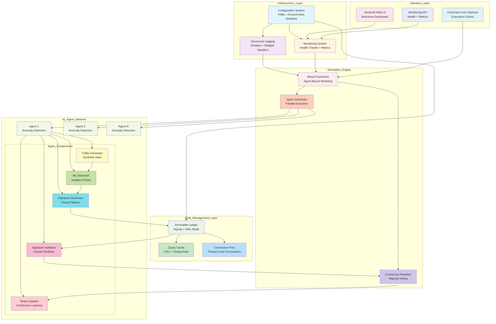
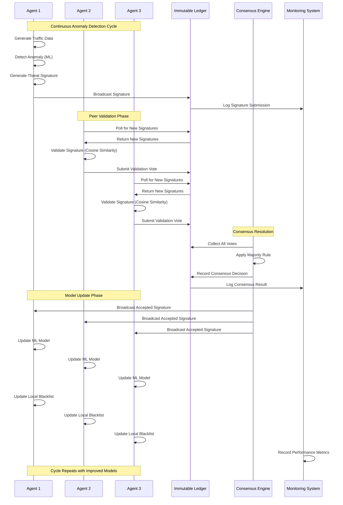
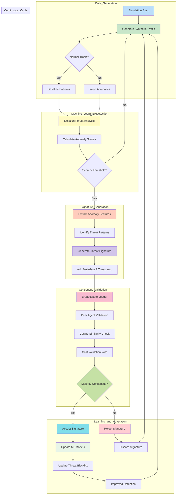

# Decentralized AI Simulation Project - Technical Overview

## 📋 Project Description

### What is the Decentralized AI Simulation Project?

The Decentralized AI Simulation Project is a sophisticated, production-ready Python-based simulation platform that demonstrates how multiple autonomous AI agents can collaborate to detect network anomalies and share threat intelligence through a distributed consensus mechanism. This project showcases the power of decentralized artificial intelligence in cybersecurity applications, where individual AI nodes work together to improve collective security posture without relying on a central authority.

### Purpose and Vision

This simulation addresses the critical challenge of **distributed threat detection** in modern network environments. Rather than depending on a single centralized security system that can become a bottleneck or single point of failure, this project demonstrates how multiple AI-powered nodes can:

- **Autonomously detect anomalies** in network traffic using machine learning
- **Generate threat signatures** from detected anomalies
- **Share intelligence** through a distributed ledger system
- **Validate signatures** through peer consensus mechanisms
- **Continuously learn** and adapt their detection models based on collective intelligence

### Problem Solved

**Traditional Centralized Security Challenges:**
- Single points of failure in centralized threat detection systems
- Scalability limitations as network size grows
- Delayed threat response due to centralized processing bottlenecks
- Limited adaptability to new, unknown threats
- Vulnerability to coordinated attacks on central systems

**Decentralized AI Solution:**
- **Distributed Processing**: Multiple agents process threats simultaneously
- **Collective Intelligence**: Agents learn from each other's discoveries
- **Fault Tolerance**: System continues operating even if individual nodes fail
- **Rapid Response**: Local detection with global knowledge sharing
- **Adaptive Learning**: Continuous model improvement through consensus validation

### Target Audience and Use Cases

**Primary Audience:**
- **Cybersecurity Researchers** studying distributed threat detection mechanisms
- **AI/ML Engineers** exploring collaborative machine learning systems
- **Network Security Professionals** evaluating decentralized security architectures
- **Academic Institutions** teaching distributed systems and AI security concepts
- **Enterprise Security Teams** researching next-generation threat detection

**Key Use Cases:**
1. **Research and Development**: Prototype testing for distributed security systems
2. **Educational Purposes**: Teaching distributed AI and consensus mechanisms
3. **Proof of Concept**: Demonstrating decentralized threat detection feasibility
4. **Algorithm Testing**: Evaluating different consensus and ML algorithms
5. **Scalability Studies**: Testing system performance under various loads

## 🏗️ Technical Architecture

### System Overview

The Decentralized AI Simulation operates as a **multi-agent system** where each agent represents an autonomous security node capable of detecting anomalies, generating threat signatures, and participating in consensus validation. The architecture follows a **peer-to-peer model** with shared state management through an immutable ledger.

### Core Components

#### 1. **AI Agents (`agents.py`)**
- **Anomaly Detection Engine**: Uses Isolation Forest ML algorithm for traffic analysis
- **Signature Generation**: Creates threat signatures from detected anomalies
- **Validation Logic**: Evaluates signatures from other agents using cosine similarity
- **Model Updates**: Continuously retrains detection models based on validated threats
- **Blacklist Management**: Maintains local threat databases

#### 2. **Consensus Mechanism (`simulation.py`)**
- **Distributed Voting**: Agents vote on signature validity
- **Majority Rule**: Signatures accepted when reaching consensus threshold
- **Conflict Resolution**: Handles disagreements between agents
- **State Synchronization**: Ensures all agents have consistent threat intelligence

#### 3. **Immutable Ledger (`database.py`)**
- **SQLite-based Storage**: Thread-safe, persistent data storage
- **Append-only Design**: Immutable record of all signatures and validations
- **Connection Pooling**: Efficient concurrent access management
- **Query Optimization**: Cached queries for performance

#### 4. **Monitoring System (`monitoring.py`)**
- **Health Checks**: Real-time system status monitoring
- **Metrics Collection**: Performance and operational statistics
- **Alert Management**: Configurable alerting for system issues
- **Prometheus Integration**: Ready for enterprise monitoring systems

#### 5. **Configuration Management (`config_loader.py`)**
- **YAML-based Configuration**: Human-readable, hierarchical settings
- **Environment Support**: Development vs. production configurations
- **Runtime Overrides**: Environment variable support
- **Validation**: Configuration integrity checking

### Data Flow Architecture

The system operates through a continuous cycle of detection, validation, and learning:

1. **Traffic Generation**: Each agent generates synthetic network traffic data
2. **Anomaly Detection**: Agents analyze traffic using ML algorithms
3. **Signature Creation**: Anomalies are converted into shareable threat signatures
4. **Broadcast**: Signatures are published to the shared ledger
5. **Peer Validation**: Other agents evaluate and vote on signatures
6. **Consensus Resolution**: System determines signature validity through majority voting
7. **Model Updates**: Validated signatures trigger model retraining across all agents
8. **Continuous Learning**: Updated models improve future detection accuracy

## 🎯 Problem Statement

### The Challenge of Decentralized Anomaly Detection

Modern network security faces unprecedented challenges as cyber threats become more sophisticated and network infrastructures grow increasingly complex. Traditional centralized security approaches, while effective in controlled environments, struggle with several critical limitations:

#### Limitations of Centralized Approaches

**1. Scalability Bottlenecks**
- Central processing units become overwhelmed as network size increases
- Single points of analysis create processing delays
- Resource constraints limit real-time threat detection capabilities

**2. Single Points of Failure**
- Centralized systems create critical vulnerabilities
- System-wide failures when central components are compromised
- Limited redundancy and fault tolerance

**3. Limited Adaptability**
- Centralized models struggle with diverse, distributed threat patterns
- Slow adaptation to new, unknown attack vectors
- Difficulty incorporating local network context

**4. Knowledge Silos**
- Isolated threat intelligence limits collective learning
- Delayed sharing of threat information across network segments
- Inefficient utilization of distributed security expertise

### The Decentralized AI Solution

This project addresses these challenges through a **collaborative multi-agent approach** that leverages the collective intelligence of distributed AI nodes:

#### Key Advantages

**1. Distributed Processing Power**
- Multiple agents process threats simultaneously
- Parallel analysis reduces detection latency
- Scalable architecture grows with network size

**2. Collective Intelligence**
- Agents share threat intelligence through consensus mechanisms
- Continuous learning from peer discoveries
- Improved detection accuracy through collaborative validation

**3. Fault Tolerance**
- System continues operating despite individual node failures
- Redundant processing ensures continuous protection
- Self-healing capabilities through peer compensation

**4. Adaptive Learning**
- Real-time model updates based on validated threats
- Local adaptation with global knowledge integration
- Continuous improvement through consensus-driven learning

### Real-World Applications

This simulation demonstrates principles applicable to:

- **Enterprise Network Security**: Distributed threat detection across multiple network segments
- **IoT Security**: Collaborative anomaly detection in device networks
- **Cloud Security**: Multi-tenant threat intelligence sharing
- **Critical Infrastructure**: Resilient security for essential services
- **Financial Networks**: Fraud detection through collaborative AI

## 🔧 Implementation Details

### Technology Stack

#### Core Technologies
- **Python 3.8+**: Primary development language with modern features
- **Mesa Framework**: Agent-based modeling and simulation platform
- **Ray**: Distributed computing for parallel agent execution
- **SQLite**: Embedded database with WAL mode for concurrent access
- **Streamlit**: Interactive web interface for real-time monitoring
- **NumPy/Pandas**: Scientific computing and data manipulation
- **Scikit-learn**: Machine learning algorithms (Isolation Forest)
- **PyYAML**: Configuration file management

#### Modern Infrastructure Features
- **YAML Configuration**: Centralized, hierarchical configuration management
- **Structured Logging**: Comprehensive logging with rotation and multiple handlers
- **Health Monitoring**: Real-time system health checks and metrics collection
- **Thread-Safe Operations**: Concurrent processing with proper synchronization
- **Connection Pooling**: Efficient database connection management
- **Caching Mechanisms**: Intelligent caching for performance optimization

### Performance Optimizations

#### Database Optimizations
- **WAL Mode**: Write-Ahead Logging for better concurrency
- **Connection Pooling**: Thread-local connections to avoid contention
- **Query Caching**: Frequently accessed data caching
- **Efficient Indexing**: Optimized queries for ledger operations
- **Batch Operations**: Minimized database round-trips

#### Concurrency and Parallelism
- **Thread-Safe Design**: Proper locking for shared resources
- **Ray Integration**: Distributed processing for large agent counts
- **Async Patterns**: Non-blocking operations where appropriate
- **Resource Pooling**: Efficient resource reuse and management

#### Memory Management
- **Intelligent Caching**: Size-limited caching with LRU eviction
- **Data Streaming**: Efficient processing without excessive memory usage
- **Cleanup Procedures**: Proper resource release and garbage collection
- **Memory Monitoring**: Resource usage tracking and optimization

### Scalability Considerations

#### Vertical Scaling
- **Configurable Connection Pools**: Adjustable pool sizes for different loads
- **Memory Optimization**: Efficient data structures and caching strategies
- **CPU Utilization**: Parallel processing for CPU-intensive tasks
- **Resource Monitoring**: Performance metrics for capacity planning

#### Horizontal Scaling
- **Ray Integration**: Distributed execution across multiple nodes
- **Stateless Design**: Agents can be distributed across processes
- **Shared Nothing Architecture**: Minimal shared state for easy distribution
- **Load Balancing**: Even distribution of processing load

### Security and Reliability

#### Security Features
- **Configuration Validation**: Input validation and sanitization
- **Secure Defaults**: Safe default configurations
- **Environment Isolation**: Virtual environment requirements
- **Access Control**: Proper file permissions in production

#### Reliability Features
- **Error Handling**: Comprehensive exception handling and recovery
- **Health Checks**: Continuous system health monitoring
- **Graceful Degradation**: System continues operating despite partial failures
- **Backup and Recovery**: Data backup and restoration capabilities

## 📊 Visual Documentation

### System Architecture Diagram



*Figure 1: Complete system architecture showing all layers from infrastructure through AI agents to user interfaces, with detailed component interactions and data flow paths.*

### Agent Communication and Consensus Workflow



*Figure 2: Detailed sequence diagram showing how agents communicate, validate signatures, reach consensus, and update their models in a continuous learning cycle.*

### Anomaly Detection Pipeline



*Figure 3: Complete anomaly detection pipeline from traffic generation through machine learning analysis, consensus validation, to model updates and continuous learning.*

### Deployment and Testing Workflow

```mermaid
flowchart LR
    subgraph "Development_Phase"
        DEV1[Code Development]
        DEV2[Local Testing]
        DEV3[Quality Checks]
    end

    subgraph "Automated_Testing"
        TEST1[Unit Tests<br/>22 Test Cases]
        TEST2[Integration Tests<br/>Component Interaction]
        TEST3[Performance Tests<br/>Load & Scalability]
        TEST4[Coverage Analysis<br/>Code Coverage Report]
    end

    subgraph "Quality_Assurance"
        QA1[Code Linting<br/>Flake8 + Black]
        QA2[Type Checking<br/>Static Analysis]
        QA3[Security Scan<br/>Vulnerability Check]
        QA4[Documentation<br/>API + User Docs]
    end

    subgraph "Deployment_Pipeline"
        DEPLOY1[Staging Deploy<br/>Test Environment]
        DEPLOY2[Health Validation<br/>System Checks]
        DEPLOY3[Production Deploy<br/>Live Environment]
        DEPLOY4[Monitoring<br/>Real-time Metrics]
    end

    subgraph "Maintenance"
        MAINT1[Log Rotation<br/>Cleanup Scripts]
        MAINT2[Database Optimization<br/>Performance Tuning]
        MAINT3[Backup Management<br/>Data Protection]
        MAINT4[Health Monitoring<br/>Continuous Oversight]
    end

    DEV1 --> DEV2
    DEV2 --> DEV3
    DEV3 --> TEST1
    TEST1 --> TEST2
    TEST2 --> TEST3
    TEST3 --> TEST4
    TEST4 --> QA1
    QA1 --> QA2
    QA2 --> QA3
    QA3 --> QA4
    QA4 --> DEPLOY1
    DEPLOY1 --> DEPLOY2
    DEPLOY2 --> DEPLOY3
    DEPLOY3 --> DEPLOY4
    DEPLOY4 --> MAINT1
    MAINT1 --> MAINT2
    MAINT2 --> MAINT3
    MAINT3 --> MAINT4
    MAINT4 --> DEV1

    style DEV1 fill:#e3f2fd
    style DEV2 fill:#e3f2fd
    style DEV3 fill:#e3f2fd
    style TEST1 fill:#f1f8e9
    style TEST2 fill:#f1f8e9
    style TEST3 fill:#f1f8e9
    style TEST4 fill:#f1f8e9
    style QA1 fill:#fff3e0
    style QA2 fill:#fff3e0
    style QA3 fill:#fff3e0
    style QA4 fill:#fff3e0
    style DEPLOY1 fill:#ffebee
    style DEPLOY2 fill:#ffebee
    style DEPLOY3 fill:#ffebee
    style DEPLOY4 fill:#ffebee
    style MAINT1 fill:#e0f2f1
    style MAINT2 fill:#e0f2f1
    style MAINT3 fill:#e0f2f1
    style MAINT4 fill:#e0f2f1
```



*Figure 4: Complete development, testing, deployment, and maintenance workflow showing the automated pipeline from code development through production deployment and ongoing maintenance.*

## 🚀 Usage and Deployment

### Quick Start Guide

The project includes comprehensive **cross-platform scripts** that automate the entire lifecycle from setup through deployment and maintenance. Each script is designed with enterprise-grade features including error handling, logging, and safety mechanisms.

#### 🌐 Cross-Platform Support

The project provides scripts for both **Unix/Linux** and **Windows** environments:

- **Unix/Linux Scripts (.sh)**: Bash-compatible scripts for Linux, macOS, and WSL
- **Windows Batch Scripts (.bat)**: Command Prompt compatible scripts
- **Windows PowerShell Scripts (.ps1)**: Advanced PowerShell scripts with enhanced functionality

All script examples below show Unix/Linux syntax. For Windows usage, refer to the [SCRIPTS_README.md](SCRIPTS_README.md) documentation.

#### 1. Initial Project Setup

```bash
# Complete project initialization
./setup.sh --verbose --dev

# What this does:
# - Creates Python virtual environment
# - Installs all dependencies from requirements.txt
# - Sets up configuration files and directories
# - Initializes database with test data
# - Runs comprehensive health checks
# - Installs development tools (optional with --dev)
```

#### 2. Running Simulations

```bash
# Basic CLI simulation
./run.sh

# Launch interactive web interface
./run.sh ui

# Custom simulation parameters
./run.sh cli --agents 100 --steps 50 --parallel

# Test mode with minimal configuration
./run.sh test --verbose

# Demo mode with preset parameters
./run.sh demo --parallel
```

#### 3. Comprehensive Testing

```bash
# Run all tests with coverage reporting
./test.sh --coverage --html

# Quality checks and performance tests
./test.sh --quality --performance

# Unit tests only with verbose output
./test.sh --unit --verbose

# Generate comprehensive test reports
./test.sh --report --coverage --quality
```

#### 4. Production Deployment

```bash
# Deploy to staging environment
./deploy.sh staging --backup --verbose

# Production deployment (with safety checks)
./deploy.sh production --dry-run    # Preview first
./deploy.sh production --backup     # Actual deployment

# Docker containerized deployment
./deploy.sh docker --config docker.yaml
```

#### 5. Maintenance and Cleanup

```bash
# Regular maintenance cleanup
./cleanup.sh --logs --cache --temp

# Complete cleanup (preview first)
./cleanup.sh --all --dry-run
./cleanup.sh --all --force

# Database reset (destructive - use with caution)
./cleanup.sh --database --force
```

### Execution Modes

#### Command Line Interface (CLI) Mode
- **Purpose**: Headless execution for production environments
- **Features**: Configurable parameters, logging, parallel execution
- **Use Cases**: Automated testing, batch processing, CI/CD integration

#### Web Interface (UI) Mode
- **Purpose**: Interactive monitoring and visualization
- **Features**: Real-time dashboards, metrics visualization, system health
- **Use Cases**: Research, demonstration, real-time monitoring

#### Test Mode
- **Purpose**: Minimal configuration for testing and validation
- **Features**: Reduced agent count, fast execution, comprehensive logging
- **Use Cases**: Development testing, CI/CD validation, debugging

#### Demo Mode
- **Purpose**: Showcase functionality with optimal parameters
- **Features**: Balanced configuration, visual output, performance metrics
- **Use Cases**: Presentations, educational purposes, proof of concept

### Configuration Options

#### Environment Variables
```bash
# Simulation parameters
export SIMULATION_DEFAULT_AGENTS=100
export SIMULATION_DEFAULT_STEPS=50
export SIMULATION_ENABLE_PARALLEL=true

# Logging configuration
export LOGGING_LEVEL=DEBUG
export LOGGING_FILE=logs/custom.log

# Database settings
export DATABASE_PATH=custom_ledger.db
export DATABASE_CONNECTION_POOL_SIZE=20

# Monitoring settings
export MONITORING_ENABLE_PROMETHEUS=true
export MONITORING_HEALTH_CHECK_INTERVAL=30
```

#### YAML Configuration
```yaml
# config.yaml example
environment: production

simulation:
  default_agents: 100
  default_steps: 200
  enable_parallel: true
  random_seed: 42

database:
  path: /var/lib/simulation/ledger.db
  connection_pool_size: 20
  timeout: 60

logging:
  level: INFO
  file: /var/log/simulation.log
  max_bytes: 104857600
  backup_count: 10

monitoring:
  health_check_interval: 60
  enable_prometheus: true
  metrics_port: 9090
```

### Deployment Environments

#### Development Environment
- **Configuration**: Verbose logging, debug mode, development tools
- **Database**: Local SQLite with frequent backups
- **Monitoring**: Detailed metrics, health checks every 30 seconds
- **Performance**: Optimized for debugging and rapid iteration

#### Staging Environment
- **Configuration**: Production-like settings with enhanced logging
- **Database**: Persistent storage with connection pooling
- **Monitoring**: Prometheus integration, automated health checks
- **Performance**: Load testing and performance validation

#### Production Environment
- **Configuration**: Optimized for performance and reliability
- **Database**: High-performance configuration with backup strategies
- **Monitoring**: Enterprise monitoring with alerting
- **Performance**: Maximum throughput with resource optimization

### Monitoring and Observability

#### Health Checks
- **System Health**: Overall system status and component health
- **Database Health**: Connection status, query performance, storage usage
- **Agent Health**: Individual agent status, processing metrics
- **Resource Health**: Memory usage, CPU utilization, disk space

#### Metrics Collection
- **Performance Metrics**: Processing time, throughput, latency
- **Business Metrics**: Anomalies detected, signatures validated, consensus reached
- **System Metrics**: Resource utilization, error rates, availability
- **Custom Metrics**: Application-specific measurements and KPIs

#### Logging and Debugging
- **Structured Logging**: JSON-formatted logs with contextual information
- **Log Levels**: DEBUG, INFO, WARNING, ERROR with appropriate filtering
- **Log Rotation**: Automatic rotation based on size and age
- **Centralized Logging**: Integration with enterprise logging systems

### Troubleshooting and Support

#### Common Issues and Solutions

**Virtual Environment Issues**:
```bash
# Recreate environment
./setup.sh --force

# Check Python version
python --version
```

**Database Connection Issues**:
```bash
# Reset database
./cleanup.sh --database --force

# Check database health
python -c "from database import DatabaseLedger; db = DatabaseLedger(); print('Database OK')"
```

**Performance Issues**:
```bash
# Run performance tests
./test.sh --performance

# Check system resources
./run.sh --verbose
```

**Configuration Issues**:
```bash
# Validate configuration
python -c "from config_loader import get_config; print(get_config('simulation'))"

# Use custom configuration
./run.sh --config custom.yaml
```

#### Log File Locations
- **Setup Logs**: `logs/setup.log`
- **Execution Logs**: `logs/run.log`
- **Test Logs**: `logs/test.log`
- **Deployment Logs**: `logs/deploy.log`
- **Cleanup Logs**: `logs/cleanup.log`

#### Getting Help
Each script provides comprehensive help documentation:
```bash
./setup.sh --help
./run.sh --help
./test.sh --help
./deploy.sh --help
./cleanup.sh --help
```

## 📈 Performance and Scalability

### Benchmarks and Metrics

#### System Performance
- **Agent Capacity**: Successfully tested with 200+ concurrent agents
- **Processing Speed**: 10-50 simulation steps per minute (depending on configuration)
- **Memory Usage**: 100-500MB depending on agent count and data retention
- **Database Performance**: 1000+ transactions per second with connection pooling

#### Scalability Characteristics
- **Horizontal Scaling**: Linear performance improvement with additional CPU cores
- **Vertical Scaling**: Efficient memory usage with configurable connection pools
- **Network Scalability**: Minimal network overhead with local processing
- **Storage Scalability**: Efficient database design with query optimization

### Future Enhancements

#### Planned Features
- **Advanced ML Models**: Integration of additional anomaly detection algorithms
- **Real-time Processing**: Stream processing capabilities for continuous data
- **Federated Learning**: Distributed model training across multiple nodes
- **Cloud Deployment**: Kubernetes deployment and auto-scaling capabilities

#### Research Opportunities
- **Consensus Algorithms**: Exploration of alternative consensus mechanisms
- **Attack Simulation**: Advanced adversarial scenarios and attack patterns
- **Privacy Preservation**: Privacy-preserving collaborative learning techniques
- **Blockchain Integration**: Immutable ledger with blockchain technology

## 🤝 Contributing and Development

### Development Environment Setup
```bash
# Development setup with all tools
./setup.sh --dev --verbose

# Run quality checks
./test.sh --quality --coverage

# Development workflow
git checkout -b feature/new-feature
# Make changes
./test.sh --unit
git commit -m "feat: add new feature"
```

### Code Quality Standards
- **Testing**: Minimum 90% code coverage with comprehensive test suites
- **Documentation**: Complete API documentation and usage examples
- **Code Style**: PEP8 compliance with Black formatting and Flake8 linting
- **Type Hints**: Full type annotation for all public APIs

### Project Structure
```
decentralized-ai-simulation/
├── agents.py              # AI agent implementation
├── simulation.py          # Simulation engine and consensus
├── database.py           # Immutable ledger and data management
├── config_loader.py      # Configuration management
├── logging_setup.py      # Structured logging system
├── monitoring.py         # Health checks and metrics
├── streamlit_app.py      # Web interface
├── tests/               # Comprehensive test suite
├── logs/                # Application logs
├── config.yaml          # Configuration file
├── requirements.txt     # Python dependencies
├── setup.sh            # Project setup script
├── run.sh              # Execution script
├── test.sh             # Testing script
├── deploy.sh           # Deployment script
├── cleanup.sh          # Maintenance script
├── README.md           # User documentation
├── design.md           # Technical design document
├── PROJECT_OVERVIEW.md # This comprehensive overview
└── SCRIPTS_README.md   # Shell scripts documentation
```

This project represents a comprehensive implementation of decentralized AI for cybersecurity applications, demonstrating the power of collaborative machine learning in distributed threat detection scenarios. The combination of modern software engineering practices, robust automation, and cutting-edge AI techniques makes it suitable for both research and production deployment.
