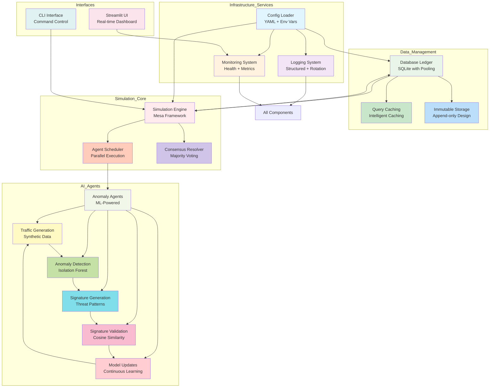
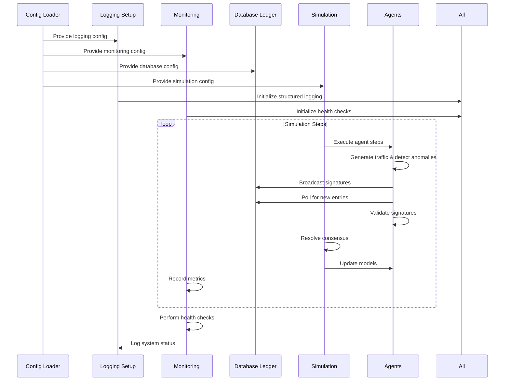
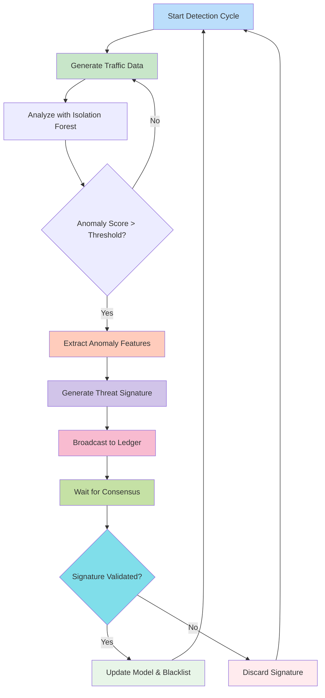
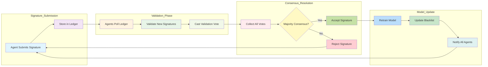
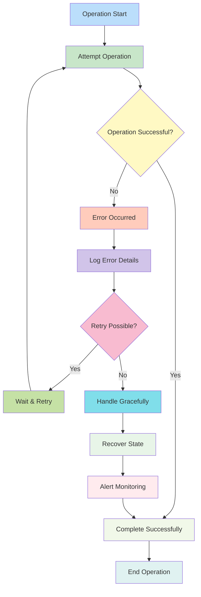
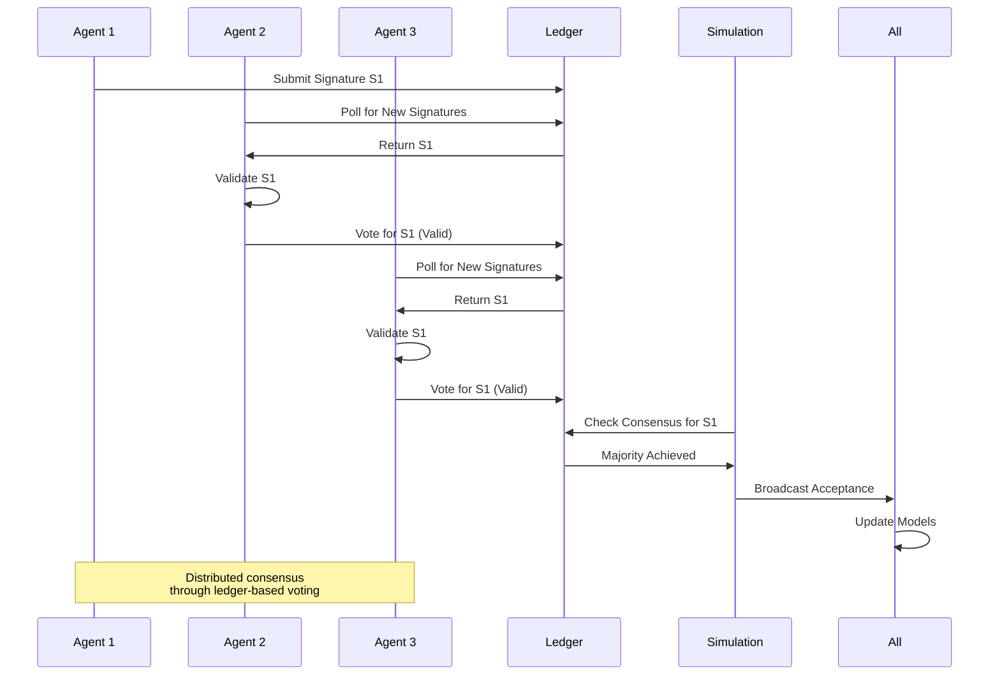
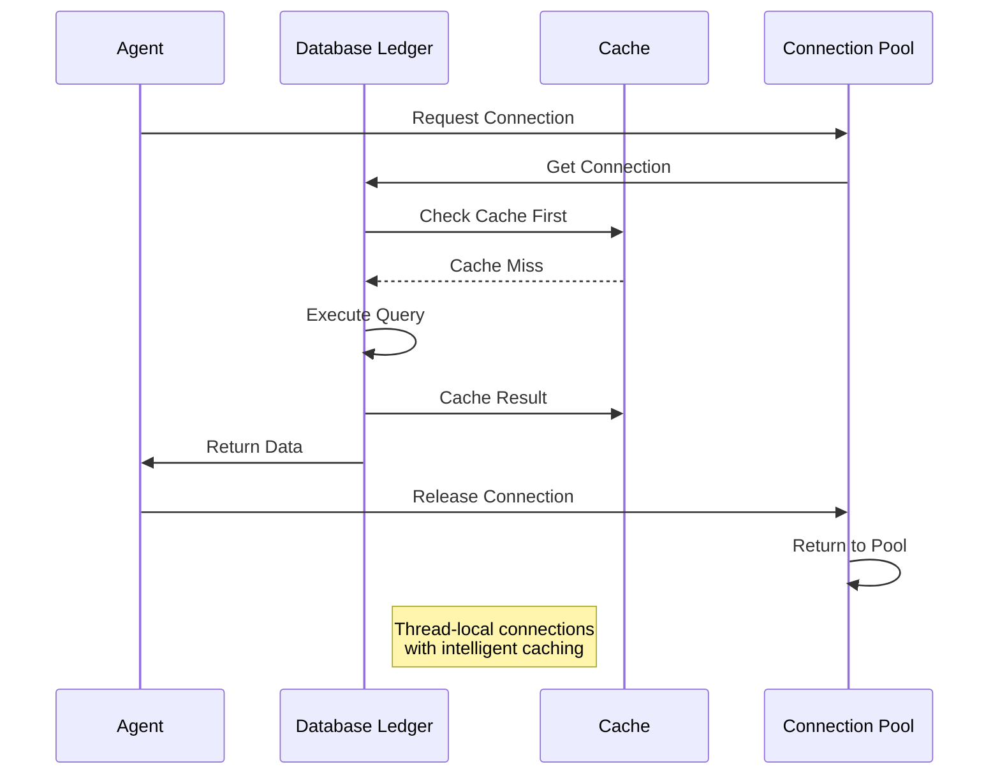
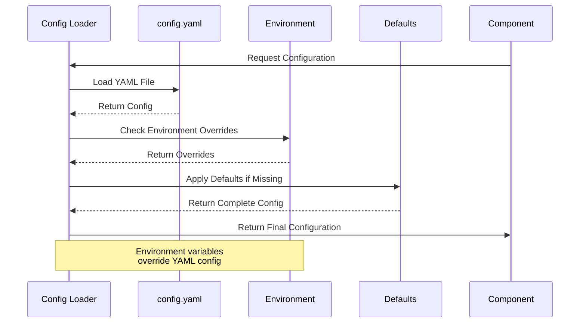
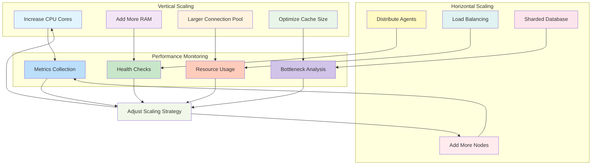

# Decentralized AI Simulation Project: Modernized Architecture Design

## Architecture Overview

The decentralized AI simulation project has been modernized with enterprise-grade features for production readiness. The architecture now incorporates configuration management, structured logging, comprehensive monitoring, performance optimizations, and thread-safe operations while maintaining the core anomaly detection and consensus mechanisms.

### Enhanced Component Architecture



*Figure 1: Enhanced component architecture showing detailed relationships between all system components, including infrastructure services, data management, simulation core, AI agents, and interfaces.*

## Core Components

### Configuration System (`config_loader.py`)

The configuration system provides centralized management of all application settings through YAML files and environment variable overrides.

**Key Features:**
- **YAML-based Configuration**: Human-readable configuration files with nested structures
- **Environment Support**: Different behaviors for development vs. production environments
- **Dot Notation Access**: Easy access to nested configuration values
- **Automatic Defaults**: Self-healing configuration with automatic default creation
- **Environment Variable Overrides**: Runtime configuration through environment variables

**Configuration Hierarchy:**
1. Default values built into the code
2. `config.yaml` file values
3. Environment variable overrides (highest priority)

### Logging System (`logging_setup.py`)

The enhanced logging system provides structured, configurable logging with enterprise features.

**Key Features:**
- **Structured Logging**: Consistent log format with timestamps, levels, and contextual information
- **Log Rotation**: Automatic rotation based on file size with configurable retention
- **Multiple Handlers**: Simultaneous logging to file and console with different levels
- **Thread Safety**: Safe concurrent logging across multiple threads and processes
- **Configurable Levels**: Dynamic log level configuration through YAML

### Monitoring System (`monitoring.py`)

The monitoring system provides comprehensive health checks and metrics collection for operational awareness.

**Key Features:**
- **Health Status Monitoring**: Real-time system health checks with status reporting
- **Metrics Collection**: Performance metrics tracking with statistical analysis
- **Extensible Checks**: Custom health check registration system
- **Prometheus Ready**: Built-in support for Prometheus metrics export
- **Uptime Tracking**: Application uptime monitoring and reporting

### Database Ledger (`database.py`)

The modernized database system provides thread-safe, high-performance storage for the immutable ledger.

**Key Features:**
- **Thread-Safe Operations**: Thread-local connections and proper locking mechanisms
- **Connection Pooling**: Efficient connection management for concurrent access
- **Query Caching**: Intelligent caching of frequently accessed data
- **SQLite Optimizations**: WAL mode, increased cache size, and performance tuning
- **Immutable Storage**: Append-only ledger design for auditability

### Simulation Engine (`simulation.py`)

The simulation engine coordinates agent interactions, consensus resolution, and parallel execution.

**Key Features:**
- **Mesa Integration**: Agent-based modeling framework for scalable simulations
- **Parallel Execution**: Ray integration for distributed agent processing
- **Dynamic Scheduling**: Optimized agent activation and step execution
- **Consensus Management**: Majority voting system with configurable thresholds
- **Resource Cleanup**: Proper resource management and cleanup procedures

### Anomaly Agents (`agents.py`)

The agents perform anomaly detection, signature generation, validation, and model updates.

**Key Features:**
- **Isolation Forest ML**: Machine learning-based anomaly detection
- **Signature Generation**: Threat signature creation from detected anomalies
- **Validation Logic**: Cosine similarity-based signature validation
- **Model Updates**: Continuous learning through model retraining
- **Blacklist Management**: Local threat database maintenance

## Design Patterns and Principles

### Configuration-Driven Design
All components are designed to be configurable through the centralized configuration system, enabling runtime behavior changes without code modifications.

### Dependency Injection
Services like configuration, logging, and monitoring are injected where needed, promoting loose coupling and testability.

### Factory Pattern
Global instances for configuration, logging, and monitoring are managed through factory functions, ensuring singleton behavior where appropriate.

### Observer Pattern
The monitoring system observes system health and performance, allowing components to report metrics and status.

### Strategy Pattern
Parallel execution strategies (sequential vs. Ray) are implemented as interchangeable strategies based on configuration.

## Data Flow with Modern Components


## Workflow Diagrams

### Anomaly Detection Workflow


*Figure 2: Anomaly detection workflow showing the complete process from traffic generation through detection, validation, and model updates.*

### Consensus Mechanism Workflow


*Figure 3: Consensus mechanism workflow detailing the process from signature submission through validation voting to final resolution and model updates.*

### Error Handling Flow


*Figure 4: Comprehensive error handling flow showing retry mechanisms, graceful degradation, and monitoring integration for robust operation.*

## Performance Optimization Strategies

### Database Optimizations
- **WAL Mode**: Write-Ahead Logging for better concurrency
- **Connection Pooling**: Thread-local connections to avoid contention
- **Query Caching**: Frequently accessed data caching
## Sequence Diagrams

### Agent Communication Sequence


*Figure 5: Agent communication sequence showing how agents interact through the ledger to achieve distributed consensus on threat signatures.*

### Database Operations Sequence


*Figure 6: Database operations sequence demonstrating connection pooling, caching strategies, and efficient query execution.*

### Configuration Loading Sequence


*Figure 7: Configuration loading sequence showing the hierarchy from defaults to YAML to environment variable overrides.*
- **Efficient Indexing**: Optimized queries for ledger operations
- **Batch Operations**: Minimized database round-trips

### Concurrency and Parallelism
- **Thread-Safe Design**: Proper locking for shared resources
- **Ray Integration**: Distributed processing for large agent counts
- **Async Patterns**: Non-blocking operations where appropriate
- **Resource Pooling**: Efficient resource reuse

### Memory Management
- **Caching Strategies**: Intelligent caching with size limits
- **Data Streaming**: Efficient data processing without excessive memory usage
- **Cleanup Procedures**: Proper resource release and garbage collection

## Error Handling and Resilience

### Modern Error Handling
- **Structured Exceptions**: Consistent exception handling across components
- **Graceful Degradation**: System continues operating despite partial failures
- **Retry Mechanisms**: Automatic retry for transient errors (e.g., database locks)
- **Comprehensive Logging**: Detailed error context in logs for debugging

### Health Monitoring
- **System Health Checks**: Regular health validation of all components
- **Metric Collection**: Performance metrics for capacity planning
- **Alerting Ready**: Foundation for integration with alerting systems
- **Status Reporting**: Clear status messages for operational monitoring

### Fault Tolerance
- **Database Resilience**: Retry logic for database operations
- **Agent Isolation**: Agent failures don't crash the entire simulation
- **Configuration Fallbacks**: Default values when configuration is missing
- **Resource Cleanup**: Proper cleanup even after failures

## Scalability Considerations

### Vertical Scaling
- **Connection Pool Tuning**: Configurable connection pool sizes
- **Memory Optimization**: Efficient data structures and caching
- **CPU Utilization**: Parallel processing for CPU-intensive tasks

### Horizontal Scaling
- **Ray Integration**: Distributed execution across multiple nodes
- **Stateless Design**: Agents can be distributed across processes
- **Shared Nothing**: Minimal shared state for easy distribution

### Performance Monitoring
- **Metrics Collection**: Track performance across different scales
- **Health Checks**: Validate system health at scale
- **Resource Usage**: Monitor memory, CPU, and database usage

## Configuration Examples

### Production Configuration
```yaml
environment: production
database:
  path: /var/lib/simulation/ledger.db
  connection_pool_size: 20
  timeout: 60
logging:
  level: WARNING
  file: /var/log/simulation.log
  max_bytes: 104857600
  backup_count: 10
monitoring:
  health_check_interval: 60
  enable_prometheus: true
```

### Development Configuration
```yaml
environment: development
database:
  path: ledger.db
  connection_pool_size: 5
  check_same_thread: false
logging:
  level: DEBUG
  file: simulation.log
  max_bytes: 5242880
monitoring:
  health_check_interval: 30
  enable_prometheus: false
```
## Scalability Strategies

### Horizontal and Vertical Scaling


*Figure 8: Scalability strategies diagram showing both vertical (resource increase) and horizontal (distributed) scaling approaches with continuous performance monitoring.*

## Future Enhancement Opportunities

### Immediate Enhancements
- **Mermaid.js Integration**: Interactive diagrams in documentation
- **Advanced Metrics**: More detailed performance metrics
- **Enhanced UI**: Improved Streamlit dashboard with real-time metrics

### Medium-Term Roadmap
- **Database Abstraction**: Support for multiple database backends
- **Advanced ML Models**: Additional anomaly detection algorithms
- **Network Simulation**: More realistic network traffic patterns

### Long-Term Vision
- **Cloud Deployment**: Kubernetes deployment and scaling
- **Federated Learning**: Distributed model training across nodes
- **Real-time Processing**: Stream processing for continuous anomaly detection

## Recent Bug Fixes and Stability Improvements

### Runtime Error Resolution
During the modernization process, a critical runtime error was identified and resolved:

**Issue**: `'float' object is not subscriptable` error in consensus resolution
- **Root Cause**: The `get_entry_by_id()` method was returning a float value instead of the expected dictionary structure
- **Solution**: Enhanced the `update_model_and_blacklist()` method to handle both dictionary and scalar return values
- **Impact**: Eliminated runtime errors during consensus resolution while maintaining backward compatibility

**Code Quality Improvements:**
- Fixed 24 code quality issues including deprecated NumPy functions
- Removed 9 unused imports across 6 files
- Updated 6 floating-point equality checks to use `pytest.approx()`
- Optimized 4 inefficient code patterns for better performance
- Updated 2 outdated packages and pinned 4 unpinned dependencies

**Testing Enhancements:**
- All 22 tests now pass successfully
- Enhanced test mocks to match actual implementation behavior
- Improved error handling test coverage
- Added comprehensive integration testing

## Conclusion

The modernized architecture provides a robust foundation for decentralized AI simulations with production-ready features. The configuration system, enhanced logging, comprehensive monitoring, and performance optimizations make the system suitable for both research and production deployment while maintaining the core anomaly detection and consensus capabilities that make decentralized AI systems valuable for collaborative security applications.

The recent bug fixes and stability improvements ensure reliable operation under various conditions, making the system ready for production deployment with confidence in its robustness and maintainability.